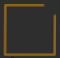
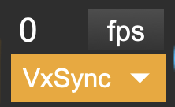
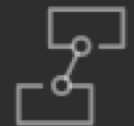
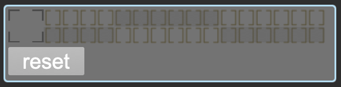

# CORE Toolbar

The CORE Toolbar provides quick access to SPARCK's main functions. It appears at the top of the CORE abstraction.

## Toolbar Controls

| Title | Icon | Description |
|-------|------|-------------|
| **Switch** | {width=100} | Starts and stops the rendering engine. |
| **FPS** |  | Shows current and target frame rate. Click the 'fps' button to open a live graph showing frame rate stability. |
| **Refresh** | {width=100} | Triggers a refresh for nodes set to manual update mode. Useful for reducing performance load when nodes only need an initial render pass (e.g., a texture loaded from file). |
| **Workspace** | {width=100} | Opens the Workspace subpatcher where you can organize your SPARCK nodes. |
| **3DViewer** | {width=100} | Opens and enables the 3DViewer for previewing your scene. |
| **RenderGroup** |  | Selects which render group to display in the 3DViewer. |
| **Preferences** | {width=100} | Opens the SPARCK preferences panel. |
| **Introspection** | {width=100} | Shows all SPARCK node properties and their current values. Useful for scripting and debugging. |

## 3DViewer Navigation

When the 3DViewer is open, use these mouse controls to navigate:

| Action | Control |
|--------|---------|
| **Rotation** | ++cmd++ + mouse drag |
| **Shift** | ++shift++ + mouse drag |
| **Zoom** | ++ctrl++ + mouse drag |
