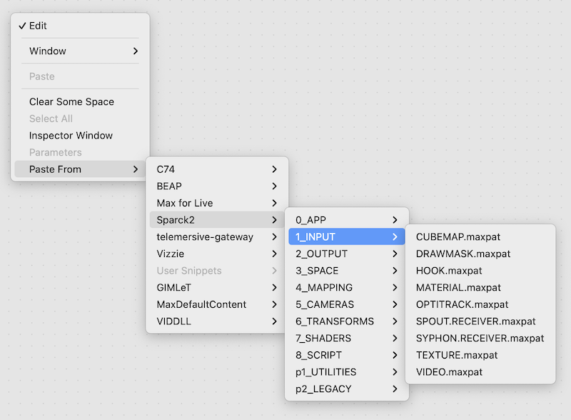
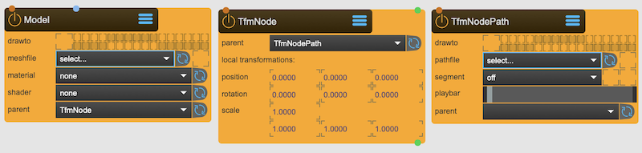

# Introduction

SPARCK is the acronym for SPatial Augmented Reality Contruction Kit and realized as a [Max](https://cycling74.com/) [Package](https://docs.cycling74.com/userguide/packages/).

It follows a similar approach to [VIZZIE](https://cycling74.com/packages/vizzie), and provides a collection of [abstractions](https://docs.cycling74.com/userguide/abstractions/) (in SPARCK parlance called [Nodes](./sparck_node.md)) that allow the creation of [spatial augmented projection](../start/applications/applications.md) setups with the need for only a few nodes to realize the project.

## Locate the Nodes

The way to access SPARCK abstractions is through the context menu that pops up when you right click inside a patcher:



## Setup 

The main difference to the approach which VIZZIE takes: SPARCK needs a [CORE](sparck_core.md) abstraction,  placed[^1] in the root patcher.

It is possble to 'enhance' an existing patcher with SPARCK, but be aware that once you save the patcher, the file structure (see below) will be created.

So best you.. 

```
Start with empty patcher
         ↓
Select CORE from context menu
         ↓
Save patcher in pristine folder
         ↓
Close the patcher
         ↓
Reopen the patcher
         ↓
SPARCK is open for business ✓
```


## File structure

When you create your first SPARCK patcher, you will notice that SPARCK generates its own folder-structure next to where the patcher is stored:

```
projectPath/
├── your_just_saved_sparck_patcher.maxpat
├── _assets/
│   ├── _scripts/
│   │   └── _ques/
│   ├── _shaders/
│   │   └── _raymarch/
│   ├── _textures/
│   │   ├── _volumes/
│   │   └── _cubemaps/
│   ├── _videos/
│   │   └── _hap/
│   ├── _materials/
│   ├── _warps/
│   ├── _models/
│   │   ├── _calib/
│   │   └── _warps/
│   ├── _projectors/
│   │   └── _calib/
│   ├── _nodes/
│   ├── _paths/
│   │   ├── _ledstrips/
│   │   └── _animations/
│   └── _patchers/
├── _tmp/
└── _export/
    ├── _textures/
    ├── _projectors/
    └── _warps/
```

While all Max objects find their content in the search-path, SPARCK's nodes expect them within certain folders. This makes sure your SPARCK project is always complete when you move the project-folder. This is similar to and compatible with Max [Projects](https://docs.cycling74.com/userguide/projects/).

The SPARCK Nodes tooltip hints should tell you where each node expects its files and which file types are accepted.

## Adding Nodes

Once you reopend your just created patcher, you can start adding Nodes. Ideally you use the provided 'Workspace' subpatcher - but you don't have to. You can do it where ever you heart desires.

To add a node, go again into the context menu and select the one you need.

!!! note "SPARCK Node"
    [The Anatomy of a SPARCK Node](sparck_node.md)

## Connecting Nodes

There are multiple mechanism to connect SPARCK Nodes. 

### Using Patchcords
The most obvious one is using [patch-cords](https://docs.cycling74.com/userguide/patch_cords/). 

However, the only meaningfull exchange between SPARCK Nodes via patch-cords are textures. All other inlets and outlets the Nodes provide are for interacting with the Max - environment.

So whenever you want to send textures from one SPARCK Node to another, you use patch-cords.

For everything else, there are other mechanisms:

### Render groups

There are two type of nodes when it comes to rendering 2d and 3d scenes:

#### Content - Nodes


Content nodes are [Model], [Canvas], [Grid], [CornerPin], [SkyBox], [MeshWarp] that place objects in the 3d scene to be rendered.

#### Capturing - Nodes


Capturing nodes are [SceneCapture], [BoxMapCapture] or [Beamer] that render 3d scenes from a specific view point (defined by either a [SceneCamera], [BoxMapCamera] or [LookAtCamera] - the [Beamer] is an exception - it is both Camera and Capture node)

---

* For the content nodes, the render group interface indicates into which group a content needs to be rendered - hence it is called **drawto**.
* For the recording nodes, the render group interface indicates which groups a rendering node renders - hence it is called **capture**.

There are more nodes that have render groups, like [SceneCamera]. Now a SceneCamera is neither being drawn to a scene nor is capturing a scene (the [SceneCapture] node does that). This render group is called **gizmo** and gives control if and where the camera gizmo should be drawn to.

### Transformations & Shaders & Materials



Another way to link Nodes is via Transformations. In the above example, the **Model** node is parented to the **TfmNode**, which in turn is parented to the **TfmPathNode**. 

!!! info
    Connecting **Shaders** or **Materials** works the same way. 

!!! tip
    The menus should give you all the valid selectable Nodes. If the menu doesn't show the required Node, press the 'refresh' button to the right to let SPARCK gather all valid selections.

### Files

The same thing applies to Nodes that need to load files. If they are available and valid, they show up. Or press 'refresh' and look again.

---

## Render & Transformation Passes

The render and transform pass settings define how the nodes interact with the SPARCK ecosystem.

Each Frame is the result of the execution of multiple passes, either transformation and render passes, that need to run in a special sequence (see below). There are theoretically 30 passes that can happen in each frame. The settings allow some control when in this chain of events the node is affected by the transformation or when it is rendered [^2]. While the default settings make sure that in most use cases you don't have to worry to much about the correct timing, in special circumstances it is necessary to decide which node is rendered or transformed before another. 

For example: 

<div class="grid cards" markdown>
-   
    if the result of the rendering of one nodeA is a texture that is needed as an input for nodeB, it is obviously important that nodeA is rendered before nodeB. By indicating the render pass you can control the sequence.

-   
    The same applies to transformations. While for standard Transformation Trees the sequence is defined by the hierarchy of the tree, there are transformation nodes whose result is a transformation matrix that is detatched (i.e. [TfmLookAt] or [TfmMirror]). If a transformation treeB relies on the evaluation-result of a [TfmLookAt] in treeA, treeB needs to be executed after treeA.

</div>

### Overview of all the passes in a frame


Not all these passes can be accessed by the configuration settings of a node. Some are for internal uses only but shown here for the sake of completeness:

<div class="grid cards" markdown>

!!! info "Script Passes"
    * 1.Script-Update
    * 2.Script-Execute
!!! info "Transform Passes"
    * 3.Pre-Transform
    * 4.Pre-Transform Update
    * 5.Transform:pass1
    * 6.Transform:pass2
    * 7.Transform:pass3
    * 8.Post-Transform
!!! info "Misc Passes"
    * 9.Pre Physics
    * 10.Depth
    * 11.Pre Bake
    * 12.Manual Bake
    * 13.Bake
    * 14.Post Bake
!!! info "Manual Render Passes"
    * 15.Render Pass Manual A
    * 16.Render Pass Manual B
    * 17.Render Pass Manual C
    * 18.Render Pass Manual D
!!! info "Render Passes"
    * 19.Pre Render Pass
    * 20.Main Render Pass A
    * 21.Main Render Pass B
    * 22.Main Render Pass C
    * 23.Main Render Pass D
    * 24.Main Render Pass E
    * 25.Main Render Pass F
    * 26.Main Render Pass G
    * 27.Main Render Pass H
    * 28.Beamer Render Pass 
    * 29.Post Render Pass
    * 30.Preview Render Pass

</div>


## Connecting Jitter objects to SPARCK

It is possible to render already existing Jitter patches inside the SPARCK eco-system. There is an extra [Hook] node for this purpose. It makes sure your jitter objects are drawn into the correct context and render group.

### Render Contexts

To give you some deeper insights: SPARCK uses 8 Render Contexts in the Background:


1. The Sparck-Context is where content is rendered (this would include your jitter objects).
2. The Viewer-Context is for displaying the 3DViewer
3. The Editor-Context is for the Editor
4. Output-Context 1 managed by [Window] nodes
5. Output-Context 2 managed by [Window] nodes
6. Output-Context 3 managed by [Window] nodes
7. Output-Context 4 managed by [Window] nodes
8. A Special-Context for Texture Inputs, like Video or Spout/Syphon inputs 

The 4 Output-Context are where the last renderpasses happen to output to a Window - This doesn't mean only 4 Projectors can be attached: Each Window can be split into 24 Viewports, this makes 96 theoretical Screens to connect to - if you GFX card can handle that. 

[^1]: Ideally place in the root. Theoretically it could work elsewhere, but I never tested this.
[^2]: To be more precise: when the capturing happens - it is the Capturing Nodes that execute the render.

[LookAtCamera]: ../reference/nodes/LookAtCamera.md
[Grid]: ../reference/nodes/Grid.md
[DrawMask]: ../reference/nodes/DrawMask.md
[Hook]: ../reference/nodes/Hook.md
[OptiTrack]: ../reference/nodes/OptiTrack.md
[Texture]: ../reference/nodes/Texture.md
[SpoutSender]: ../reference/nodes/SpoutSender.md
[SyphonSender]: ../reference/nodes/SyphonSender.md
[SkyBox]: ../reference/nodes/SkyBox.md
[ShaderPointCloud]: ../reference/nodes/ShaderPointCloud.md
[Light]: ../reference/nodes/Light.md
[Canvas]: ../reference/nodes/Canvas.md
[TfmMerge]: ../reference/nodes/TfmMerge.md
[TfmMirror]: ../reference/nodes/TfmMirror.md
[ShaderBlur]: ../reference/nodes/ShaderBlur.md
[ShaderBrCoSa]: ../reference/nodes/ShaderBrCoSa.md
[ShaderColormap]: ../reference/nodes/ShaderColormap.md
[ShaderSelection]: ../reference/nodes/ShaderSelection.md
[ShaderTexStitch]: ../reference/nodes/ShaderTexStitch.md
[ShaderTexZoom]: ../reference/nodes/ShaderTexZoom.md
[ShaderTexZoom]: ../reference/nodes/ShaderTexZoom.md
[CalibrationCross]: ../reference/nodes/CalibrationCross.md
[TfmLookAt]: ../reference/nodes/TfmLookAt.md
[TextureProjectury]: ../reference/nodes/TextureProjectory.md
[TfmNode]: ../reference/nodes/TfmNode.md
[BlendSoftedge]: ../reference/nodes/BlendSoftedge.md
[SpatialShadery]: ../reference/nodes/SpatialShadery.md
[Model]: ../reference/nodes/Model.md
[QueScript]: ../reference/nodes/QueScript.md
[ShaderAnaglyph]: ../reference/nodes/ShaderAnaglyph.md
[Material]: ../reference/nodes/Material.md
[Canvas]: ../reference/nodes/Canvas.md
[ShdrTexOP]: ../reference/nodes/ShaderTexOP.md
[Video]: ../reference/nodes/Video.md
[SceneCamera]: ../reference/nodes/SceneCamera.md
[SceneCapture]: ../reference/nodes/SceneCapture.md
[BoxMapCamera]: ../reference/nodes/BoxMapCamera.md
[BoxMapCapture]: ../reference/nodes/BoxMapCapture.md
[ShaderRaymarcher]: ../reference/nodes/ShaderRaymarcher.md
[Beamer]: ../reference/nodes/Beamer.md
[CornerPin]: ../reference/nodes/CornerPin.md
[MeshWarp]: ../reference/nodes/MeshWarp.md
[Window]: ../reference/nodes/Window.md
[Viewport]: ../reference/nodes/ViewPort.md
