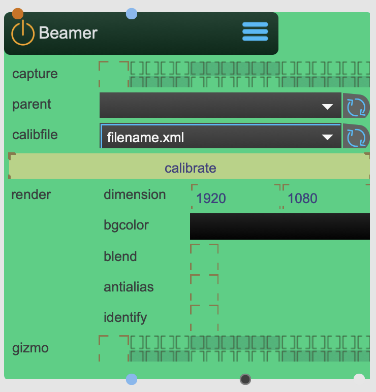

# Beamer

A Beamer represents a real world projector inside SPARCK's 3D space.

It has a calibration mode to find the orientation and lense properties (extrinsic and intrinsic transformations) of the projector.

<figure markdown>
{ width="300" }
</figure> 

## Reference

The following properties can be configured for this node:

=== "Properties"

    | Property | Type | Description |
    |----------|------|-------------|
    | `parent` | Reference | Reference to parent transformation node |
    | `calibfile` | File | Select the transformation RIG. The file needs to be located inside the `~/_assets/_projectors` folder |
    | `calibrate` | Button | Opens the calibration editor |
    | `dimensions` | Size | Sets the texture size of this render pass |
    | `bgcolor` | Color | The background color |
    | `stereo` | Boolean | Creates two renderpasses for each stereo texture |
    | `blend` | Boolean | Enables blending |
    | `antialias` | Boolean | Enables antialiasing |
    | `identify` | Boolean | Use the calibration-color as background color |
    | `gizmo` | Integer | Set the render group to draw the gizmo to |

=== "Inlets"

    | Inlet      | Type          | Description                            |
    |------------|---------------|----------------------------------------|
    | properties | properties | properties &#124; use message [set &lt;propertyPath> &lt;value(s)>] (without node/&lt;nodeName> at the beginning) to set internal properties |
    | background | texture | background texture for camera calibration |
    | custom | message | custom commands. message 'createToXY' creates a new model with calibration vertices relative to the XY-plane: 'createToX  x1  y1  z1  x2  y2  z2  x3  y3  z3  ...'. &#124; message 'addToXY' adds calibration vertices relative to the XY-plane: 'addToX  x1  y1  z1  x2  y2  z2  x3  y3  z3  ...' |

=== "Outlets"

    | Outlet     | Type          | Description                            |
    |------------|---------------|----------------------------------------|
    | captured | texture | captured texture (left if stereo) |
    | captured | warping | captured texture (right if stereo) |
    | dump | message | dump (transform, frustum) |

---

*Last updated: 2024-12-01 | [Edit this page on GitHub](https://github.com/immersive-arts/Sparck2/edit/main/docs/nodes/Beamer.md)*