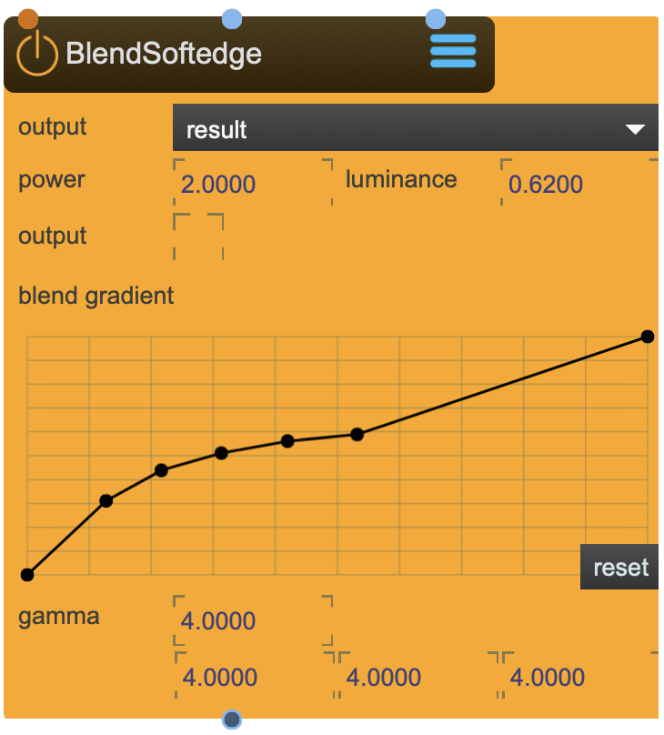

# BlendSoftedge

Blends color textures with softedge textures

<figure markdown>
{ width="300" }
</figure> 


## Properties

The following properties can be configured for this node:

=== "Reference"

    | Property | Type | Description |
    |----------|------|-------------|
    | `ouput` | - | output mode: <li>result shows the final blend <li>texture one shows the color texture <li>texture two shows the blend texture |
    | `power` | - | blend power |
    | `luminance` | - | blend luminance |
    | `output` | - | enable texture shader pass. the outlet that appears below will output the resulting texture. |
    | `gradient` | - | custom gradient curve |
    | `gamma` | - | gamma correction |

=== "Workflow"

    1. TBD


---

## Important Notes

!!! warning "Calibration Requirements"
    
    this node can be used as a shader of as a texture shader pass.

!!! info "File Locations"
    
    ```
    ~/_assets/_projectors/     # Calibration files
    ~/_assets/_model/          # Calibration models (.obj)
    ```

---


<div class="grid cards" markdown>

-   :material-clock-fast:{ .lg .middle } __Quick Start__

    ---

    Get started with BlendSoftedge in minutes
    
    [:octicons-arrow-right-24: Project Examples](../../start/examples/project_examples.md)

-   :material-file-document:{ .lg .middle } __Complementing__ **BlendSoftedge**

    ---
    * [:octicons-arrow-right-24: SpatialSoftegde](SpatialSoftegde.md) 
    * [:octicons-arrow-right-24: Beamer](Beamer.md) 
    * [:octicons-arrow-right-24: ViewPort](ViewPort.md) 
    * [:octicons-arrow-right-24: Canvas](Canvas.md) 

  
-   :material-video-box:{ .lg .middle } __Tutorials__

    ---
    
    [:octicons-arrow-right-24: Watch Now](../../start/tutorials/videos.md){ .md-button .md-button--primary }

-   :material-forum:{ .lg .middle } __Community__

    ---

    [:octicons-arrow-right-24: Join Now](https://github.com/immersive-arts/Sparck2/discussions){ .md-button .md-button--primary }


</div>

---

!!! question "Need help or want to suggest improvements?"
       
    [:fontawesome-brands-github: Report an issue](../../contributing/reporting-a-bug.md){ .md-button }
    [:fontawesome-brands-github: Improve the Docs](../../contributing/reporting-a-docs-issue.md){ .md-button }


---

*Last updated: 2025-12-01 | [Edit this page on GitHub](https://github.com/immersive-arts/Sparck2/edit/main/docs/nodes/BlendSoftedge.md)*
