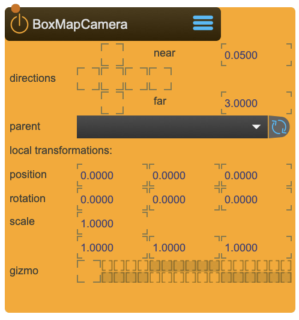

# BoxMapCamera

BoxMapCamera creates rig for a BoxMapCapture Node

BoxMapCamera represents the virtual camera chassis, while the BoxMapCapture represents the virtual film: For capturing the textures the BoxMapCapture is needed.

A BoxMap is similar to an OpenGL-CubeMap, but instead consists of a list of 6 unique textures, each representing the view of one box side. The term BoxMap is used in order to make sure it is not confused with a CubeMap.

<figure markdown>
{ width="300" }
</figure> 

## Reference

The following properties can be configured for this node:

=== "Properties"

    | Property | Type | Description |
    |----------|------|-------------|
    | `directions` | - | sets which of the 6 Box-sides need to rendered |
    | `near` | - | near frustum clip |
    | `far` | - | far frustum clip |
    | `parent` | - | parent transformation node |
    | `position` | (local transformation) | position x y z |
    | `rotation` | (local transformation) | rotation x y z |
    | `scale` | (local transformation) | scale x y z |
    | `gizmo` | - | show Camera icon on 3DViewer |

=== "Inlets"

    | Inlet      | Type          | Description                            |
    |------------|---------------|----------------------------------------|
    | properties | properties | properties &#124; use message [set &lt;propertyPath> &lt;value(s)>] (without node/&lt;nodeName> at the beginning) to set internal properties |

=== "Outlets"

    | Outlet     | Type          | Description                            |
    |------------|---------------|----------------------------------------|

---

-   :material-clock-fast:{ .lg .middle } __Quick Start__

    ---

    Get started with BoxMapCamera in minutes
    
    * [:octicons-arrow-right-24: Project Examples](../../start/examples/project/project_examples.md)
    * [:octicons-arrow-right-24: Node Examples](../../start/examples/nodes/node_examples.md)

-   :material-file-document:{ .lg .middle } __Complementing__ **BoxMapCamera**

    ---
    * [:octicons-arrow-right-24: BoxMapCapture](BoxMapCapture.md) 
    * [:octicons-arrow-right-24: TfmNode](TfmNode.md) 

  
-   :material-video-box:{ .lg .middle } __Tutorials__

    ---
    
    [:octicons-arrow-right-24: Watch Now](../../start/tutorials/videos.md){ .md-button .md-button--primary }

-   :material-forum:{ .lg .middle } __Community__

    ---

    [:octicons-arrow-right-24: Join Now](https://github.com/immersive-arts/Sparck2/discussions){ .md-button .md-button--primary }

---

!!! question "Need help or want to suggest improvements?"
       
    [:fontawesome-brands-github: Report an issue](../../contributing/reporting-a-bug.md){ .md-button }
    [:fontawesome-brands-github: Improve the Docs](../../contributing/reporting-a-docs-issue.md){ .md-button }

*Last updated: 2025-12-01 | [Edit this page on GitHub](https://github.com/immersive-arts/Sparck2/edit/main/docs/nodes/BoxMapCamera.md)*
