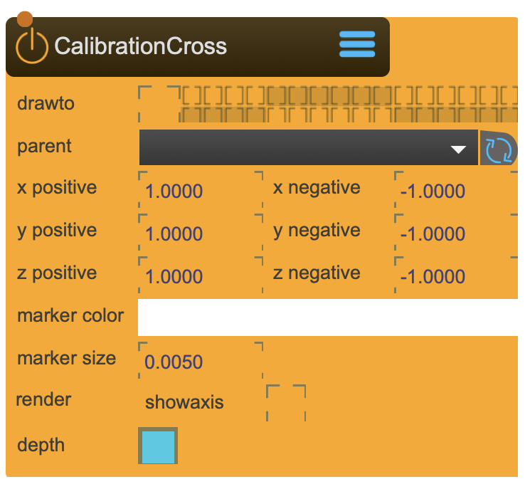

# CalibrationCross

A helper to get oriented in 3D space

<figure markdown>
{ width="300" }
</figure> 

## Reference

The following properties can be configured for this node:

=== "Properties"

    | Property | Type | Description |
    |----------|------|-------------|
    | `drawto` | - | set the render group |
    | `parent` | - | parent transformation node |
    | `x positive` | (local transformation) | position +x |
    | `x negative` | (local transformation) | position -x |
    | `y positive` | (local transformation) | position +y |
    | `y negative` | (local transformation) | position -y |
    | `z positive` | (local transformation) | position +z |
    | `z negative` | (local transformation) | position -z |
    | `marker color` | rgba | color of rendered points |
    | `marker size` | int | size of marker point |
    | `show axis` | bool | show axis |
    | `depth` | bool | use depth layer |

=== "Inlets"

    | Inlet      | Type          | Description                            |
    |------------|---------------|----------------------------------------|
    | properties | properties | properties &#124; use message [set &lt;propertyPath> &lt;value(s)>] (without node/&lt;nodeName> at the beginning) to set internal properties |

=== "Outlets"

    | Outlet     | Type          | Description                            |
    |------------|---------------|----------------------------------------|

---

*Last updated: 2025-12-01 | [Edit this page on GitHub](https://github.com/immersive-arts/Sparck2/edit/main/docs/nodes/Grid.md)*
