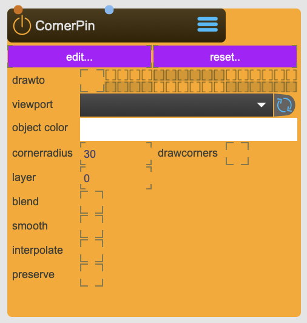

# CornerPin

Provides controls for mapping textures to an output window by repositioning the image corners.

It is the most simple and easy to use mapping nodes at SPARCK's disposal

<figure markdown>
{ width="300" }
</figure> 

## Reference

The following properties can be configured for this node:

=== "Properties"

    | Property | Type | Description |
    |----------|------|-------------|
    | `edit` | - | sets the focus of the editor window to this node |
    | `reset` | - | resets the corner pins to their default positions |
    | `drawto` | - | set the render group. Capture/Beamer/3DViewer have an equivalent in which you can choose which group to render. |
    | `viewport` | - | select viewport this cornerpin is directly rendered to. Inside the viewport node you should set the mesh to 'off' |
    | `object color` | - | object color |
    | `corner radius` | - | size of the handles |
    | `drawcorners` | - | draws to handles in the final rendering |
    | `layer` | - | depth layer (works best with depth-buffering off) |
    | `smooth` | - | smooth rendering |
    | `blend` | - | enables blendmode |
    | `blendmode` | - | choose blendmode: <li>alphablend <li>add <li>multiply <li>screen <li>exclusion <li>colorblend <li>coloradd <li>alphaadd |
    | `interpolate` | - | use interpolation |
    | `preserve aspect` | - | preserve aspect ratio |

=== "Inlets"

    | Inlet      | Type          | Description                            |
    |------------|---------------|----------------------------------------|
    | properties | messages      | direct access to internal properties   |
    | texture    | texture       | texture applied to ...                 |

=== "Outlets"

    | Outlet     | Type          | Description                            |
    |------------|---------------|----------------------------------------|
    | properties | messages      | direct access to internal properties   |
    | texture    | texture       | texture applied to ...                 |

---

-   :material-clock-fast:{ .lg .middle } __Quick Start__

    ---

    Get started with CornerPin in minutes
    
    * [:octicons-arrow-right-24: Project Examples](../../start/examples/project/project_examples.md)
    * [:octicons-arrow-right-24: Node Examples](../../start/examples/nodes/node_examples.md)

-   :material-file-document:{ .lg .middle } __Complementing__ **CornerPin**

    ---
    * [:octicons-arrow-right-24: MeashWarp](MeashWarp.md) 
    * [:octicons-arrow-right-24: ViewPort](ViewPort.md) 

  
-   :material-video-box:{ .lg .middle } __Tutorials__

    ---
    
    [:octicons-arrow-right-24: Watch Now](../../start/tutorials/videos.md){ .md-button .md-button--primary }

-   :material-forum:{ .lg .middle } __Community__

    ---

    [:octicons-arrow-right-24: Join Now](https://github.com/immersive-arts/Sparck2/discussions){ .md-button .md-button--primary }

---

!!! question "Need help or want to suggest improvements?"
       
    [:fontawesome-brands-github: Report an issue](../../contributing/reporting-a-bug.md){ .md-button }
    [:fontawesome-brands-github: Improve the Docs](../../contributing/reporting-a-docs-issue.md){ .md-button }

---

*Last updated: 2025-12-01 | [Edit this page on GitHub](https://github.com/immersive-arts/Sparck2/edit/main/docs/nodes/CornerPin.md)*
