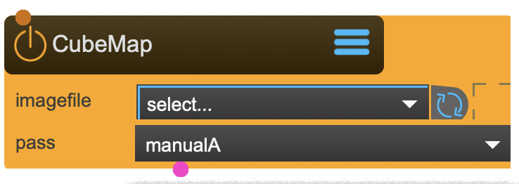

# CubeMap

Loads images files and transforms them into cubemaps.

Cubemaps are used by the SkyBox and Material nodes.

<figure markdown>
{ width="300" }
</figure> 

## Reference

The following properties can be configured for this node:

=== "Properties"

    | Property | Type | Description |
    |----------|------|-------------|
    | `imagefile` | - | loads the file from ~_assets/_textures/_cubemaps |
    | `filewatch` | - | loads automaticaly a changed image file |
    | `pass` | - | select the renderpass |

=== "Inlets"

    | Inlet      | Type          | Description                            |
    |------------|---------------|----------------------------------------|
    | properties | properties | properties &#124; use message [set &lt;propertyPath> &lt;value(s)>] (without node/&lt;nodeName> at the beginning) to set internal properties |
    | cross | texture | cross shape texture holding the 6 faces of the cube |

=== "Outlets"

    | Outlet     | Type          | Description                            |
    |------------|---------------|----------------------------------------|
    | cubemap | cubemap | cubemap texture |

---

*Last updated: 2025-12-01 | [Edit this page on GitHub](https://github.com/immersive-arts/Sparck2/edit/main/docs/nodes/CubeMap.md)*
