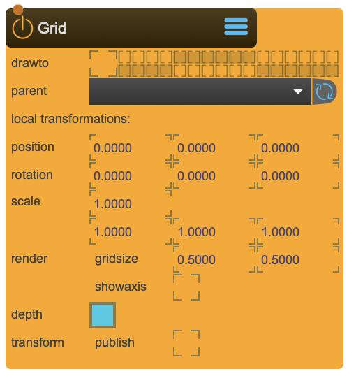

# Grid

A helper to get oriented in 3D space

<figure markdown>
{ width="300" }
</figure> 

## Reference

The following properties can be configured for this node:

=== "Properties"

    | Property | Type | Description |
    |----------|------|-------------|
    | `drawto` | - | set the render group. Capture/Beamer/3DViewer have an equivalent in which you can choose which group to render. |
    | `parent` | - | parent transformation node |
    | `position` | (local transformation) | position x y z |
    | `rotation` | (local transformation) | rotation x y z |
    | `scale` | (local transformation) | scale x y z |
    | `gridsize` | - | grid slice size. |
    | `depth` | - | enable autodepth |
    | `layer` | - | depth layer |
    | `publish transformation` | - | publishes this mode transformation as a transformation node |

=== "Inlets"

    | Inlet      | Type          | Description                            |
    |------------|---------------|----------------------------------------|
    | properties | properties | properties &#124; use message [set &lt;propertyPath> &lt;value(s)>] (without node/&lt;nodeName> at the beginning) to set internal properties |

=== "Outlets"

    | Outlet     | Type          | Description                            |
    |------------|---------------|----------------------------------------|

---

*Last updated: 2025-12-01 | [Edit this page on GitHub](https://github.com/immersive-arts/Sparck2/edit/main/docs/nodes/Grid.md)*
