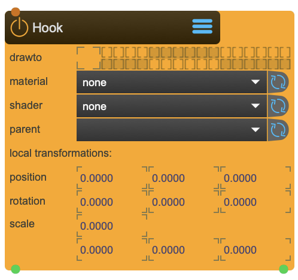

# Hook

A helper to get Jitter objects draw and tranform with SPARCKS render and transform nodes

<figure markdown>
{ width="300" }
</figure> 

## Properties

The following properties can be configured for this node:

=== "Reference"

    | Property | Type | Description |
    |----------|------|-------------|
    | `drawto` | - | set the render group. Capture/Beamer/3DViewer have an equivalent in which you can choose which group to render. |
    | `material` | - | select one of sparcks material nodes |
    | `shader` | - | select one of spracks shader nodes |
    | `parent` | - | parent transformation node |
    | `position` | (local transformation) | position x y z |
    | `rotation` | (local transformation) | rotation x y z |
    | `scale` | (local transformation) | scale x y z |

=== "Workflow"

    1. TBD

---

-   :material-clock-fast:{ .lg .middle } __Quick Start__

    ---

    Get started with Hook in minutes
    
    [:octicons-arrow-right-24: Project Examples](../../start/examples/project_examples.md)

-   :material-file-document:{ .lg .middle } __Complementing__ **Grid**

    ---
    * [:octicons-arrow-right-24: Beamer](Beamer.md) 
    * [:octicons-arrow-right-24: TfmNode](TfmNode.md) 

  
-   :material-video-box:{ .lg .middle } __Tutorials__

    ---
    
    [:octicons-arrow-right-24: Watch Now](../../start/tutorials/videos.md){ .md-button .md-button--primary }

-   :material-forum:{ .lg .middle } __Community__

    ---

    [:octicons-arrow-right-24: Join Now](https://github.com/immersive-arts/Sparck2/discussions){ .md-button .md-button--primary }

---

!!! question "Need help or want to suggest improvements?"
       
    [:fontawesome-brands-github: Report an issue](../../contributing/reporting-a-bug.md){ .md-button }
    [:fontawesome-brands-github: Improve the Docs](../../contributing/reporting-a-docs-issue.md){ .md-button }

---

*Last updated: 2025-12-04 | [Edit this page on GitHub](https://github.com/immersive-arts/Sparck2/edit/main/docs/nodes/Hook.md)*
