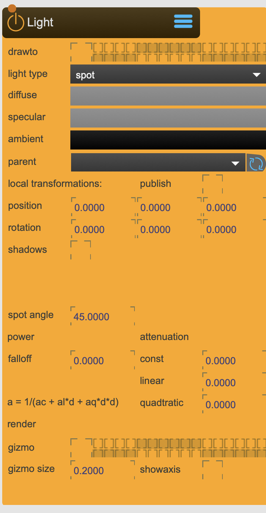

# Light

Contains the properties needed to define a light source in OpenGL. These include light type (directional, point and spot), light color, attenuation, and spot angle and falloff. 

In addition a position (for point and spot) and orientation (for directional and spot) can be defined for a virtual light in 3D space.

<figure markdown>
{ width="300" }
</figure> 


## Properties

The following properties can be configured for this node:

=== "Reference"

    | Property | Type | Description |
    |----------|------|-------------|
    | `parent` | - | parent transformation node |
    | `RenderGroup` | - | set the render group. Capture/Beamer/3DViewer have an equivalent in which you can choose which group to render. |
    | `position` | (local transformation) | position x y z |
    | `rotation` | (local transformation) | rotation x y z |
    | `shadows` | - | Enable shadow casting from this light |
    | `shadowquality` | - | Shadow texture quality. Setting this value affects the dim and type of the internal shadow target: <li>'lo' (type=float16, dim=512) <li>'med-lo' (type=float16, dim=1024) <li>'med' (type=float32, dim=1024) <li>'med-hi' (type=float32, dim=2048) <li>'hi' (type=float32, dim=4096 ) |
    | `shadowblur` | - | Shadow blur amount (default = 0.2). Indicates the width of a gaussian blur performed on the shadow output texture. |
    | `shadowrange` | - | Shadow range value (default = 50.0). For directional lights, this represents the the maximum distance a shadow-caster can be from shadow-receiver. For spot/point lights the maximum range a light will affect other objects. Setting this as low as possible in the scene generally gives better shadow results. |
    | `type` | - | Light type: <li>'point' <li>'directional' <li>'spot' |
    | `spot angle` | - | Defines the cone angle for spot type lights |
    | `atten const` | - | The constant factor in the attenuation formula: 1.0 means never attenuate, 0.0 is complete attenuation. The attenuation parameters determine how the light source diminishes with distance. |
    | `atten linear` | - | The linear factor in the attenuation formula: 1 means attenuate evenly over the distance. The attenuation parameters determine how the light source diminishes with distance. |
    | `atten quad` | - | The quadratic factor in the attenuation formula: adds a curvature to the attenuation formula. The attenuation parameters determine how the light source diminishes with distance. |
    | `fall off` | - | Defines the rate of falloff of the light from the center, to the edges of the cone. Only applies to spot type lights. |
    | `diffuse` | - | diffuse color |
    | `specular` | - | specular color |
    | `ambient` | - | ambient color |
    | `publish transformation` | - | published this light as a transformation node |

=== "Workflow"

    1. TBD


---

## Important Notes

!!! warning "Calibration Requirements"
    
    Multiple jit.gl.light objects can be added to a scene, up to a maximum that is specific to your graphics card. The actual appearance of 3D objects is a combination of the material properties of that object, and the color values of the Loght objects in the scene. The possible color values are ambient, diffuse and specular. For more information, see chapter 5 of the OpenGl Redbook.

!!! info "File Locations"
    
    ```
    ~/_assets/_projectors/     # Calibration files
    ~/_assets/_model/          # Calibration models (.obj)
    ```

---


<div class="grid cards" markdown>

-   :material-clock-fast:{ .lg .middle } __Quick Start__

    ---

    Get started with Light in minutes
    
    [:octicons-arrow-right-24: Calibration Guide](../../start/tutorials/201/calibration.md)

-   :material-file-document:{ .lg .middle } __Complementing__ **Light**

    ---
    * [:octicons-arrow-right-24: Model](Model.md) 
    * [:octicons-arrow-right-24: Material](Material.md) 
    * [:octicons-arrow-right-24: TfmNode](TfmNode.md) 
    * [:octicons-arrow-right-24: SceneCapture](SceneCapture.md) 

  
-   :material-video-box:{ .lg .middle } __Tutorials__

    ---
    
    [:octicons-arrow-right-24: Watch Now](../../start/tutorials/videos.md){ .md-button .md-button--primary }

-   :material-forum:{ .lg .middle } __Community__

    ---

    [:octicons-arrow-right-24: Join Now](https://github.com/immersive-arts/Sparck2/discussions){ .md-button .md-button--primary }


</div>

---

!!! question "Need help or want to suggest improvements?"
       
    [:fontawesome-brands-github: Report an issue](../../contributing/reporting-a-bug.md){ .md-button }
    [:fontawesome-brands-github: Improve the Docs](../../contributing/reporting-a-docs-issue.md){ .md-button }


---

*Last updated: 2025-12-01 | [Edit this page on GitHub](https://github.com/immersive-arts/Sparck2/edit/main/docs/nodes/Light.md)*
