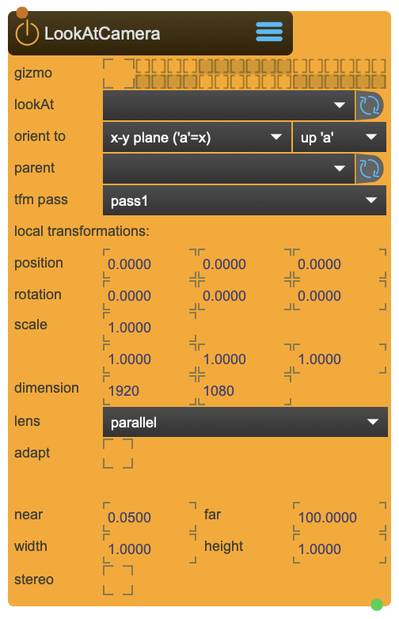

# LookAtCamera

Camera in 3D space with buildin lookat functionality. The node  will orient the camera in such a way, that the near-clip plane will lie on the lookat plane. To be used to create controlled cuts through objects or cave-like VR experiences

LookAtCamera represents the virtual camera chassis, while SceneCapture represents the virtual film: For capturing the textures SceneCapture is needed.

<figure markdown>
{ width="300" }
</figure> 

## Reference

The following properties can be configured for this node:

=== "Properties"

    | Property | Type | Description |
    |----------|------|-------------|
    | `gizmo` | - | show Camera icon on 3DViewer |
    | `look at` | - | transformation node to look at |
    | `orient to` | - | local lookat plane orientation |
    | `plane up vector` | - | local lookat plane up vector |
    | `parent` | - | parent transformation node |
    | `tfm pass` | - | select transformation pass |
    | `position` | (local transformation) | position x y z |
    | `rotation` | (local transformation) | rotation x y z |
    | `scale` | (local transformation) | scale x y z |
    | `dimension` | - | suggested capture dimension |
    | `lens` | - | lens type |
    | `adapt` | - | automatically adapt frustum to distance from lookat plane |
    | `adapt factor` | - | adjust the adaptation |
    | `ratio` | - | view ratio |
    | `angle` | - | field of view |
    | `width` | - | width |
    | `height` | - | height |
    | `near` | - | near frustum clip |
    | `far` | - | far frustum clip |

=== "Inlets"

    | Inlet      | Type          | Description                            |
    |------------|---------------|----------------------------------------|
    | properties | properties | properties &#124; use message [set &lt;propertyPath> &lt;value(s)>] (without node/&lt;nodeName> at the beginning) to set internal properties |

=== "Outlets"

    | Outlet     | Type          | Description                            |
    |------------|---------------|----------------------------------------|
    | camera | message | camera intrinsics [vi_matrix, v_matrix, p_patrix, worldpos, worldquat, frustum] |

---

-   :material-clock-fast:{ .lg .middle } __Quick Start__

    ---

    Get started with LookAtCamera in minutes
    
    * [:octicons-arrow-right-24: Project Examples](../../start/examples/project/project_examples.md)
    * [:octicons-arrow-right-24: Node Examples](../../start/examples/nodes/node_examples.md)

-   :material-file-document:{ .lg .middle } __Complementing__ **LookAtCamera**

    ---
    * [:octicons-arrow-right-24: SceneCapture](SceneCapture.md) 
    * [:octicons-arrow-right-24: BoxMapCamera](BoxMapCamera.md) 
    * [:octicons-arrow-right-24: TfmNode](TfmNode.md) 
    * [:octicons-arrow-right-24: TfmLookAt](TfmLookAt.md) 

  
-   :material-video-box:{ .lg .middle } __Tutorials__

    ---
    
    [:octicons-arrow-right-24: Watch Now](../../start/tutorials/videos.md){ .md-button .md-button--primary }

-   :material-forum:{ .lg .middle } __Community__

    ---

    [:octicons-arrow-right-24: Join Now](https://github.com/immersive-arts/Sparck2/discussions){ .md-button .md-button--primary }

---

!!! question "Need help or want to suggest improvements?"
       
    [:fontawesome-brands-github: Report an issue](../../contributing/reporting-a-bug.md){ .md-button }
    [:fontawesome-brands-github: Improve the Docs](../../contributing/reporting-a-docs-issue.md){ .md-button }

*Last updated: 2025-12-01 | [Edit this page on GitHub](https://github.com/immersive-arts/Sparck2/edit/main/docs/nodes/LookAtCamera.md)*
