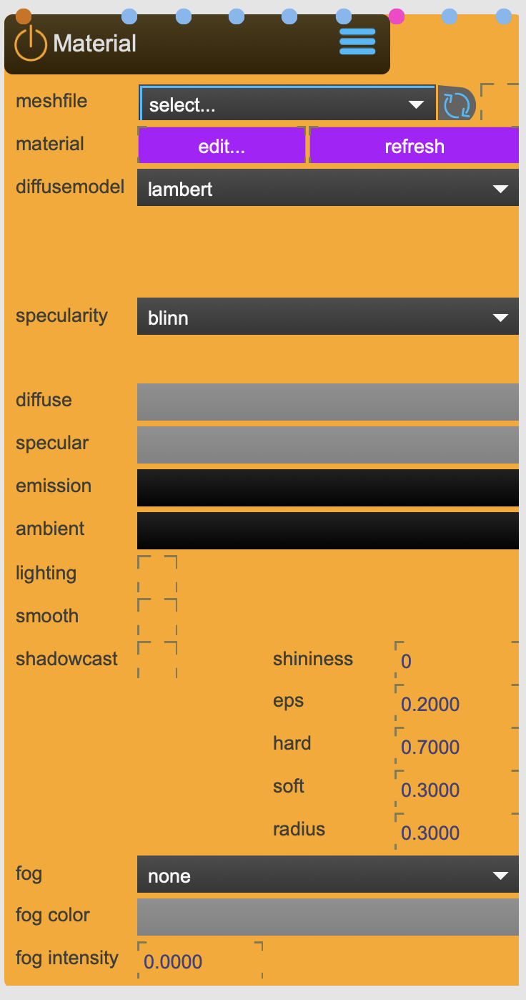

# Material

Produces shaders for high quality rendering that automatically adapt to texture inputs and the number of active lights.

<figure markdown>
{ width="300" }
</figure> 


## Reference

The following properties can be configured for this node:

=== "Properties"

    | Property | Type | Description |
    |----------|------|-------------|
    | `Material file` | - | load a material file (needs to be in the MaxMSP-Jitter Material format) |
    | `E` | - | refresh properties from material editor |
    | `R` | - | open material editor |
    | `diffuse model` | - | Diffuse shading model: <li>'lambert' (Lambertian diffuse shading) <li>'oren_nayer' (Oren-Nayer diffuse shading) <li>'toon' (Toon diffuse shading) <li>'minnaert' (Minnaert diffuse shading) |
    | `diffuse size` | - | Diffuse toon component size. Only valid when the diffuse shading model is toon. |
    | `diffuse smooth` | - | Diffuse toon component smoothness. Only valid when the diffuse shading model is toon. |
    | `diffuse darkness` | - | Material darkness. Only valid when the diffuse shading model is minnaert. |
    | `specular model` | - | Specular shading model : <li>'blinn' (Blinn specular shading) <li>'phong' (Phong specular shading) <li>'toon' (Toon specular shading) <li>'ward' (Ward specular shading) <li>'cook_torrance' (Cook-Torrance specular shading) |
    | `specular size` | - | Specular toon component size. Only valid when the specular shading model is toon. |
    | `specular smooth` | - | Specular toon component smoothness. Only valid when the specular shading model is toon. |
    | `fog` | - | Fog type: <li>'none' (No fog) <li>'linear' (Linear fog) <li>'exp' (Exponential fog) <li>'exp2' (Squared exponential fog) |
    | `fog density` | - | density |
    | `fog range` | - | range |
    | `fog color` | - | fog color |
    | `diffuse` | - | diffuse color |
    | `specular` | - | specular color |
    | `ambient` | - | ambient color |
    | `emission` | - | emission color |
    | `lighting` | - | lets the model react to light sources |
    | `shadowcaster` | - | lets the model cast shadows |
    | `smooth` | - | smooth rendering |
    | `shininess` | - | shininess |
    | `shadow eps` | - | Shadow epsilon (eps) modifies the shape of shadows, and corrects self-shadowing error (default = 0.2). This value is used when the bound object is a shadow-receiver. |
    | `shadow radius` | - | Adjust shadow blur radius (default = 0.3). This value is used when the bound object is a shadow-receiver. |
    | `shadow hard` | - | Adjust shadow hardness (default = 0.7). This value is used when the bound object is a shadow-receiver. |
    | `shadow soft` | - | Adjust shadow softness (default = 0.3). Overwrites shadow_radius and shadow_hard properties. This value is used when the bound object is a shadow-receiver. |

=== "Inlets"

    | Inlet      | Type          | Description                            |
    |------------|---------------|----------------------------------------|
    | properties | properties | properties &#124; use message [set &lt;propertyPath> &lt;value(s)>] (without node/&lt;nodeName> at the beginning) to set internal properties |
    | diffuse | texture | diffuse texture |
    | specular | texture | specular texture |
    | ambient | texture | ambient texture |
    | emission | texture | emission texture |
    | normal | texture | normal texture |
    | cubemap | cubemap | cubemap texture |
    | heightmap | texture | heightmap texture |
    | glossmap | texture | glossmap texture |

=== "Outlets"

    | Outlet     | Type          | Description                            |
    |------------|---------------|----------------------------------------|


---

## Important Notes

!!! warning "Calibration Requirements"
    
    text here

!!! info "File Locations"
    
    ```
    ~/_assets/_shaders/_materials     # Calibration files
    ```

---


<div class="grid cards" markdown>

-   :material-clock-fast:{ .lg .middle } __Quick Start__

    ---

    Get started with Material in minutes
    
    * [:octicons-arrow-right-24: Project Examples](../../start/examples/project/project_examples.md)
    * [:octicons-arrow-right-24: Node Examples](../../start/examples/nodes/node_examples.md)

-   :material-file-document:{ .lg .middle } __Complementing__ **Material**

    ---
    * [:octicons-arrow-right-24: Model](Model.md) 
    * [:octicons-arrow-right-24: Light](Light.md) 

  
-   :material-video-box:{ .lg .middle } __Tutorials__

    ---
    
    [:octicons-arrow-right-24: Watch Now](../../start/tutorials/videos.md){ .md-button .md-button--primary }

-   :material-forum:{ .lg .middle } __Community__

    ---

    [:octicons-arrow-right-24: Join Now](https://github.com/immersive-arts/Sparck2/discussions){ .md-button .md-button--primary }


</div>

---

!!! question "Need help or want to suggest improvements?"
       
    [:fontawesome-brands-github: Report an issue](../../contributing/reporting-a-bug.md){ .md-button }
    [:fontawesome-brands-github: Improve the Docs](../../contributing/reporting-a-docs-issue.md){ .md-button }


*Last updated: 2025-12-01 | [Edit this page on GitHub](https://github.com/immersive-arts/Sparck2/edit/main/docs/nodes/Material.md)*
