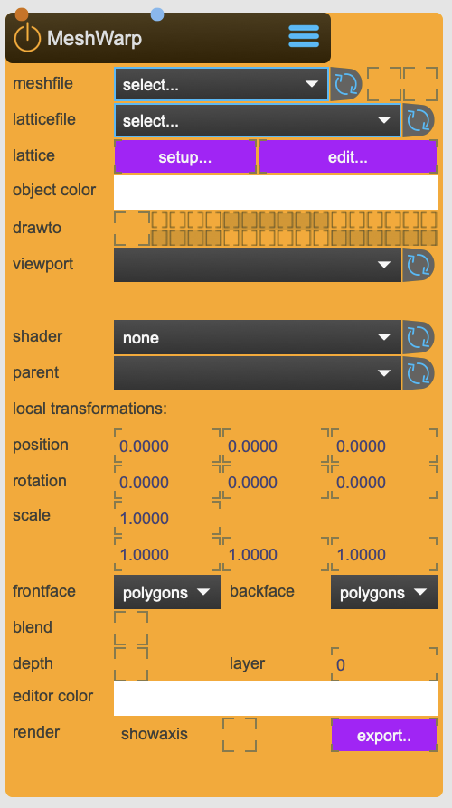

# MeshWarp

Reads and draws 2D model Wavefront OBJ

It is used for mesh warping and can be directly rendered into a ViewPort

<figure markdown>
{ width="300" }
</figure> 


## Reference

The following properties can be configured for this node:

=== "Properties"

    | Property | Type | Description |
    |----------|------|-------------|
    | `mesh` | drag n' drop | select the 3d model file to draw. the file needs to be located inside the ~/_assets/_models/_warps folder. you can also drag'n drop files, which will be copied into the _warps folder and autmatically selected. It needs to be of type Wavefront OBJ. |
    | `lattice` | - | SPARCKs own MeshWarp file format. It contains the mesh data plus the lattice data. You need to save this file if you want to keep your modifications. |
    | `new lattice` | - | creates a new lattice that is applied on the loaded mesh. |
    | `edit` | - | focuses the editor on this node |
    | `export` | - | exports the final mesh (Wavefront OBJ) to the ~/_export folder. The file will be named after the node. |
    | `RenderGroup` | - | set the render group. Capture/Beamer/3DViewer have an equivalent in which you can choose which group to render. |
    | `transform` | - | Modelview and projection transform reset flag (default = 0) When the flag is set, the modelview and projection transforms are set to the identity transform before rendering the object. This is useful for sprite or billboard overlays, or automatic scaling to window size. The transform_reset flag modes are: <li>0 = do nothing (default) <li>1 = proportional orthographic glOrtho(-aspect, aspect, -1.0, 1.0, near_clip, far_clip) <li>2 = orthographic normalized glOrtho(-1.0, 1.0, -1.0, 1.0, near_clip, far_clip) <li>3 = proportional perspective with near clip = 0.001 gluPerspective(lens_angle, aspect, 0.001/*near_clip*/, far_clip) <li>4 = normalized perspective with near clip = 0.001 gluPerspective(lens_angle, 1.0, 0.001/*near_clip*/, far_clip); |
    | `parent` | - | parent transformation node |
    | `position` | (local transformation) | position x y z |
    | `rotation` | (local transformation) | rotation x y z |
    | `scale` | (local transformation) | scale x y z |
    | `shader` | - | link to Shader Node |
    | `color` | - | object color |
    | `depth` | - | depth buffering |
    | `blend` | - | enables blendmode |
    | `blendmode` | - | choose blendmode: <li>alphablend <li>add <li>multiply <li>screen <li>exclusion <li>colorblend <li>coloradd <li>alphaadd |
    | `displaylist` | - | enables displaylist - can speed up drawing |
    | `cachemode` | - | choose cachemode: <li>vertexarray <li>displaylist <li>vertexbuffer <li>immediate |
    | `polymode` | draw.. | <li>polygons - only faces <li>lines - only lines <li>points - only vertices |
    | `axes` | - | show axes of the models origin |
    | `fileWatch` | - | watches the model file. when it changes, it will be autmatically reloaded |

=== "Inlets"

    | Inlet      | Type          | Description                            |
    |------------|---------------|----------------------------------------|
    | properties | properties | properties &#124; use message [set &lt;propertyPath> &lt;value(s)>] (without node/&lt;nodeName> at the beginning) to set internal properties |
    | main | texture | main texture |

=== "Outlets"

    | Outlet     | Type          | Description                            |
    |------------|---------------|----------------------------------------|


---

## Important Notes

!!! warning "Calibration Requirements"
    
    List of supported file types:
    - Wavefront Object Model File - .obj is the only file format.

!!! info "File Locations"
    
    ```
    ~/_assets/_projectors/     # Calibration files
    ~/_assets/_model/          # Calibration models (.obj)
    ```

---


<div class="grid cards" markdown>

-   :material-clock-fast:{ .lg .middle } __Quick Start__

    ---

    Get started with MeshWarp in minutes
    
    * [:octicons-arrow-right-24: Project Examples](../../start/examples/project/project_examples.md)
    * [:octicons-arrow-right-24: Node Examples](../../start/examples/nodes/node_examples.md)

-   :material-file-document:{ .lg .middle } __Complementing__ **MeshWarp**

    ---
    * [:octicons-arrow-right-24: ViewPort](ViewPort.md) 
    * [:octicons-arrow-right-24: CornerPin](CornerPin.md) 

  
-   :material-video-box:{ .lg .middle } __Tutorials__

    ---
    
    [:octicons-arrow-right-24: Watch Now](../../start/tutorials/videos.md){ .md-button .md-button--primary }

-   :material-forum:{ .lg .middle } __Community__

    ---

    [:octicons-arrow-right-24: Join Now](https://github.com/immersive-arts/Sparck2/discussions){ .md-button .md-button--primary }


</div>

---

!!! question "Need help or want to suggest improvements?"
       
    [:fontawesome-brands-github: Report an issue](../../contributing/reporting-a-bug.md){ .md-button }
    [:fontawesome-brands-github: Improve the Docs](../../contributing/reporting-a-docs-issue.md){ .md-button }


*Last updated: 2025-12-01 | [Edit this page on GitHub](https://github.com/immersive-arts/Sparck2/edit/main/docs/nodes/MeshWarp.md)*
