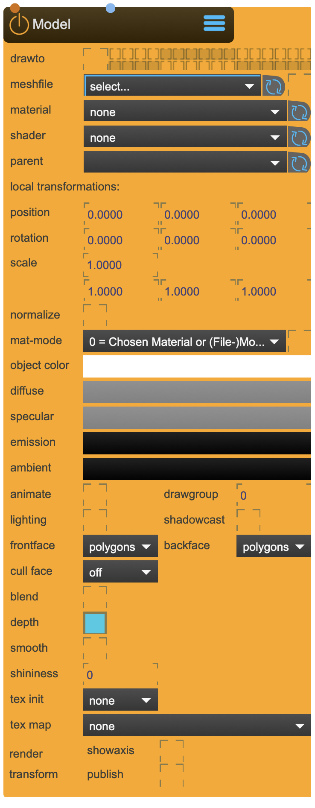

# Model

Reads and draws a variety of 3D model formats such as OBJ and Collada (see complete list under notes)

Only tesselated polygons are drawn and surfaces that are not tesselated are converted before drawing

the model node is primarily used for drawing models, while its sister-node 'Canvas' should be used for virtual projections.

<figure markdown>
{ width="300" }
</figure> 


## Reference

The following properties can be configured for this node:

=== "Properties"

    | Property | Type | Description |
    |----------|------|-------------|
    | `file` | drag n' drop | select the model file to draw. the file needs to be located inside the ~/_assets/_model folder. you can also drag'n drop file, which will be copied into the _model folder and autmatically selected. |
    | `parent` | - | parent transformation node |
    | `RenderGroup` | - | set the render group. Capture/Beamer/3DViewer have an equivalent in which you can choose which group to render. |
    | `position` | (local transformation) | position x y z |
    | `rotation` | (local transformation) | rotation x y z |
    | `scale` | (local transformation) | scale x y z |
    | `normalize` | - | normalizes the model |
    | `shader` | - | link to Shader Node |
    | `material` | - | link to Material Node |
    | `defaut texture` | - | default texture |
    | `texture map` | - | generates texture map |
    | `materialmode` | - | choose material mode |
    | `autmaterial` | - | can improove rendering result |
    | `color` | - | object color |
    | `diffuse` | - | diffuse color |
    | `specular` | - | specular color |
    | `ambient` | - | ambient color |
    | `emission` | - | emission color |
    | `lighting` | - | lets the model react to light sources |
    | `shadowcaster` | - | lets the model cast shadows |
    | `depth` | - | depth buffering |
    | `layer` | - | depth layer (works best with depth-buffering off) |
    | `smooth` | - | smooth rendering |
    | `angle` | - | edge angle for smooth rendering |
    | `blend` | - | enables blendmode |
    | `blendmode` | - | choose blendmode: <li>alphablend <li>add <li>multiply <li>screen <li>exclusion <li>colorblend <li>coloradd <li>alphaadd |
    | `displaylist` | - | enables displaylist - can speed up drawing |
    | `cachemode` | - | choose cachemode: <li>vertexarray <li>displaylist <li>vertexbuffer <li>immediate |
    | `cullface` | - | choose cullface: <li>0=Off <li>1=Back <li>2=Front |
    | `drawgroup` | - | if the model has drawgroups, choose. |
    | `polymode` | draw.. | <li>polygons - only faces <li>lines - only lines <li>points - only vertices |
    | `antialias` | - | use antialias |
    | `axes` | - | show axes of the models origin |
    | `nodeaxes` | - | if modesl has nodes, show axes of the nodes |
    | `matrixouput` | - | ouputs the faces as a jitter matrix on the dumpout outlet |
    | `fileWatch` | - | watches the model file. when it changes, it will be autmatically reloaded |
    | `publish transformation` | - | publishes this mode transformation as a transformation node |

=== "Inlets"

    | Inlet      | Type          | Description                            |
    |------------|---------------|----------------------------------------|
    | properties | messages      | direct access to internal properties   |
    | texture    | texture       | texture applied to ...                 |

=== "Outlets"

    | Outlet     | Type          | Description                            |
    |------------|---------------|----------------------------------------|
    | properties | messages      | direct access to internal properties   |
    | texture    | texture       | texture applied to ...                 |


---

## Important Notes

!!! warning "Calibration Requirements"
    
    List of supported file types:
    - Wavefront Object Model File - .obj is the prefered file format. SPARCK likes it.
    - 3D GameStudio Model File - .mdl
    - 3ds Max 3DS Model File - .3ds
    - 3ds Max ASE Model File - .ase
    - 3D GameStudio Terrain File - .hmp
    - AC3D Model File - .ac
    - AutoCAD DXF Model File - .dxf
    - Biovision BVH Motion Capture File - .bvh
    - BlitzBasic 3D Model File - .b3d
    - CharacterStudio Motion Capture File - .csm
    - Collada Model File - .dae
    - Direct X Model File - .x
    - Doom 3 Model File - .md5
    - Irrlicht Mesh File - .irrmesh
    - Irrlicht Scene File - .irr
    - Izware Nendo Model File - .ndo
    - LightWave Model File - .lwo
    - Milkshape 3D Model File - .ms3d
    - Modo Model File - .lxo
    - Neutral File Format File - .nff
    - Object File Format File - .off
    - Ogre3D XML Model File - .mesh.xml
    - PovRAY Raw Model File - .raw
    - Quake I Mesh File - .mdl
    - Quake II Mesh File - .md2
    - Quake III Mesh File - .md3
    - Quake III BSP File - .pk3
    - Quick3D Q3D Model File - .q3d
    - Quick3D Q3S Model File - .q3s
    - Return to Castle Wolfenstein Model File - .mdc
    - Sense8 WorldToolKit File - .nff
    - Stanford Polygon Library Model File - .ply
    - Stereolithography Model File - .stl
    - Terragen Terrain File - .ter
    - TrueSpace COB Model File - .cob
    - TrueSpace SCB Model File - .scb
    - Valve SMD Model File - .smd
    - Valve VTA Model File - .vta

!!! info "File Locations"
    
    ```
    ~/_assets/_projectors/     # Calibration files
    ~/_assets/_model/          # Calibration models (.obj)
    ```

---


<div class="grid cards" markdown>

-   :material-clock-fast:{ .lg .middle } __Quick Start__

    ---

    Get started with Model in minutes
    
    * [:octicons-arrow-right-24: Project Examples](../../start/examples/project/project_examples.md)
    * [:octicons-arrow-right-24: Node Examples](../../start/examples/nodes/node_examples.md)

-   :material-file-document:{ .lg .middle } __Complementing__ **Model**

    ---
    * [:octicons-arrow-right-24: Canvas](Canvas.md) 
    * [:octicons-arrow-right-24: SceneCapture](SceneCapture.md) 
    * [:octicons-arrow-right-24: TfmNode](TfmNode.md) 
    * [:octicons-arrow-right-24: Material](Material.md) 

  
-   :material-video-box:{ .lg .middle } __Tutorials__

    ---
    
    [:octicons-arrow-right-24: Watch Now](../../start/tutorials/videos.md){ .md-button .md-button--primary }

-   :material-forum:{ .lg .middle } __Community__

    ---

    [:octicons-arrow-right-24: Join Now](https://github.com/immersive-arts/Sparck2/discussions){ .md-button .md-button--primary }


</div>

---

!!! question "Need help or want to suggest improvements?"
       
    [:fontawesome-brands-github: Report an issue](../../contributing/reporting-a-bug.md){ .md-button }
    [:fontawesome-brands-github: Improve the Docs](../../contributing/reporting-a-docs-issue.md){ .md-button }


---

*Last updated: 2025-12-01 | [Edit this page on GitHub](https://github.com/immersive-arts/Sparck2/edit/main/docs/nodes/Model.md)*
