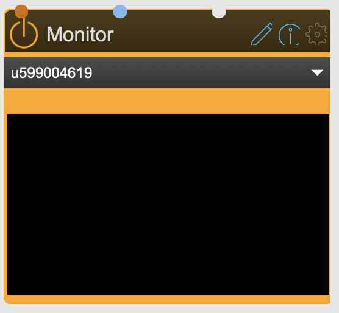

# Monitor

It displays the attached texture

This node should only be used for debugging purposes. It is very resource hungry and can affect the performance of your patch

<figure markdown>
{ width="300" }
</figure> 


## Reference

The following properties can be configured for this node:

=== "Properties"

    | Property | Type | Description |
    |----------|------|-------------|
    | `Name` | - | give it a more meaning full name. |
    | `PropertyOne` | TEXT HERE | and more text here. |

=== "Inlets"

    | Inlet      | Type          | Description                            |
    |------------|---------------|----------------------------------------|
    | properties | messages      | direct access to internal properties   |
    | texture    | texture       | texture applied to ...                 |

=== "Outlets"

    | Outlet     | Type          | Description                            |
    |------------|---------------|----------------------------------------|
    | properties | messages      | direct access to internal properties   |
    | texture    | texture       | texture applied to ...                 |


---

## Important Notes

!!! warning "Calibration Requirements"
    
    It is really very resource hungry. For a more permament texture inspection your are adviced to use a Window-ViewPort - pair.

!!! info "File Locations"
    
    ```
    ~/_assets/_projectors/     # Calibration files
    ~/_assets/_model/          # Calibration models (.obj)
    ```

---


<div class="grid cards" markdown>

-   :material-clock-fast:{ .lg .middle } __Quick Start__

    ---

    Get started with Monitor in minutes
    
    * [:octicons-arrow-right-24: Project Examples](../../start/examples/project/project_examples.md)
    * [:octicons-arrow-right-24: Node Examples](../../start/examples/nodes/node_examples.md)

-   :material-file-document:{ .lg .middle } __Complementing__ **Monitor**

    ---
    * [:octicons-arrow-right-24: ViewPort](ViewPort.md) 
    * [:octicons-arrow-right-24: Window](Window.md) 

  
-   :material-video-box:{ .lg .middle } __Tutorials__

    ---
    
    [:octicons-arrow-right-24: Watch Now](../../start/tutorials/videos.md){ .md-button .md-button--primary }

-   :material-forum:{ .lg .middle } __Community__

    ---

    [:octicons-arrow-right-24: Join Now](https://github.com/immersive-arts/Sparck2/discussions){ .md-button .md-button--primary }


</div>

---

!!! question "Need help or want to suggest improvements?"
       
    [:fontawesome-brands-github: Report an issue](../../contributing/reporting-a-bug.md){ .md-button }
    [:fontawesome-brands-github: Improve the Docs](../../contributing/reporting-a-docs-issue.md){ .md-button }


---

*Last updated: 2025-12-01 | [Edit this page on GitHub](https://github.com/immersive-arts/Sparck2/edit/main/docs/nodes/Monitor.md)*
