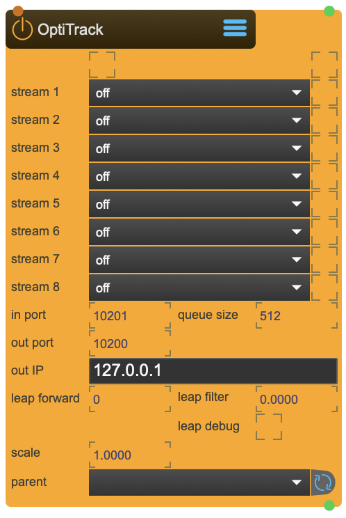

# OptiTrack

Optitrack is a commercialy available optical tracking system.

In order to use it with SPARCK, you need the NatNet2Osc App.

<figure markdown>
{ width="300" }
</figure> 


## Reference

The following properties can be configured for this node:

=== "Properties"

    | Property | Type | Description |
    |----------|------|-------------|
    | `reply indicator` | - | lights up when bidirectional connection to motive works |
    | `connection indicator` | - | lights up when optitrack data is received |
    | `stream 1 - 8` | - | chosen optitrack rigidbody to be used with rigidbody abstraction |
    | `in port` | - | listening port, port where the NatNet2Osc-app send the osc stream. |
    | `out port` | - | sending port, NatNetThree2Osc-app listening port to receive commands. |
    | `out port IP` | - | sending IP address, where the NatNetThree2Osc-app runs. |
    | `leap forward` | - | calculate forward prediction. [ms] |
    | `leap filter` | - | smooth forward prediction. [%] |
    | `parent` | - | parent transformation node |
    | `scale` | (local transformation) | scale in x y z |

=== "Inlets"

    | Inlet      | Type          | Description                            |
    |------------|---------------|----------------------------------------|
    | properties | messages      | direct access to internal properties   |
    | texture    | texture       | texture applied to ...                 |

=== "Outlets"

    | Outlet     | Type          | Description                            |
    |------------|---------------|----------------------------------------|
    | properties | messages      | direct access to internal properties   |
    | texture    | texture       | texture applied to ...                 |


---

## Important Notes

!!! warning "Calibration Requirements"
    
    Optitrack streams its data in its own format called NatNet. The NatNet2Osc application listens to the Optitrack application and transforms the data into the OpenSoundControl protocol and passes it on to SPARCK.

!!! info "File Locations"
    
    ```
    ~/_assets/_projectors/     # Calibration files
    ~/_assets/_model/          # Calibration models (.obj)
    ```

---


<div class="grid cards" markdown>

-   :material-clock-fast:{ .lg .middle } __Quick Start__

    ---

    Get started with OptiTrack in minutes
    
    * [:octicons-arrow-right-24: Project Examples](../../start/examples/project/project_examples.md)
    * [:octicons-arrow-right-24: Node Examples](../../start/examples/nodes/node_examples.md)

-   :material-file-document:{ .lg .middle } __Complementing__ **OptiTrack**

    ---
    * [:octicons-arrow-right-24: Rigidbody](Rigidbody.md) 

  
-   :material-video-box:{ .lg .middle } __Tutorials__

    ---
    
    [:octicons-arrow-right-24: Watch Now](../../start/tutorials/videos.md){ .md-button .md-button--primary }

-   :material-forum:{ .lg .middle } __Community__

    ---

    [:octicons-arrow-right-24: Join Now](https://github.com/immersive-arts/Sparck2/discussions){ .md-button .md-button--primary }


</div>

---

!!! question "Need help or want to suggest improvements?"
       
    [:fontawesome-brands-github: Report an issue](../../contributing/reporting-a-bug.md){ .md-button }
    [:fontawesome-brands-github: Improve the Docs](../../contributing/reporting-a-docs-issue.md){ .md-button }


---

*Last updated: 2025-12-01 | [Edit this page on GitHub](https://github.com/immersive-arts/Sparck2/edit/main/docs/nodes/OptiTrack.md)*
