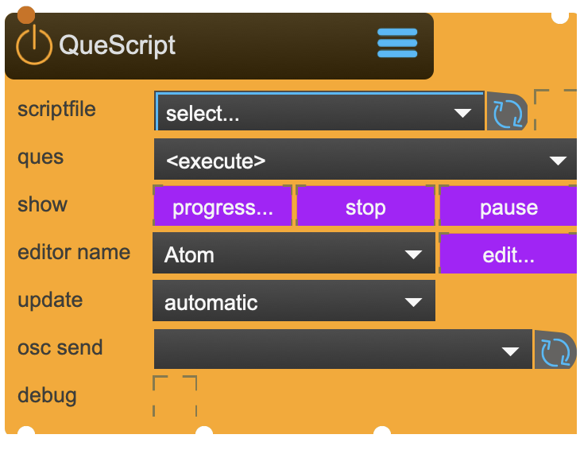

# QueScript

Que Script is SPARCK own super powerfull scripting language.

You find a nice introduction following the link 'Reference' below.

The implementation of QueScript inside SPARCK follows certain idiosyncracies that are described down below.

<figure markdown>
{ width="300" }
</figure> 


## Properties

The following properties can be configured for this node:

=== "Reference"

    | Property | Type | Description |
    |----------|------|-------------|
    | `scriptfile` | - | load and execute que script |
    | `fileWatch` | - | reloads the script file if it has changed by an external editor. Usually a good idea while you are editing. |
    | `ques` | - | lists all ques inside the script and allows you to manually execute the chosen one. |
    | `progress..` | - | shows how each que is progressing |
    | `pause / play` | - | pauses / plays the execution |
    | `stop` | - | stops the execution |
    | `Editor` | - | select your prefered editor or add your own. |
    | `edit` | - | edit the loaded file. You can set your prefered editor inside properties. |
    | `update mode` | - | there are two modes to choose: <li>automatic will update the script with each frame-pass. <li>custom will allow you to set your own update frequency. |
    | `frequency` | - | custom update frequency |
    | `osc send` | - | Que script can create OSC messages, but needs an OscSend node to send them to. |
    | `debug` | - | will output debug information to the console |

=== "Workflow"

    1. TBD


---

## Important Notes

!!! warning "Calibration Requirements"
    
    WueScript-commands like <send>, <print>, <osc>, <out>, <trigger> are dealt with in the following way:
    <send> will send the message to the internal dispatcher. It is the only way to control SPARCK parameters. an example would be: 
	<send>/sparck/node ::QueScript::property::autostart 1</send>
    <print> will send the message to the console. an example would be: 
	<print>script passed this point...</print>
    <osc> will send the message to the linked OscSend node you set in the properties. an example would be: 
	<osc>/my/custom/oscmessage parameter 34</osc>
    <out> will send the message out of the 'out' outled of the node. an example would be: 
	<out>slowly drained creativity</out>
    <trigger> will send a trigger message out of the 'trigger' outled of the node. an example would be: 
	<trigger>completely drained creativity</trigger>
    
The QueScriptNode can also be remotely controlled via OSC.
    Que-commands like 'play', 'pause', 'resume' and 'stop' are sent to the node in the following OSC-format:
    - /sparck/node/Your_QueScript_NodeName play <que-name>
    - /sparck/node/Your_QueScript_NodeName pause <que-name>
    - /sparck/node/Your_QueScript_NodeName resume <que-name>
    - /sparck/node/Your_QueScript_NodeName stop <que-name>
    Variables can be sent to the QueScript. They will belong to the <script> scope (as mentioned in the reference) and are sent to the node in the following OSC-format:
    - /sparck/node/Your_QueScript_NodeName var <var-name> <var-value> (<var-values>)
    All variables sent to the Node this way can be cleared with the reset command:
    - /sparck/node/Your_QueScript_NodeName reset
    Trigger messages can be sent to the QueScript. They are sent to all currently running que's and are sent to the node in the following OSC-format:
    - /sparck/node/Your_QueScript_NodeName trigger <trigger-value> (<trigger-value2> <trigger-value3> ...)

!!! info "File Locations"
    
    ```
    ~/_assets/_projectors/     # Calibration files
    ~/_assets/_model/          # Calibration models (.obj)
    ```

---


<div class="grid cards" markdown>

-   :material-clock-fast:{ .lg .middle } __Quick Start__

    ---

    Get started with QueScript in minutes
    
    [:octicons-arrow-right-24: Calibration Guide](../../start/tutorials/201/calibration.md)

-   :material-file-document:{ .lg .middle } __Complementing__ **QueScript**

    ---
    * [:octicons-arrow-right-24: OscSend](OscSend.md) 

  
-   :material-video-box:{ .lg .middle } __Tutorials__

    ---
    
    [:octicons-arrow-right-24: Watch Now](../../start/tutorials/videos.md){ .md-button .md-button--primary }

-   :material-forum:{ .lg .middle } __Community__

    ---

    [:octicons-arrow-right-24: Join Now](https://github.com/immersive-arts/Sparck2/discussions){ .md-button .md-button--primary }


</div>

---

!!! question "Need help or want to suggest improvements?"
       
    [:fontawesome-brands-github: Report an issue](../../contributing/reporting-a-bug.md){ .md-button }
    [:fontawesome-brands-github: Improve the Docs](../../contributing/reporting-a-docs-issue.md){ .md-button }


---

*Last updated: 2025-12-01 | [Edit this page on GitHub](https://github.com/immersive-arts/Sparck2/edit/main/docs/nodes/QueScript.md)*
