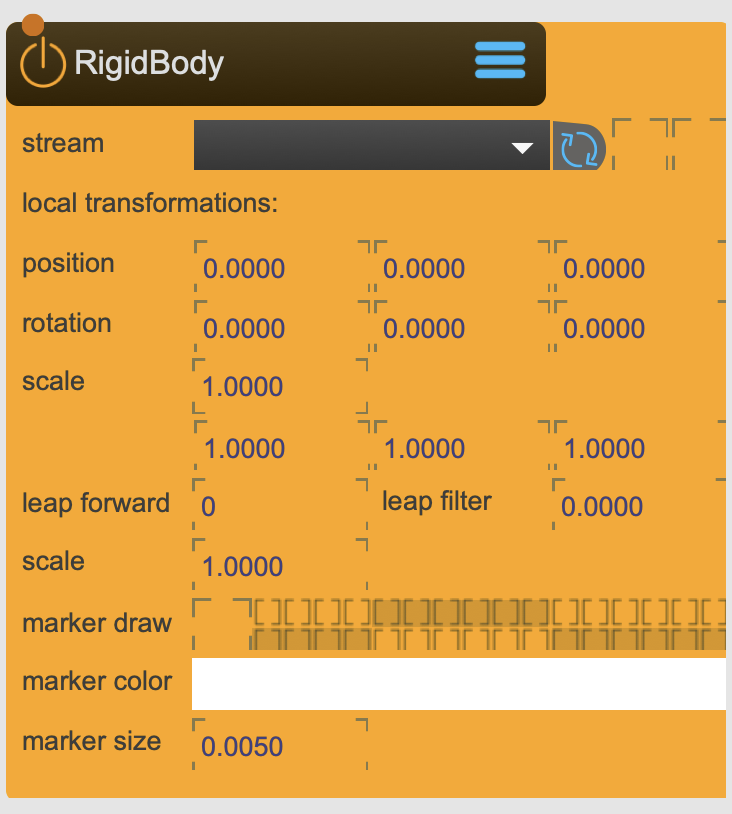

# RigidBody

The Rigidbody Node represents a transformation (position, rotation and scale) in 3D space received from the [OptiTrack] node. It can be connected to almost all nodes that have a representation in 3D space.

It can also be used to establish parent-child relationships in a hirarchical transformation structure, where child nodes are transformed relative to their parents

<figure markdown>
{ width="300" }
</figure> 

## Reference

The following properties can be configured for this node:

=== "Properties"

    | Property | Type | Description |
    |----------|------|-------------|
    | `stream` | - | link to stream provided by the [OptiTrack] node |
    | `position` | (local transformation) | position x y z |
    | `rotation` | (local transformation) | rotation x y z |
    | `scale` | (local transformation) | scale x y z |
    | `leap forward` | [milliseconds] | if value is positive, it calculates forward predicted position. If value is negative, it queues the transformation for the amout of time (i.e. to make it synchronous with video feed that takes longer to capture) |
    | `leap filter` | - | noise filter |
    | `scale` | - | scaling of translation values only |
    | `marker draw` | - | if marker information is sent, it can be drawn to this render groups |
    | `marker color` | - | if marker are drawn, color of marker |
    | `marker size` | - | if marker are drawn, size of marker |

!!! info Connection and Stream indicators
    The two boxes behind the 'stream' property indicate if there is a connection to the OptiTrack system and if the data is alive.

[OptiTrack]: ./OptiTrack.md

=== "Inlets"

    | Inlet      | Type          | Description                            |
    |------------|---------------|----------------------------------------|
    | properties | messages      | direct access to internal properties   |
    | texture    | texture       | texture applied to ...                 |

=== "Outlets"

    | Outlet     | Type          | Description                            |
    |------------|---------------|----------------------------------------|
    | properties | messages      | direct access to internal properties   |
    | texture    | texture       | texture applied to ...                 |

---

-   :material-clock-fast:{ .lg .middle } __Quick Start__

    ---

    Get started with TfmNode in minutes
    
    * [:octicons-arrow-right-24: Project Examples](../../start/examples/project/project_examples.md)
    * [:octicons-arrow-right-24: Node Examples](../../start/examples/nodes/node_examples.md)

-   :material-file-document:{ .lg .middle } __Complementing__ **TfmNode**

    ---
    * [:octicons-arrow-right-24: TfmMerge](TfmMerge.md) 
    * [:octicons-arrow-right-24: TfmNodeInfo](TfmNodeInfo.md) 
    * [:octicons-arrow-right-24: TfmLookAt](TfmLookAt.md) 
    * [:octicons-arrow-right-24: TfmMirror](TfmMirror.md) 

  
-   :material-video-box:{ .lg .middle } __Tutorials__

    ---
    
    [:octicons-arrow-right-24: Watch Now](../../start/tutorials/videos.md){ .md-button .md-button--primary }

-   :material-forum:{ .lg .middle } __Community__

    ---

    [:octicons-arrow-right-24: Join Now](https://github.com/immersive-arts/Sparck2/discussions){ .md-button .md-button--primary }

---

!!! question "Need help or want to suggest improvements?"
       
    [:fontawesome-brands-github: Report an issue](../../contributing/reporting-a-bug.md){ .md-button }
    [:fontawesome-brands-github: Improve the Docs](../../contributing/reporting-a-docs-issue.md){ .md-button }

---

*Last updated: 2025-12-01 | [Edit this page on GitHub](https://github.com/immersive-arts/Sparck2/edit/main/docs/nodes/TfmNode.md)*
