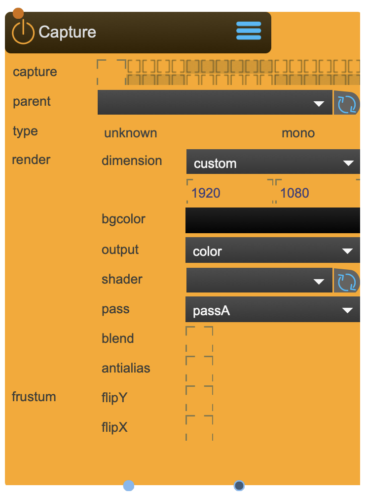

# SceneCapture

The SceneCapture node is needed to render the view from a SceneCamera.

While SceneCamera represents the virtual camera chassis, SceneCapture represents the virtual film: For capturing the textures SceneCapture is needed.

<figure markdown>
{ width="300" }
</figure> 

## Reference

The following properties can be configured for this node:

=== "Properties"

    | Property | Type | Description |
    |----------|------|-------------|
    | `capture` | - | render group to draw. Model/Canvas/MeshWarp/Grid have an equivalent in which you can choose which group to draw to. |
    | `parent` | - | select the camera node from where to render. |
    | `type` | (set by the Camera selection) | can be one of the following: <li>off <li>camera capture <li>beamer capture <li>beamer mirror <li>special capture <li>special mirror |
    | `stereo` | (set by the Camera selection) | shows if the linked camera is stereo. If it is stereo, the Capture-node will have two texture outlets. |
    | `dim` | - | sets the texture size of this render pass. Beware: If used in conjunction with a Camera, the Camera will set the aspect ratio. Dim will only define the resolution of the rendered texture. |
    | `shader` | - | Applies this shader to all objects rendered in this renderpass. |
    | `bgcolor` | - | the background color |
    | `pass` | - | Renderpass. This defines when in a frame-pass (see reference) this Capure node does the rendering. A manual renderpass will only be executed right after loading a project or when pressing the 'manual renderpass button' in the main menu. |
    | `blend` | - | use alpha channels in textures |
    | `antialias` | - | render with antialias |
    | `flip image` | - | flips the rendered image |

=== "Inlets"

    | Inlet      | Type          | Description                            |
    |------------|---------------|----------------------------------------|
    | properties | properties | properties &#124; use message [set &lt;propertyPath> &lt;value(s)>] (without node/&lt;nodeName> at the beginning) to set internal properties |

=== "Outlets"

    | Outlet     | Type          | Description                            |
    |------------|---------------|----------------------------------------|
    | captured | texture | captured texture (left if stereo) |
    | if | texture | if stereo: captured right texture |

---

-   :material-clock-fast:{ .lg .middle } __Quick Start__

    ---

    Get started with SceneCapture in minutes
    
    * [:octicons-arrow-right-24: Project Examples](../../start/examples/project/project_examples.md)
    * [:octicons-arrow-right-24: Node Examples](../../start/examples/nodes/node_examples.md)

-   :material-file-document:{ .lg .middle } __Complementing__ **SceneCapture**

    ---
    * [:octicons-arrow-right-24: SceneCamera](SceneCamera.md) 
    * [:octicons-arrow-right-24: Beamer](Beamer.md) 
    * [:octicons-arrow-right-24: TfmMirror](TfmMirror.md) 

  
-   :material-video-box:{ .lg .middle } __Tutorials__

    ---
    
    [:octicons-arrow-right-24: Watch Now](../../start/tutorials/videos.md){ .md-button .md-button--primary }

-   :material-forum:{ .lg .middle } __Community__

    ---

    [:octicons-arrow-right-24: Join Now](https://github.com/immersive-arts/Sparck2/discussions){ .md-button .md-button--primary }

---

!!! question "Need help or want to suggest improvements?"
       
    [:fontawesome-brands-github: Report an issue](../../contributing/reporting-a-bug.md){ .md-button }
    [:fontawesome-brands-github: Improve the Docs](../../contributing/reporting-a-docs-issue.md){ .md-button }

*Last updated: 2025-12-01 | [Edit this page on GitHub](https://github.com/immersive-arts/Sparck2/edit/main/docs/nodes/SceneCapture.md)*
