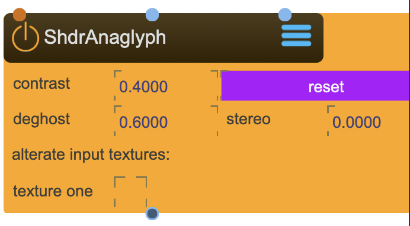

# ShaderAnaglyph

The TextureAnaglyph node takes two input textures, usually a stereo pair, and merges them into a anaglyph texture

The TextureAnaglyph node can be either applied as a shader to a 3d object or a ViewPort node, or used as an explicit texture renderpass to create the anaglyph texture.

<figure markdown>
{ width="300" }
</figure> 

!!! success "Create Stereoscopic 3D for Red-Cyan Glasses"
    ShaderAnaglyph merges a stereo pair (left and right eye views) into a single anaglyph texture viewable with red-cyan 3D glasses. Combined with [SceneCamera](SceneCamera.md) in stereo mode, you can create immersive 3D content for projection mapping, installations, or video output.

## Reference

The following properties can be configured for this node:

=== "Properties"

    | Property | Type | Description |
    |----------|------|-------------|
    | `contrast` | - | contrast between left and right |
    | `deghost` | - | deghosting value |
    | `stereo` | - | stereo texture spread |

=== "Inlets"

    | Inlet      | Type          | Description                            |
    |------------|---------------|----------------------------------------|
    | properties | properties | properties &#124; use message [set &lt;propertyPath> &lt;value(s)>] (without node/&lt;nodeName> at the beginning) to set internal properties |
    | texture | texture | texture left (left eye view) |
    | texture | texture | texture right (right eye view) |

=== "Outlets"

    | Outlet     | Type          | Description                            |
    |------------|---------------|----------------------------------------|
    | texture | texture | anaglyph texture (combined stereo output) |

---

## How Anaglyph Works

!!! info "Stereo to Anaglyph Conversion"
    Anaglyph 3D encodes the left and right eye views into different color channels:
    
    - **Left eye**: Encoded in the red channel
    - **Right eye**: Encoded in the cyan (green + blue) channels
    
    When viewed through red-cyan glasses, each eye sees only its corresponding image, creating the illusion of depth.

## Stereo Pipeline Setup

!!! example "Complete Stereo Rendering Workflow"
    To create anaglyph 3D content from a SPARCK scene:
    
    1. Create a [SceneCamera](SceneCamera.md) and enable **stereo** mode
    2. Configure stereo parameters (`spread` and `rotate`) for comfortable viewing
    3. Create a [SceneCapture](SceneCapture.md) linked to the stereo camera
    4. The SceneCapture outputs two textures (left and right)
    5. Create a **ShaderAnaglyph** node
    6. Connect SceneCapture's left texture to ShaderAnaglyph's first inlet
    7. Connect SceneCapture's right texture to ShaderAnaglyph's second inlet
    8. Use the anaglyph output for display or further processing

## Quality Settings

!!! tip "Adjusting Stereo Quality"
    | Property | Effect | Guidance |
    |----------|--------|----------|
    | **contrast** | Balance between left/right images | Adjust if one eye dominates |
    | **deghost** | Reduces color bleeding between eyes | Increase if you see "ghost" images |
    | **stereo** | Controls texture spread/separation | Fine-tune depth perception |
    
    Start with default values and adjust based on your viewing setup and content.

## Usage Modes

!!! info "Two Ways to Use ShaderAnaglyph"
    
    **As a texture processor:**
    
    - Connect stereo textures to the inlets
    - Use the output texture in other nodes or for display
    
    **As a shader on objects:**
    
    - Apply ShaderAnaglyph directly to a 3D object or [ViewPort](ViewPort.md)
    - The shader processes textures in place during rendering

## Viewing Requirements

!!! note "3D Glasses Required"
    Anaglyph output requires **red-cyan 3D glasses** for proper stereoscopic viewing:
    
    - Red lens over left eye
    - Cyan (blue-green) lens over right eye
    
    Without glasses, the image appears as overlapping red and cyan outlines.

---

-   :material-clock-fast:{ .lg .middle } __Quick Start__

    ---

    Get started with ShaderAnaglyph in minutes
    
    * [:octicons-arrow-right-24: Project Examples](../../start/examples/project/project_examples.md)
    * [:octicons-arrow-right-24: Node Examples](../../start/examples/nodes/node_examples.md)

-   :material-file-document:{ .lg .middle } __Complementing__ **ShaderAnaglyph**

    ---
    * [:octicons-arrow-right-24: SceneCamera](SceneCamera.md) 
    * [:octicons-arrow-right-24: SceneCapture](SceneCapture.md) 
    * [:octicons-arrow-right-24: ViewPort](ViewPort.md)
    * [:octicons-arrow-right-24: LookAtCamera](LookAtCamera.md)

  
-   :material-video-box:{ .lg .middle } __Tutorials__

    ---
    
    [:octicons-arrow-right-24: Watch Now](../../start/tutorials/videos.md){ .md-button .md-button--primary }

-   :material-forum:{ .lg .middle } __Community__

    ---

    [:octicons-arrow-right-24: Join Now](https://github.com/immersive-arts/Sparck2/discussions){ .md-button .md-button--primary }

---

!!! question "Need help or want to suggest improvements?"
       
    [:fontawesome-brands-github: Report an issue](../../contributing/reporting-a-bug.md){ .md-button }
    [:fontawesome-brands-github: Improve the Docs](../../contributing/reporting-a-docs-issue.md){ .md-button }

*Last updated: 2025-12-01 | [Edit this page on GitHub](https://github.com/immersive-arts/Sparck2/edit/main/docs/nodes/ShaderAnaglyph.md)*