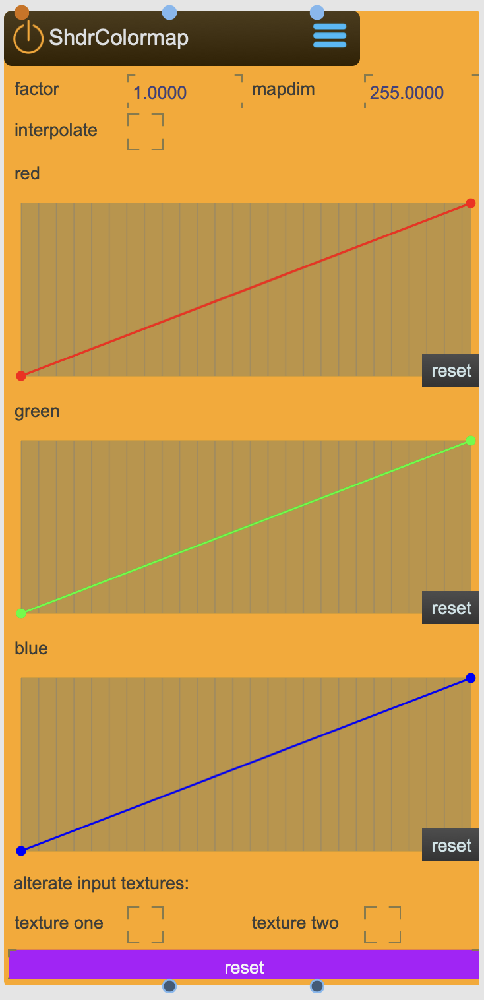

# ShaderColormap

Can be also used as a texture render pass, for two textures.

<figure markdown>
{ width="300" }
</figure> 

## Properties

The following properties can be configured for this node:

=== "Reference"

    | Property | Type | Description |
    |----------|------|-------------|
    | `factor` | - | factor |
    | `map dim` | - | color map dimension |
    | `interpolate` | - | use interpolation on the output texture |
    | `enable` | - | use this node as a texture render pass node. |
    | `red` | - | color map for red channel |
    | `green` | - | color map for green channel |
    | `blue` | - | color map for blue channel |

=== "Workflow"

    1. TBD

---

-   :material-clock-fast:{ .lg .middle } __Quick Start__

    ---

    Get started with ShaderColormap in minutes
    
    [:octicons-arrow-right-24: Calibration Guide](../../start/tutorials/201/calibration.md)

-   :material-file-document:{ .lg .middle } __Complementing__ **ShaderColormap**

    ---
    * [:octicons-arrow-right-24: ShaderTexOP](ShaderTexOP.md) 
    * [:octicons-arrow-right-24: ShaderTexlur](ShaderTexlur.md) 
    * [:octicons-arrow-right-24: ShaderTexZoom](ShaderTexZoom.md) 

  
-   :material-video-box:{ .lg .middle } __Tutorials__

    ---
    
    [:octicons-arrow-right-24: Watch Now](../../start/tutorials/videos.md){ .md-button .md-button--primary }

-   :material-forum:{ .lg .middle } __Community__

    ---

    [:octicons-arrow-right-24: Join Now](https://github.com/immersive-arts/Sparck2/discussions){ .md-button .md-button--primary }

---

!!! question "Need help or want to suggest improvements?"
       
    [:fontawesome-brands-github: Report an issue](../../contributing/reporting-a-bug.md){ .md-button }
    [:fontawesome-brands-github: Improve the Docs](../../contributing/reporting-a-docs-issue.md){ .md-button }

---

*Last updated: 2025-12-01 | [Edit this page on GitHub](https://github.com/immersive-arts/Sparck2/edit/main/docs/nodes/ShaderColormap.md)*
