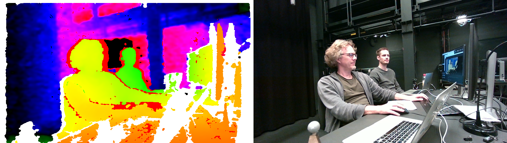

# ShaderPointCloud

Renders ShaderPointClouds in the format of an RGB-D image, where the image is split into the rgb information and the depth encoded information. Works best with [Space-Stream], a python based app that takes live feed from the most common 3d cameras and transfers it into the rgb-d format. [Space-Stream] can stream the video directly via [SpoutReceiver] or [SyphonReceiver] to a SPARCK project. 

[Space-Stream]: https://github.com/cansik/space-stream
[SpoutReceiver]: SpoutReceiver.md
[SyphonReceiver]: SyphonReceiver.md

<figure markdown>
{ width="300" }
</figure> 

!!! success "Live 3D Camera Integration"
    ShaderPointCloud renders real-time point clouds from depth cameras (Intel RealSense, Azure Kinect, etc.) directly in SPARCK. Combined with [Space-Stream](https://github.com/cansik/space-stream), you can capture live 3D environments and integrate them into your projection mapping or Spatial Augmented Reality installations.

## Reference

The following properties can be configured for this node:

=== "Properties"

    | Property | Type | Description |
    |----------|------|-------------|
    | `drawto` | - | set the render group. Capture/Beamer/3DViewer have an equivalent in which you can choose which group to render. |
    | `resolution` | [px] | resolution of the rgb-image (half the width of the received stream) |
    | `encoded` | - | recomended format is 'uniform hue'. choose from 'linear 8bit', 'linear 16bit', 'uniform hue', 'inverse hue', 'hsv' |
    | `point size` | [px] | size of a point in the cloud |
    | `hole detect` | - | tries to fix holes in the point cloud |
    | `principal point` | - | intrinsic lense setting |
    | `focal point` | - | intrinsic lense setting |
    | `distance min` | - | min distance from where the depth encoding starts |
    | `distance max` | - | max distance to where the depth encoding stops |
    | `cull near` | - | min distance from where the points are rendered |
    | `cull far` | - | max distance to where the points are rendered |
    | `frontface` | draw.. | <li>polygons - only faces <li>lines - only lines <li>points - only vertices |
    | `backface` | draw.. | <li>polygons - only faces <li>lines - only lines <li>points - only vertices |
    | `cullface` | - | choose cullface: <li>0=Off <li>1=Back <li>2=Front |
    | `parent` | - | parent transformation node |
    | `position` | (local transformation) | position x y z |
    | `rotation` | (local transformation) | rotation x y z |
    | `scale` | (local transformation) | scale x y z |

=== "Inlets"

    | Inlet      | Type          | Description                            |
    |------------|---------------|----------------------------------------|
    | properties | properties | properties &#124; use message [set &lt;propertyPath> &lt;value(s)>] (without node/&lt;nodeName> at the beginning) to set internal properties |
    | texture | texture | texture one (also used for shader) |

=== "Outlets"

    | Outlet     | Type          | Description                            |
    |------------|---------------|----------------------------------------|

---

## RGB-D Format

!!! info "Understanding the Input Format"
    The RGB-D format combines color and depth information in a single texture:
    
    - **Right half**: RGB color image
    - **Left half**: Depth encoded as color values
    
    The `resolution` property should be set to half the width of the incoming stream (the width of just the RGB portion).

## Depth Encoding Modes

!!! tip "Choosing an Encoding Format"
    The `encoded` property determines how depth values are decoded from the color data:
    
    | Mode | Description | Best For |
    |------|-------------|----------|
    | **uniform hue** | Recommended default — depth encoded as hue values with uniform distribution | Most use cases |
    | **linear 8bit** | Simple linear mapping, 8-bit precision | Low depth range |
    | **linear 16bit** | Linear mapping with 16-bit precision | High precision needs |
    | **inverse hue** | Inverted hue encoding | Special cases |
    | **hsv** | Full HSV color space encoding | Maximum precision |
    
    The encoding must match what your depth camera or Space-Stream is outputting.

## Space-Stream Setup

!!! example "Complete Workflow"
    To stream point clouds from a depth camera to SPARCK:
    
    1. Install [Space-Stream](https://github.com/cansik/space-stream) (Python-based application)
    2. Connect your depth camera (RealSense, Azure Kinect, etc.)
    3. In Space-Stream, select **uniform hue** encoding
    4. **Disable 'normalized intrinsics'** in Space-Stream UI to get absolute values
    5. Start streaming via Spout (Windows) or Syphon (macOS)
    6. In SPARCK, create a [SpoutReceiver](SpoutReceiver.md) or [SyphonReceiver](SyphonReceiver.md)
    7. Connect the receiver output to ShaderPointCloud's texture inlet
    8. Match all intrinsic parameters (see Parameter Matching below)

## Depth Culling

!!! tip "Controlling Visible Range"
    Two sets of distance controls allow fine-tuning:
    
    **Encoding Range** (must match source):
    
    - `distance min`: Where depth encoding starts (near plane of encoding)
    - `distance max`: Where depth encoding ends (far plane of encoding)
    
    **Render Culling** (can be adjusted freely):
    
    - `cull near`: Minimum distance to render points (hides close objects)
    - `cull far`: Maximum distance to render points (hides distant objects)
    
    Use culling to remove unwanted parts of the point cloud (floors, ceilings, background walls).

## Point Rendering

!!! info "Visual Quality Settings"
    - **point size**: Larger values fill gaps but reduce detail; smaller values show more detail but may have visible gaps
    - **hole detect**: Attempts to fill holes in the point cloud — enable for cleaner surfaces
    - **frontface/backface**: Control how points are rendered (polygons, lines, or points)
    - **cullface**: Hide front or back faces to improve performance or visual clarity

---

## Important Notes

!!! warning "Parameter Matching"

    To have the best results receiving point clouds encoded in the RGB-D format, you must ensure these properties match between Space-Stream and ShaderPointCloud:

    * Resolution
    * Principal Point
    * Focal Point
    * Min Distance
    * Max Distance

    [Space-Stream](https://github.com/cansik/space-stream) stores some properties normalized, while this shader takes them absolute. Get absolute values by **disabling 'normalized intrinsics'** in the Space-Stream UI.

---

!!! info "Reference"

    The algorithm of this shader is based on this Intel [whitepaper](https://dev.realsenseai.com/docs/depth-image-compression-by-colorization-for-intel-realsense-depth-cameras). A bug was detected in their math during implementation — this has been corrected in SPARCK's implementation.

-   :material-clock-fast:{ .lg .middle } __Quick Start__

    ---

    Get started with ShaderPointCloud in minutes
    
    * [:octicons-arrow-right-24: Project Examples](../../start/examples/project/project_examples.md)
    * [:octicons-arrow-right-24: Node Examples](../../start/examples/nodes/node_examples.md)

-   :material-file-document:{ .lg .middle } __Complementing__ **ShaderPointCloud**

    ---
    * [:octicons-arrow-right-24: SpoutReceiver](SpoutReceiver.md) 
    * [:octicons-arrow-right-24: SyphonReceiver](SyphonReceiver.md)
  
-   :material-video-box:{ .lg .middle } __Tutorials__

    ---
    
    [:octicons-arrow-right-24: Watch Now](../../start/tutorials/videos.md){ .md-button .md-button--primary }

-   :material-forum:{ .lg .middle } __Community__

    ---

    [:octicons-arrow-right-24: Join Now](https://github.com/immersive-arts/Sparck2/discussions){ .md-button .md-button--primary }

---

!!! question "Need help or want to suggest improvements?"
       
    [:fontawesome-brands-github: Report an issue](../../contributing/reporting-a-bug.md){ .md-button }
    [:fontawesome-brands-github: Improve the Docs](../../contributing/reporting-a-docs-issue.md){ .md-button }

*Last updated: 2025-12-01 | [Edit this page on GitHub](https://github.com/immersive-arts/Sparck2/edit/main/docs/nodes/ShaderPointCloud.md)*