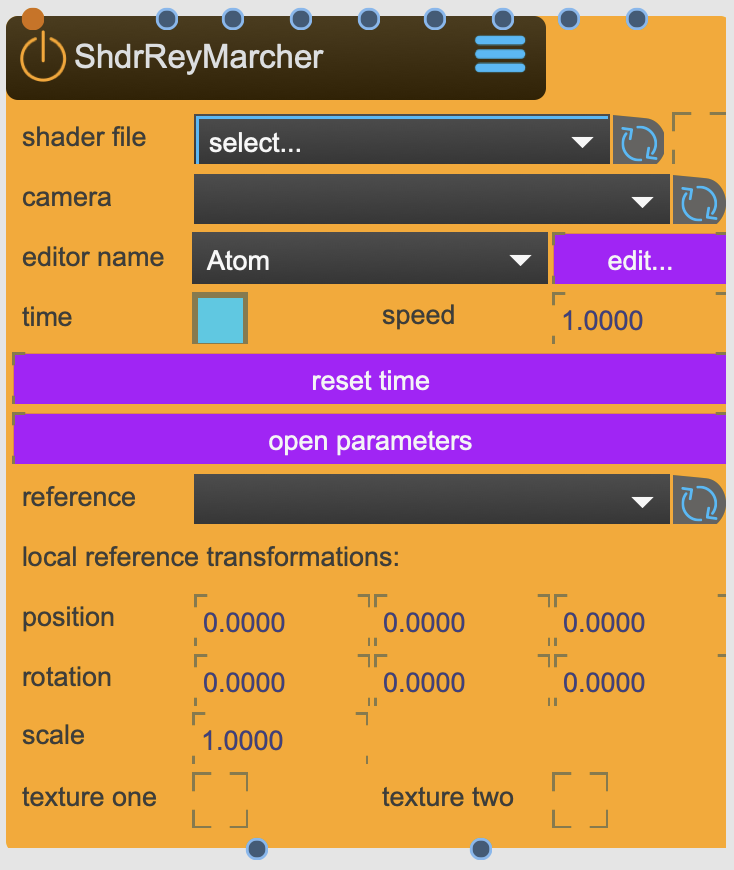

# ShaderRaymarcher

Loads and applies Raymarching GLSL shaders in 3D space. Shaders of the likes you can find on ShaderToy.org

<figure markdown>
{ width="300" }
</figure> 

## Reference

The following properties can be configured for this node:

=== "Properties"

    | Property | Type | Description |
    |----------|------|-------------|
    | `shader` | (drag'n drop) | shader file. Needs to be in the MaxJitter format for GLSL shaders |
    | `filewatch` | - | use filewatch |
    | `camera` | - | BoxMapCamera node. From here are the rays cast outward. |
    | `editor name` | - | choose prefered editor |
    | `edit` | - | open shader with chosen editor |
    | `time` | - | use time |
    | `speed` | - | set speed |
    | `reset time` | - | resets time to zero |
    | `reference` | - | additional transformation node to refer to. |
    | `position` | - | local translations |
    | `rotation` | - | local rotation |
    | `scale` | - | local scale |
    | `texture one` | - | open input for additional texture |
    | `texture two` | - | open input for additional texture |

=== "Inlets"

    | Inlet      | Type          | Description                            |
    |------------|---------------|----------------------------------------|
    | properties | properties | properties &#124; use message [set &lt;propertyPath> &lt;value(s)>] (without node/&lt;nodeName> at the beginning) to set internal properties |
    | texture | texture | texture 0 &lt;param name=tex0 type=int default=0 /> |
    | texture | texture | texture 1 &lt;param name=tex1 type=int default=0 /> |
    | texture | texture | texture 2 &lt;param name=tex2 type=int default=0 /> |
    | texture | texture | texture 3 &lt;param name=tex3 type=int default=0 /> |
    | texture | texture | texture 4 &lt;param name=tex4 type=int default=0 /> |
    | texture | texture | texture 5 &lt;param name=tex5 type=int default=0 /> |
    | texture | texture | texture 6 &lt;param name=tex6 type=int default=0 /> |
    | texture | texture | texture 7 &lt;param name=tex7 type=int default=0 /> |

=== "Outlets"

    | Outlet     | Type          | Description                            |
    |------------|---------------|----------------------------------------|
    | texture | texture | texture one altered |
    | texture | texture | texture two altered |

---

*Last updated: 2025-12-01 | [Edit this page on GitHub](https://github.com/immersive-arts/Sparck2/edit/main/docs/nodes/ShaderRaymarcher.md)*
