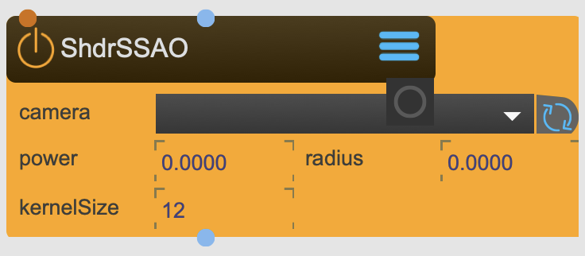

# ShaderSSAO

Adds ambient oclusion to texture.

<figure markdown>
{ width="300" }
</figure> 

## Properties

The following properties can be configured for this node:

=== "Reference"

    | Property | Type | Description |
    |----------|------|-------------|
    | `camera` | - | choose camera. Usually the same from where this texture is captured from |
    | `power` | - | power |
    | `radius` | - | radius |
    | `kernel size` | - | kernel size |

=== "Workflow"

    1. TBD

---

-   :material-clock-fast:{ .lg .middle } __Quick Start__

    ---

    Get started with ShaderSSAO in minutes
    
    [:octicons-arrow-right-24: Project Examples](../../start/examples/project_examples.md)

-   :material-file-document:{ .lg .middle } __Complementing__ **ShaderSSAO**

    ---
    * [:octicons-arrow-right-24: SceneCamera](SceneCamera.md) 
    * [:octicons-arrow-right-24: SceneCapture](SceneCapture.md) 
    * [:octicons-arrow-right-24: Texture](Texture.md) 

  
-   :material-video-box:{ .lg .middle } __Tutorials__

    ---
    
    [:octicons-arrow-right-24: Watch Now](../../start/tutorials/videos.md){ .md-button .md-button--primary }

-   :material-forum:{ .lg .middle } __Community__

    ---

    [:octicons-arrow-right-24: Join Now](https://github.com/immersive-arts/Sparck2/discussions){ .md-button .md-button--primary }

---

!!! question "Need help or want to suggest improvements?"
       
    [:fontawesome-brands-github: Report an issue](../../contributing/reporting-a-bug.md){ .md-button }
    [:fontawesome-brands-github: Improve the Docs](../../contributing/reporting-a-docs-issue.md){ .md-button }

---

*Last updated: 2025-12-01 | [Edit this page on GitHub](https://github.com/immersive-arts/Sparck2/edit/main/docs/nodes/ShaderSSAO.md)*
