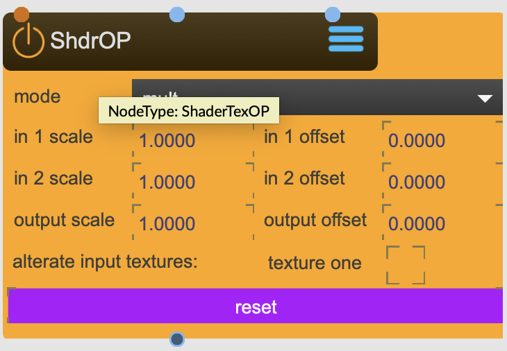

# ShaderTexOP

The TextureOP node applies either a binary operator to two input textures, or a unary operator to the left input texture

<figure markdown>
{ width="300" }
</figure> 

## Properties

The following properties can be configured for this node:

=== "Reference"

    | Property | Type | Description |
    |----------|------|-------------|
    | `mode` | - | operation mode (see details down below) |
    | `in1scale` | - | scale scalar for texture left |
    | `in2scale` | - | scale scalar for texture right |
    | `in1offset` | - | offset scalar for texture left |
    | `in2offset` | - | offset scalar for texture right |
    | `outScale` | - | output offset |
    | `enable` | - | use node for a texture effect render pass |

=== "Workflow"

    1. TBD

---

## Important Notes

!!! Info "Arithmetic Operators"
    
    - mult = multiplication
    - div = division
    - add = addition
    - sub = subtraction
    - mod = modulo
    - min = minimum
    - max = maximum
    - abs = absolute value
    - avg = average
    - absdiff = absolute value of difference
    ... and others...

---

-   :material-clock-fast:{ .lg .middle } __Quick Start__

    ---

    Get started with ShaderTexOP in minutes
    
    [:octicons-arrow-right-24: Calibration Guide](../../start/tutorials/201/calibration.md)

-   :material-file-document:{ .lg .middle } __Complementing__ **ShaderTexOP**

    ---
    * [:octicons-arrow-right-24: ShaderTexBlur](ShaderTexBlur.md) 
    * [:octicons-arrow-right-24: ShaderTexColorMap](ShaderTexColorMap.md) 
    * [:octicons-arrow-right-24: ShaderTexZoom](ShaderTexZoom.md) 

  
-   :material-video-box:{ .lg .middle } __Tutorials__

    ---
    
    [:octicons-arrow-right-24: Watch Now](../../start/tutorials/videos.md){ .md-button .md-button--primary }

-   :material-forum:{ .lg .middle } __Community__

    ---

    [:octicons-arrow-right-24: Join Now](https://github.com/immersive-arts/Sparck2/discussions){ .md-button .md-button--primary }

---

!!! question "Need help or want to suggest improvements?"
       
    [:fontawesome-brands-github: Report an issue](../../contributing/reporting-a-bug.md){ .md-button }
    [:fontawesome-brands-github: Improve the Docs](../../contributing/reporting-a-docs-issue.md){ .md-button }

---

*Last updated: 2025-12-01 | [Edit this page on GitHub](https://github.com/immersive-arts/Sparck2/edit/main/docs/nodes/ShaderTexOP.md)*
