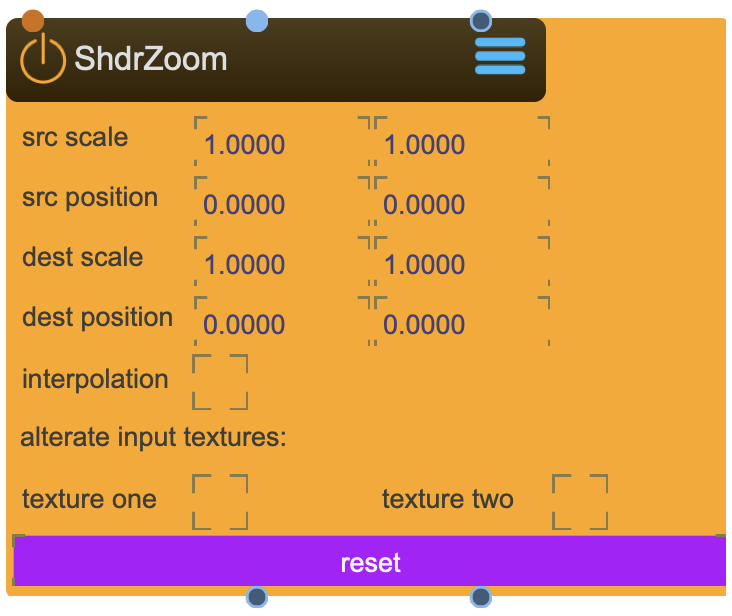

# ShaderTexZoom

Can be also used as a texture render pass, for two textures.

<figure markdown>
{ width="300" }
</figure> 

## Properties

The following properties can be configured for this node:

=== "Reference"

    | Property | Type | Description |
    |----------|------|-------------|
    | `src scale` | - | source x and y scale |
    | `src pos` | - | source x and y position |
    | `dest scale` | - | dest x and y scale |
    | `dest pos` | - | dest x and y position |
    | `interpolate` | - | use interpolation on output texture |
    | `texture one` | - | use this node as texture render pass |
    | `texture two` | - | use this node as texture render pass |

=== "Workflow"

    1. TBD

---

-   :material-clock-fast:{ .lg .middle } __Quick Start__

    ---

    Get started with ShaderTexZoom in minutes
    
    [:octicons-arrow-right-24: Project Examples](../../start/examples/project_examples.md)

-   :material-file-document:{ .lg .middle } __Complementing__ **ShaderTexZoom**

    ---
    * [:octicons-arrow-right-24: ShaderTexOP](ShaderTexOP.md) 
    * [:octicons-arrow-right-24: ShaderTexColorMap](ShaderTexColorMap.md) 
    * [:octicons-arrow-right-24: ShaderTexBlur](ShaderTexBlur.md) 

  
-   :material-video-box:{ .lg .middle } __Tutorials__

    ---
    
    [:octicons-arrow-right-24: Watch Now](../../start/tutorials/videos.md){ .md-button .md-button--primary }

-   :material-forum:{ .lg .middle } __Community__

    ---

    [:octicons-arrow-right-24: Join Now](https://github.com/immersive-arts/Sparck2/discussions){ .md-button .md-button--primary }

---

!!! question "Need help or want to suggest improvements?"
       
    [:fontawesome-brands-github: Report an issue](../../contributing/reporting-a-bug.md){ .md-button }
    [:fontawesome-brands-github: Improve the Docs](../../contributing/reporting-a-docs-issue.md){ .md-button }

---

*Last updated: 2025-12-01 | [Edit this page on GitHub](https://github.com/immersive-arts/Sparck2/edit/main/docs/nodes/ShaderTexZoom.md)*
