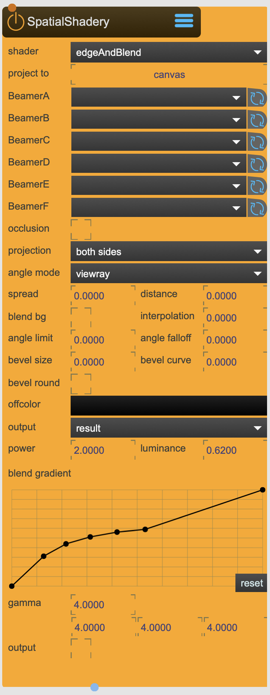

# SpatialShadery

This shader is spatialy aware and is used for multi projector installation where the use of softedge is necessary.

It is mainly used for Spatial Augmented Reality installations where there is the need for the creation of dynamic softedges.

<figure markdown>
{ width="300" }
</figure> 

## Reference

The following properties can be configured for this node:

=== "Properties"

    | Property | Type | Description |
    |----------|------|-------------|
    | `shader` | - | the shader type: <li>'edge' is used in combination with the BlendSoftedge node <li>'edge & blend' calculates softedge combined with the blending. |
    | `project to` | - | projection type: <li>'canvas' is used to render the projector weights <li>'baked texture' implements all render passes for generating the final pixel. |
    | `BeamerA-F` | - | Select the Camera/Beamer from where to project. |
    | `occlusion` | - | tries to adjust for occlusions of objects. |
    | `depth dim` | - | depth texture size of the occlusion pass. |
    | `projection` | - | use only front, back or both side of the canvas |
    | `angle mode` | - | angle differentiation: <li>'viewray' will differentiate based on the angle between the surface normal and the viewray, <li>'direction' will differentiate based on the angle between the surface normal and the camera direction |
    | `spread` | - | spread factor will increase the differentiation between overlapping projections |
    | `distance` | - | use distance as an additional differentiator. It will show its influence when the spread is increased. (0 = no influence) |
    | `blend bg` | - | enables blending with the background |
    | `interpolation` | - | interpolation |
    | `angle limit` | - | angle limit (how much of the visible surface area is considered, 0 = no limit) |
    | `angle falloff` | - | angle-limit falloff (defines the size of the angle blend transition at the angle limit) {/sparck/node ::<nodename>::property::angleFalloff <float>} |
    | `bevel size` | - | bevel size |
    | `bevel curve` | - | bevel curve |
    | `bevel round` | - | use rounded bevel |
    | `offcolor` | - | surface color of uncovered areas |
    | `output` | - | display mode of the model on which this shader is applied onto. <li>'result' shows the final texture <li>'content' shows the input texture <li>'mask' shows the Beamer weights |
    | `power` | - | blend power - softegde blend parameter |
    | `luminance` | - | luminance - softegde blend parameter |
    | `gradient curve` | - | adjusts the softedge curve |
    | `gamma` | - | gamma correction |

=== "Inlets"

    | Inlet      | Type          | Description                            |
    |------------|---------------|----------------------------------------|
    | properties | messages      | direct access to internal properties   |
    | texture    | texture       | texture applied to ...                 |

=== "Outlets"

    | Outlet     | Type          | Description                            |
    |------------|---------------|----------------------------------------|
    | properties | messages      | direct access to internal properties   |
    | texture    | texture       | texture applied to ...                 |

---

-   :material-clock-fast:{ .lg .middle } __Quick Start__

    ---

    Get started with SpatialShadery in minutes
    
    * [:octicons-arrow-right-24: Project Examples](../../start/examples/project/project_examples.md)
    * [:octicons-arrow-right-24: Node Examples](../../start/examples/nodes/node_examples.md)

-   :material-file-document:{ .lg .middle } __Complementing__ **SpatialShadery**

    ---
    * [:octicons-arrow-right-24: BlendSoftedge](BlendSoftedge.md) 
    * [:octicons-arrow-right-24: SceneCapture](SceneCapture.md) 

  
-   :material-video-box:{ .lg .middle } __Tutorials__

    ---
    
    [:octicons-arrow-right-24: Watch Now](../../start/tutorials/videos.md){ .md-button .md-button--primary }

-   :material-forum:{ .lg .middle } __Community__

    ---

    [:octicons-arrow-right-24: Join Now](https://github.com/immersive-arts/Sparck2/discussions){ .md-button .md-button--primary }

---

!!! question "Need help or want to suggest improvements?"
       
    [:fontawesome-brands-github: Report an issue](../../contributing/reporting-a-bug.md){ .md-button }
    [:fontawesome-brands-github: Improve the Docs](../../contributing/reporting-a-docs-issue.md){ .md-button }

---

*Last updated: 2025-12-01 | [Edit this page on GitHub](https://github.com/immersive-arts/Sparck2/edit/main/docs/nodes/SpatialShadery.md)*
