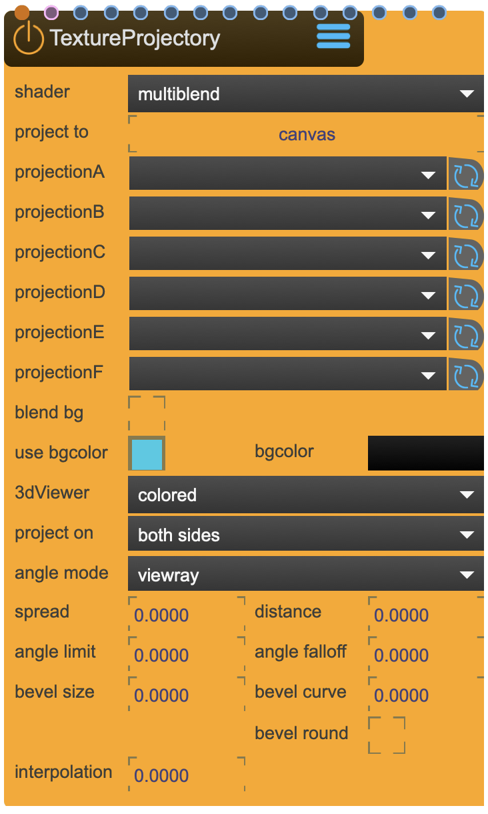

# TextureProjectory

Projects textures outwards from the location of the Camera

This is a shader and can be applied to [Canvas](Canvas.md) nodes.

<figure markdown>
{ width="300" }
</figure> 

!!! note "TextureProjectory vs Beamer"
    Both project content, but serve different purposes:
    
    | TextureProjectory | Beamer |
    |-------------------|--------|
    | **Virtual projection** — projects textures onto 3D surfaces within SPARCK | **Physical projection** — represents real-world projector output |
    | Used for texture mapping, pre-visualization, baking | Used for actual projection mapping installations |
    | Works with SceneCamera, BoxMapCamera | Requires calibration to physical projector |
    | No physical output | Outputs to display/projector hardware |
    
    TextureProjectory lets you virtually project textures onto a virtual canvas, then capture the result with a Beamer to project onto the physical world.

## Reference

The following properties can be configured for this node:

=== "Properties"

    | Property | Type | Description |
    |----------|------|-------------|
    | `shader` | - | choose between the different projection types. <li>'single' to project one texture <li>'multiblend' to project multiple textures <li>'360VR.single' project equirectangular textures. For this the camera needs to be a BoxMapCamera <li>'360VR.multiblend' project normal and equirectangular textures. To project a equirectangular texture, the camera needs to be a BoxMapCamera <li>'boxmap' for projecting boxmap textures |
    | `project to` | - | <li>'canvas' to us it as a standard shader <li>'bake texture' to bake the result into a texture. |
    | `projectionA-F` | - | select the [Beamer](Beamer.md), [SceneCapture](SceneCapture.md) or [BoxMapCapture](BoxMapCapture.md) |
    | `3d viewer` | - | display mode of the model on which this shader is applied onto. <li>'Textured' shows the projected texture(s) <li>'Colored' shows the projections in colors <li>'Overlap' shows the amount of overlap <li>'Map' shows the differentiation <li>'BeamX' shows projection X |
    | `project on` | - | Onto which face of the model this texture is projected: <li>'back' <li>'both sides' <li>'front' |
    | `blend bg` | - | benables blending with the background |
    | `use bgcolor` | - | use this color if no specific background texture is used |
    | `bgcolor` | - | color if no projected texture reaches the surface |
    | `angle mode` | - | angle differentiation: <li>'viewray' will differentiate based on the angle between the surface normal and the viewray, <li>'direction' will differentiate based on the angle between the surface normal and the camera direction. |
    | `spread` | - | spread factor will increase the differentiation between overlapping projections (1 = full spread) |
    | `distance` | - | use distance as an additional differentiator. It will show its influence when the spread is increased. (0 = no influence) |
    | `angle limit` | - | angle limit, how much of the visible surface area is considered (0 = no limit) |
    | `angle falloff` | - | size of falloff gradient at the angle limit |
    | `bevel size` | - | bevel size. it creates a gradient falloff defined by the frustum cone of the camera |
    | `bevel curve` | - | bevel gradient shape |
    | `bevel rounded` | - | use rounded bevel |
    | `interpolation` | - | interpolation correction. if strange artefacts start to appear, raise the value until the artefacts disappear. the artefacts are a result of interpolation errors between the vertex and fragment shader and occur close to the local x-y plane of the camera. increasing the subdivisions of the model can help, too |

=== "Inlets"

    | Inlet      | Type          | Description                            |
    |------------|---------------|----------------------------------------|
    | properties | properties | properties &#124; use message [set &lt;propertyPath> &lt;value(s)>] (without node/&lt;nodeName> at the beginning) to set internal properties |
    | boxmap | boxmap | boxmap (list) |
    | camera | texture | camera A - texture one (mono, if stereo -> left texture) |
    | camera | texture | camera A - texture two (if stereo -> right texture) |
    | camera | texture | camera B - texture one (mono, if stereo -> left texture) |
    | camera | texture | camera B - texture two (if stereo -> right texture) |
    | camera | texture | camera C - texture one (mono, if stereo -> left texture) |
    | camera | texture | camera C - texture two (if stereo -> right texture) |
    | camera | texture | camera D - texture one (mono, if stereo -> left texture) |
    | camera | texture | camera D - texture two (if stereo -> right texture) |
    | camera | texture | camera E - texture one (mono, if stereo -> left texture) |
    | camera | texture | camera E - texture two (if stereo -> right texture) |
    | camera | texture | camera F - texture one (mono, if stereo -> left texture) |
    | camera | texture | camera F - texture two (if stereo -> right texture) |
    | Background | texture | Background texture |

=== "Outlets"

    | Outlet     | Type          | Description                            |
    |------------|---------------|----------------------------------------|

---

## Shader Modes

!!! tip "Choosing the Right Shader Mode"
    TextureProjectory offers five shader modes for different projection scenarios:
    
    | Mode | Description | Camera Type |
    |------|-------------|-------------|
    | **single** | Project one texture from one camera | SceneCamera / LookAtCamera |
    | **multiblend** | Blend multiple textures from multiple cameras | SceneCamera / LookAtCamera |
    | **360VR.single** | Project equirectangular (360°) texture | BoxMapCamera required |
    | **360VR.multiblend** | Blend equirectangular with standard textures | BoxMapCamera required |
    | **boxmap** | Project BoxMap textures (6-face cubemap) | BoxMapCamera required |
    
    For 360° content from external engines (Unreal, Unity, TouchDesigner), use **360VR.single** mode with equirectangular content received via Spout/Syphon.

## Debugging Visualization

!!! info "3D Viewer Display Modes"
    Use the `3d viewer` property to debug and visualize your projection setup:
    
    - **Textured**: Shows the actual projected texture(s) — use for final output
    - **Colored**: Shows each projection source in a unique color — useful for identifying coverage
    - **Overlap**: Visualizes where projections overlap — helps optimize blending
    - **Map**: Shows the differentiation between projections
    - **BeamX**: Shows individual projection X only — isolate specific sources

## Common Workflows

!!! example "Single Texture Projection"
    For projecting a single texture onto a 3D surface:
    
    1. Create a [SceneCamera](SceneCamera.md) or [LookAtCamera](LookAtCamera.md) positioned as your virtual projector
    2. Add a [SceneCapture](SceneCapture.md) linked to the camera
    3. Apply TextureProjectory shader to your [Canvas](Canvas.md)
    4. Set shader mode to **single**
    5. Set `projectionA` to your SceneCapture
    6. Connect your texture to the camera A inlet

!!! example "360° BoxMap Projection"
    For seamless 360° content from external render engines:
    
    1. Create a [BoxMapCamera](BoxMapCamera.md) at your desired viewpoint
    2. Add a [BoxMapCapture](BoxMapCapture.md) linked to the camera
    3. Receive 360° content via [SpoutReceiver](SpoutReceiver.md) or [SyphonReceiver](SyphonReceiver.md)
    4. Apply TextureProjectory shader to your Canvas
    5. Set shader mode to **boxmap**
    6. Connect the BoxMapCapture's boxmap outlet to the boxmap inlet

## Troubleshooting

!!! warning "Interpolation Artifacts"
    If strange visual artifacts appear (especially near the camera's local X-Y plane):
    
    1. Increase the `interpolation` value until artifacts disappear
    2. Alternatively, increase the subdivisions of your target model
    
    These artifacts result from interpolation errors between vertex and fragment shaders.

---

!!! warning "IMPORTANT: Projection Selection"
    This shader is usually applied to a [Canvas](Canvas.md) which in turn is rendered (or captured) by a capture node (be it a [Beamer](Beamer.md), [SceneCapture](SceneCapture.md) or [BoxMapCapture](BoxMapCapture.md)). It is of **utmost** importance that the 'projection' selection points to the capture node that renders the canvas this shader is applied to, otherwise this shader will not work as intended.

---

-   :material-clock-fast:{ .lg .middle } __Quick Start__

    ---

    Get started with TextureProjectory in minutes
    
    * [:octicons-arrow-right-24: Project Examples](../../start/examples/project/project_examples.md)
    * [:octicons-arrow-right-24: Node Examples](../../start/examples/nodes/node_examples.md)

-   :material-file-document:{ .lg .middle } __Complementing__ **TextureProjectory**

    ---
    * [:octicons-arrow-right-24: SceneCamera](SceneCamera.md)
    * [:octicons-arrow-right-24: LookAtCamera](LookAtCamera.md)
    * [:octicons-arrow-right-24: BoxMapCamera](BoxMapCamera.md) 
    * [:octicons-arrow-right-24: SceneCapture](SceneCapture.md)
    * [:octicons-arrow-right-24: BoxMapCapture](BoxMapCapture.md)
    * [:octicons-arrow-right-24: Canvas](Canvas.md)
    * [:octicons-arrow-right-24: SpatialShadery](SpatialShadery.md)
    * [:octicons-arrow-right-24: Beamer](Beamer.md)

  
-   :material-video-box:{ .lg .middle } __Tutorials__

    ---
    
    [:octicons-arrow-right-24: Watch Now](../../start/tutorials/videos.md){ .md-button .md-button--primary }

-   :material-forum:{ .lg .middle } __Community__

    ---

    [:octicons-arrow-right-24: Join Now](https://github.com/immersive-arts/Sparck2/discussions){ .md-button .md-button--primary }

---

!!! question "Need help or want to suggest improvements?"
       
    [:fontawesome-brands-github: Report an issue](../../contributing/reporting-a-bug.md){ .md-button }
    [:fontawesome-brands-github: Improve the Docs](../../contributing/reporting-a-docs-issue.md){ .md-button }

*Last updated: 2025-12-01 | [Edit this page on GitHub](https://github.com/immersive-arts/Sparck2/edit/main/docs/nodes/TextureProjectory.md)*