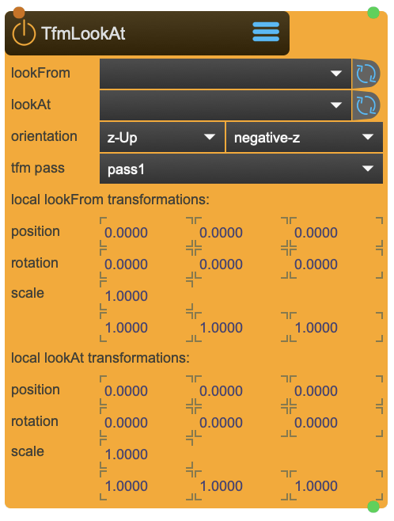

# TfmLookAt

The LookAt transformation takes two transformation nodes: One where to look-from, and one where to look-at.

<figure markdown>
{ width="300" }
</figure> 

## Reference

The following properties can be configured for this node:

=== "Properties"

    | Property | Type | Description |
    |----------|------|-------------|
    | `look from` | - | from where to look |
    | `look at` | - | where to look at |
    | `orientation` | - | axis orientation |
    | `direction` | - | look from look-from to look-at or from look-at to look-from |
    | `transformation pass` | - | select transfromation pass |

=== "Inlets"

    | Inlet      | Type          | Description                            |
    |------------|---------------|----------------------------------------|
    | properties | properties | properties &#124; use message [set &lt;propertyPath> &lt;value(s)>] (without node/&lt;nodeName> at the beginning) to set internal properties |
    | send | message | send direct message to anim object: 'bang' for forced transformation bang. OR 'getlist' &lt;get...> items for dump out current values (needs a bang). Possible &lt;get...> items: getposition, getquat, getscale, getworldpos, getworldquat, getworldscale, gettransform, getinvtransform, getworldtransform |

=== "Outlets"

    | Outlet     | Type          | Description                            |
    |------------|---------------|----------------------------------------|
    | dump | message | dump of 'anim' , output of the requested &lt;get...> values and transformation bang from the above inlet. also outputs 'markerlist' if markers are received. |

---

*Last updated: 2025-12-01 | [Edit this page on GitHub](https://github.com/immersive-arts/Sparck2/edit/main/docs/nodes/TfmLookAt.md)*
