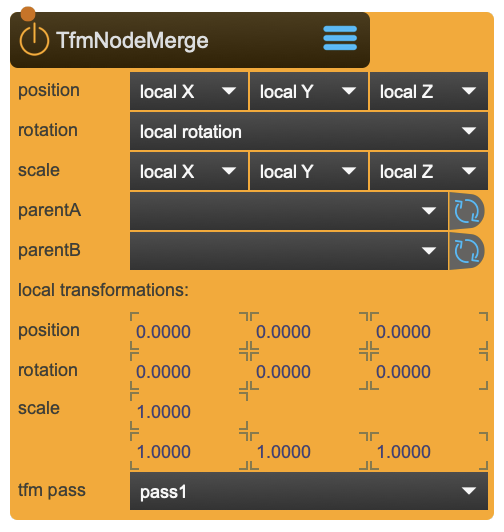

# TfmMerge

The node merges different transformational parts of two differen transformation nodes into one.

<figure markdown>
{ width="300" }
</figure> 

## Reference

The following properties can be configured for this node:

=== "Properties"

    | Property | Type | Description |
    |----------|------|-------------|
    | `parentA` | - | parent A transformation node |
    | `parentB` | - | parent B transformation node |
    | `pos` | - | select the translational part from one of the parents |
    | `rot` | - | select the rotation from one of the parents |
    | `scale` | - | select the scale part from one of the parents |
    | `transformation pass` | - | transformation pass |

=== "Inlets"

    | Inlet      | Type          | Description                            |
    |------------|---------------|----------------------------------------|
    | properties | properties | properties &#124; use message [set &lt;propertyPath> &lt;value(s)>] (without node/&lt;nodeName> at the beginning) to set internal properties |

=== "Outlets"

    | Outlet     | Type          | Description                            |
    |------------|---------------|----------------------------------------|

---

-   :material-clock-fast:{ .lg .middle } __Quick Start__

    ---

    Get started with TfmMerge in minutes
    
    * [:octicons-arrow-right-24: Project Examples](../../start/examples/project/project_examples.md)
    * [:octicons-arrow-right-24: Node Examples](../../start/examples/nodes/node_examples.md)

-   :material-file-document:{ .lg .middle } __Complementing__ **TfmMerge**

    ---
    * [:octicons-arrow-right-24: TfmNode](TfmNode.md) 
    * [:octicons-arrow-right-24: TfmNodeInfo](TfmNodeInfo.md) 
    * [:octicons-arrow-right-24: TfmLookAt](TfmLookAt.md) 
    * [:octicons-arrow-right-24: TfmMirror](TfmMirror.md) 

  
-   :material-video-box:{ .lg .middle } __Tutorials__

    ---
    
    [:octicons-arrow-right-24: Watch Now](../../start/tutorials/videos.md){ .md-button .md-button--primary }

-   :material-forum:{ .lg .middle } __Community__

    ---

    [:octicons-arrow-right-24: Join Now](https://github.com/immersive-arts/Sparck2/discussions){ .md-button .md-button--primary }

---

!!! question "Need help or want to suggest improvements?"
       
    [:fontawesome-brands-github: Report an issue](../../contributing/reporting-a-bug.md){ .md-button }
    [:fontawesome-brands-github: Improve the Docs](../../contributing/reporting-a-docs-issue.md){ .md-button }

*Last updated: 2025-12-01 | [Edit this page on GitHub](https://github.com/immersive-arts/Sparck2/edit/main/docs/nodes/TfmMerge.md)*
