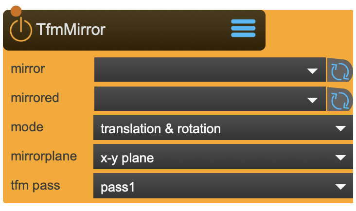

# TfmMirror

The Mirror transformation takes two transformation nodes: One where to set the mirror, and a second one to be mirrored.

the mirrored transformation can also be a Beamer or a Camera -  in this case the node becomes a mirrored Beamer or Camera node and can be used by a Capture node.

<figure markdown>
{ width="300" }
</figure> 

## Reference

The following properties can be configured for this node:

=== "Properties"

    | Property | Type | Description |
    |----------|------|-------------|
    | `mirror` | - | mirror node |
    | `mirrored` | - | mirrored node - can also be a Beamer or Camera node |
    | `mode` | - | the kind of mirror transformation |
    | `mirrorplane` | - | set which two axis become the mirror plane |
    | `transformation pass` | - | select transfromation pass |

=== "Inlets"

    | Inlet      | Type          | Description                            |
    |------------|---------------|----------------------------------------|
    | properties | properties | properties &#124; use message [set &lt;propertyPath> &lt;value(s)>] (without node/&lt;nodeName> at the beginning) to set internal properties |

=== "Outlets"

    | Outlet     | Type          | Description                            |
    |------------|---------------|----------------------------------------|

---

*Last updated: 2025-12-01 | [Edit this page on GitHub](https://github.com/immersive-arts/Sparck2/edit/main/docs/nodes/TfmMirror.md)*
