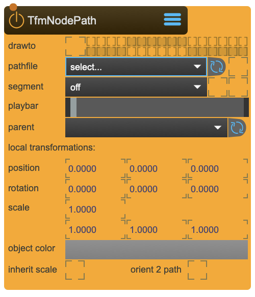

# TfmNodePath

This node allows to load animation paths exported from blender.

The file is created inside Blender with the [TfmPath-Exporter](https://github.com/immersive-arts/Sparck2_tfm_path_exporter) script.

<figure markdown>
{ width="300" }
</figure> 

!!! success "Animate Along Predefined Paths"
    TfmNodePath enables path-based animation by loading curves exported from Blender. Objects can follow these paths using the `playbar` property, which represents the relative position along the path (0.0 = start, 1.0 = end). Combined with [QueScript](QueScript.md), you can create smooth, timeline-based motion along complex 3D curves.

## Reference

The following properties can be configured for this node:

=== "Properties"

    | Property | Type | Description |
    |----------|------|-------------|
    | `drawto` | - | set the render group. Capture/Beamer/3DViewer have an equivalent in which you can choose which group to render. |
    | `file` | - | animation path file |
    | `fileWatch` | - | reload animation path file if it was changes |
    | `segment` | - | segment inside pathfile |
    | `closeSegment` | - | force closing the segement if it has a gap between the first and the last vertice |
    | `playbar` | - | relative position on path. Best animated with QueScript |
    | `parent` | - | parent transformation node |
    | `position` | (local transformation) | position x y z |
    | `rotation` | (local transformation) | rotation x y z |
    | `scale` | (local transformation) | scale x y z |
    | `object color` | - | display color |

=== "Inlets"

    | Inlet      | Type          | Description                            |
    |------------|---------------|----------------------------------------|
    | properties | properties | properties &#124; use message [set &lt;propertyPath> &lt;value(s)>] (without node/&lt;nodeName> at the beginning) to set internal properties |

=== "Outlets"

    | Outlet     | Type          | Description                            |
    |------------|---------------|----------------------------------------|


---

## Playbar Animation

!!! tip "Controlling Path Position"
    The `playbar` property controls where the transformation is positioned along the path:
    
    | Value | Position |
    |-------|----------|
    | **0.0** | Start of path |
    | **0.5** | Middle of path |
    | **1.0** | End of path |
    
    Animate this value to move objects along the path. Values outside 0-1 may extend beyond the path endpoints depending on the path configuration.

## Animating with QueScript

!!! example "Path Animation Workflow"
    Use [QueScript](QueScript.md) to animate the playbar over time:
    
    ```xml
    <script>
      <que name="followPath">
        <anim name="pathMove" duration="10s">
          <track name="pos">0. 1.</track>
          <send>toSparck node/myPathNode/playbar {pos}</send>
        </anim>
      </que>
    </script>
    ```
    
    This animates an object from the start to the end of the path over 10 seconds. Adjust the track values and duration for different motion profiles.

## Creating Path Files in Blender

!!! info "Blender Export Workflow"
    Path files are created in [Blender](https://www.blender.org/) using the [TfmPath-Exporter](https://github.com/immersive-arts/Sparck2_tfm_path_exporter) script:
    
    1. Create a curve or path in Blender
    2. Run the TfmPath-Exporter script
    3. Export the path file
    4. Place the exported file in `~/_assets/_paths/_animations/`
    5. Select the file in TfmNodePath's `file` property
    
    Enable `fileWatch` to automatically reload when the file changes — useful during iterative design in Blender.

## Path Segments

!!! tip "Working with Multiple Segments"
    A single path file can contain multiple segments:
    
    - Use the `segment` property to select which segment to follow
    - Enable `closeSegment` to automatically close paths that have a gap between the first and last vertex
    - Closed paths allow seamless looping animations

## Visualization

!!! info "Displaying the Path"
    - Set `drawto` to render the path curve in a specific render group (e.g., 3DViewer)
    - Adjust `object color` to change the path's display color
    - The path visualization helps during setup and debugging

---

## Important Notes

!!! info "File Locations"
    
    ```
    ~/_assets/_paths/_animations/     # Animation path files
    ```

---

<div class="grid cards" markdown>

-   :material-clock-fast:{ .lg .middle } __Quick Start__

    ---

    Get started with TfmNodePath in minutes
    
    * [:octicons-arrow-right-24: Project Examples](../../start/examples/project/project_examples.md)
    * [:octicons-arrow-right-24: Node Examples](../../start/examples/nodes/node_examples.md)

-   :material-file-document:{ .lg .middle } __Complementing__ **TfmNodePath**

    ---
    * [:octicons-arrow-right-24: TfmNode](TfmNode.md)
    * [:octicons-arrow-right-24: QueScript](QueScript.md)
    * [:octicons-arrow-right-24: Canvas](Canvas.md)
    * [:octicons-arrow-right-24: Model](Model.md)

  
-   :material-video-box:{ .lg .middle } __Tutorials__

    ---
    
    [:octicons-arrow-right-24: Watch Now](../../start/tutorials/videos.md){ .md-button .md-button--primary }

-   :material-forum:{ .lg .middle } __Community__

    ---

    [:octicons-arrow-right-24: Join Now](https://github.com/immersive-arts/Sparck2/discussions){ .md-button .md-button--primary }


</div>

---

!!! question "Need help or want to suggest improvements?"
       
    [:fontawesome-brands-github: Report an issue](../../contributing/reporting-a-bug.md){ .md-button }
    [:fontawesome-brands-github: Improve the Docs](../../contributing/reporting-a-docs-issue.md){ .md-button }


*Last updated: 2025-12-01 | [Edit this page on GitHub](https://github.com/immersive-arts/Sparck2/edit/main/docs/nodes/TfmNodePath.md)*