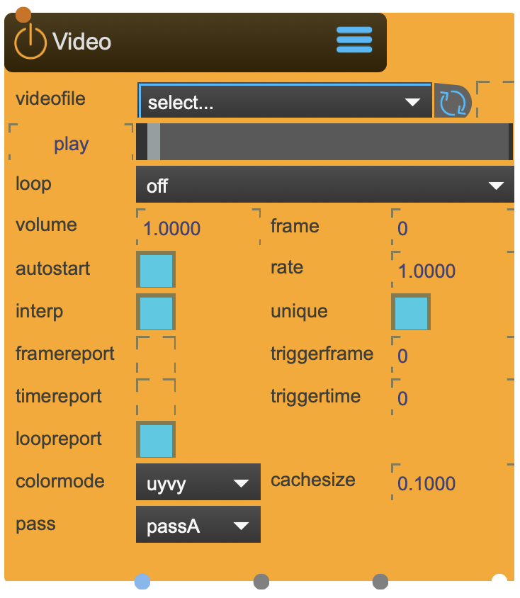

# Video

Video node can playback a variety of video codecs. Most prominently Mov, Avi, Mpg Mpg4 and Hap

Please notice: 
If you want to use the HAP codec running on the GPU, place the video inside the ~/_assets/_videos/_hap folder (recommended). Otherwise the HAP codec will run on the CPU (slower).

<figure markdown>
{ width="300" }
</figure> 


## Properties

The following properties can be configured for this node:

=== "Reference"

    | Property | Type | Description |
    |----------|------|-------------|
    | `file` | - | load and playback file |
    | `dispose` | - | dispose the loaded file |
    | `start` | - | start the video file |
    | `stop` | - | stop the video file |
    | `loop` | - | loop mode |
    | `render pass` | - | select render pass |
    | `rate` | - | playback rate (default = 1) |
    | `autostart` | - | autostart the video after loading it |
    | `volume` | - | if the video has a audio track, adjust it here. |
    | `unique` | - | unique |
    | `frame` | - | choose framenumber |
    | `interp` | - | interpolate |
    | `cache_size` | - | sets the cache size for the video engine. Reverse playback stutters may be the result of insufficient cache_size. Care should be taken when adjusting the cache_size, if the frame cache exceeds the available memory, the application may crash. |
    | `colormode` | - | colormode |
    | `loopreport` | - | reports the end of a loop |
    | `frame endtrigger` | - | sets the trigger in number of frames before the video has reached its end |
    | `time endtrigger` | - | sets the trigger in milliseconds before the video has reached its end |
    | `framereport` | - | reports framenumber and drives the playbar. CAREFULL!! the playbar is resource hungry. |
    | `timereport` | - | reports time in milliseconds. |
    | `filewatch` | - | reloads automatically file if file changes. |

=== "Workflow"

    1. TBD


---

## Important Notes

!!! warning "Calibration Requirements"
    
    - Currently only the follwing codecs are supported:
    - Hap
    - Hap alpha
    - Hap Q
    - Hap Q alpha is NOT supported for playing on the GPU.
    You can send the follwoing OSC-messages to the node 
	/sparck/node/<nodename> start 
	/sparck/node/<nodename> stop 
	/sparck/node/<nodename> pause 
	/sparck/node/<nodename> dispose
    Some info about HAP: Visit the Hap Github page (link on top) for more information. No additional installations are needed for playback, however in order to convert files to Hap codec, additional platform specific installs are necessary.
    Mac users can use the AVF Batch Converter application to convert existing files to use the Hap codec. The mac file format container must be Quicktime MOV.
    Windows users wishing to convert files should install the Renderheads DirectShow codec and use a compatible software such as Adobe Media Encoder. The Windows file format container must be AVI.

!!! info "File Locations"
    
    ```
    ~/_assets/_projectors/     # Calibration files
    ~/_assets/_model/          # Calibration models (.obj)
    ```

---


<div class="grid cards" markdown>

-   :material-clock-fast:{ .lg .middle } __Quick Start__

    ---

    Get started with Video in minutes
    
    [:octicons-arrow-right-24: Project Examples](../../start/examples/project_examples.md)

-   :material-file-document:{ .lg .middle } __Complementing__ **Video**

    ---
    * [:octicons-arrow-right-24: Texture](Texture.md) 

  
-   :material-video-box:{ .lg .middle } __Tutorials__

    ---
    
    [:octicons-arrow-right-24: Watch Now](../../start/tutorials/videos.md){ .md-button .md-button--primary }

-   :material-forum:{ .lg .middle } __Community__

    ---

    [:octicons-arrow-right-24: Join Now](https://github.com/immersive-arts/Sparck2/discussions){ .md-button .md-button--primary }


</div>

---

!!! question "Need help or want to suggest improvements?"
       
    [:fontawesome-brands-github: Report an issue](../../contributing/reporting-a-bug.md){ .md-button }
    [:fontawesome-brands-github: Improve the Docs](../../contributing/reporting-a-docs-issue.md){ .md-button }


---

*Last updated: 2025-12-01 | [Edit this page on GitHub](https://github.com/immersive-arts/Sparck2/edit/main/docs/nodes/Video.md)*
