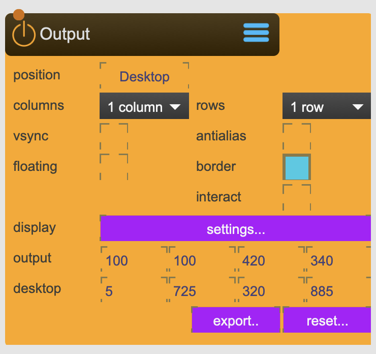

# Window

Used to display the rendered result to an output device like a screen or projector.

The window node can slice its frame into (so called) viewports, arranged in rows and columns. Each slice (viewport) can be addressed with a ViewPort-node.

With the display-setup tool you can easily define the windows output size and postion relative to the desktop display.

<figure markdown>
{ width="300" }
</figure> 

!!! success "Multi-Screen Output"
    Window is the final output stage of SPARCK's rendering pipeline. Each Window can be split into up to **24 ViewPort sections** (2 rows × 12 columns), and SPARCK supports up to 4 Window nodes — thus enabling up to **96 theoretical output screens** across all windows. Actual capacity depends on your graphics card's capabilities.

## Reference

The following properties can be configured for this node:

=== "Properties"

    | Property | Type | Description |
    |----------|------|-------------|
    | `position` | - | switch between the 'ouput' position and the 'desktop' position |
    | `columns and rows` | - | slice the window into the designated amount of rows (max 2) and columns (max 12) |
    | `vsync` | - | tries to sync the output framerate with the displays update frequency. not recomended. |
    | `antialias` | - | render with antialiasing. |
    | `floating` | - | for 'desktop': window will always stay on the foreground |
    | `border` | - | for 'desktop': when selected the windows borders are shown when positioned on the desktop. |
    | `escape` | - | for 'output': when pressing 'esc' the Window will swithc to 'desktop' position. |
    | `interact` | - | exposes an internal transformation node for direct 3d handling similar to the 3DViewer. The transformation node needs to be attached to a Camera-node, and its Capture-node renders out to this Window. |
    | `display` | - | opens the display-settings tool to define the 'output' position of this window. |
    | `desktop` | - | the 'desktop' position of this window. Is set automatically by draging and resizing the window |
    | `output` | - | the 'output' position of this window. Is set via display settings. |

=== "Inlets"

    | Inlet      | Type          | Description                            |
    |------------|---------------|----------------------------------------|
    | properties | properties | properties &#124; use message [set &lt;propertyPath> &lt;value(s)>] (without node/&lt;nodeName> at the beginning) to set internal properties |

=== "Outlets"

    | Outlet     | Type          | Description                            |
    |------------|---------------|----------------------------------------|

---

!!! tip "Output vs Desktop"
    Window operates in two position modes:
    
    | Mode | Purpose |
    |------|---------|
    | **Output** | Displays content on configured projectors/displays at full resolution. Use for production. |
    | **Desktop** | Creates a preview window on your desktop. Useful for development and debugging. |
    
    Toggle between modes using the `position` property. Enable `escape` to quickly switch from Output to Desktop by pressing the Escape key.

??? info "Configuring Output Position"
    Use the `display` button to open the Display Output Selector:
    
    1. Click `display` to open the configuration tool
    2. Select your output display(s) or projector(s)
    3. By selecting multiple diplays, you can span the Window across them
    4. The windows coordinates are automatically calculated and stored in the `output` property
    
    The Display Output Selector can deal with any attached display device (Matrox, DataPath, etc.).

    { width="600" }

    This allows to use only one Window node for multiple projectors or displays, simplifying complex multi-screen setups. This works only if all the displays have the same resolution and refresh rate.

??? example "Multi-Projector Setup"
    To output to multiple projectors from a single Window (e.g. a [Matrox Triple-Head setup](https://video.matrox.com/en/products/video-walls/quadhead2go-series)):
    
    1. Set `columns and rows` to match your projector arrangement (e.g., 3 columns × 1 row for 3 side-by-side projectors)
    2. Create a [ViewPort](ViewPort.md) node for each slice
    3. In each ViewPort, set the `window` reference and select the appropriate `slice` (column_X, row_Y)
    4. Connect each ViewPort to its corresponding [Beamer](Beamer.md) output
    
    Example for 3 projectors in a row:

    * Window: 3 columns × 1 row
    * ViewPort 1: column_1, row_1
    * ViewPort 2: column_2, row_1
    * ViewPort 3: column_3, row_1

    { width="600" }

!!! tip "Projector Identification"
    When working with multiple projectors, use the `identify` toggle on connected [Beamer](Beamer.md) nodes. This displays a unique color background on each output, making it easy to identify which physical projector corresponds to which SPARCK output — visible in both Output and Desktop modes.

!!! info "Render Pipeline Position"
    Window nodes manage Output Contexts 1–4, which are the final render passes before display output. The ViewPort performs the last renderpass before content is sent to output devices.

---

-   :material-clock-fast:{ .lg .middle } __Quick Start__

    ---

    Get started with Window in minutes
    
    * [:octicons-arrow-right-24: Project Examples](../../start/examples/project/project_examples.md)
    * [:octicons-arrow-right-24: Node Examples](../../start/examples/nodes/node_examples.md)

-   :material-file-document:{ .lg .middle } __Complementing__ **Window**

    ---
    * [:octicons-arrow-right-24: ViewPort](ViewPort.md)
    * [:octicons-arrow-right-24: Beamer](Beamer.md)
    * [:octicons-arrow-right-24: CornerPin](CornerPin.md)
    * [:octicons-arrow-right-24: Monitor](Monitor.md)
    * [:octicons-arrow-right-24: SceneCapture](SceneCapture.md)

  
-   :material-video-box:{ .lg .middle } __Tutorials__

    ---

    * [:octicons-arrow-right-24: Floor Projection](../../start/tutorials/05_Floor_Projection/Floor_Projection.md)
    
    [:octicons-arrow-right-24: Watch Now](../../start/tutorials/videos.md){ .md-button .md-button--primary }

-   :material-forum:{ .lg .middle } __Community__

    ---

    [:octicons-arrow-right-24: Join Now](https://github.com/immersive-arts/Sparck2/discussions){ .md-button .md-button--primary }

---

!!! question "Need help or want to suggest improvements?"
       
    [:fontawesome-brands-github: Report an issue](../../contributing/reporting-a-bug.md){ .md-button }
    [:fontawesome-brands-github: Improve the Docs](../../contributing/reporting-a-docs-issue.md){ .md-button }

*Last updated: 2025-12-01 | [Edit this page on GitHub](https://github.com/immersive-arts/Sparck2/edit/main/docs/nodes/Window.md)*