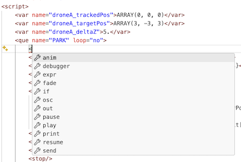

# [QueScript](QS1-Introduction.md) / How to setup Visual Studio Code

This steps describe how to setup [Visual Studio Code](https://code.visualstudio.com/download) to use as a code completion editor for Quescript:

1. Go to Extensions search for and install the "`XML Language Support by Red Hat`"
2. Go to Manage (cog in the lower left corner) > Settings > search for "`xml.fileAssociations`"
3. press 'edit in settings.json'
4. copy paste the following snippet into:

    `"xml.fileAssociations": [`
    ```json
            {
                "systemId": "https://github.com/immersive-arts/Sparck2/raw/refs/heads/master/source/java/extra/queListSchema.xsd",
                "pattern": "**/*.que",
            }
    ```
    `]`

5. Now open a quescript inside Visual Studio Code.
6. When you start editing and enter a '&lt;' the code completion will show you which commands are allowed, and - when you choose it - which attributes it needs to have set.

    