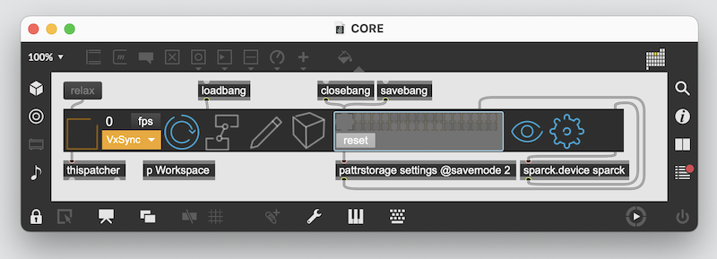
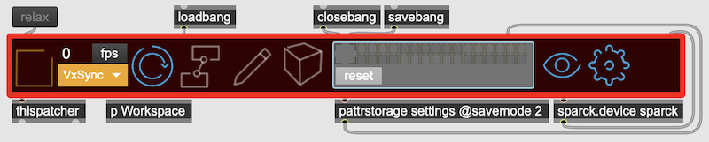
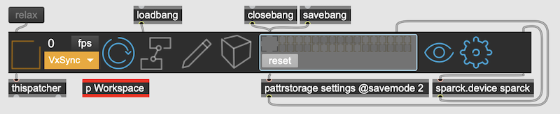
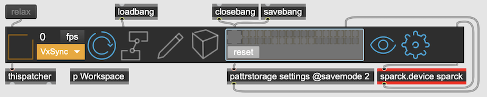
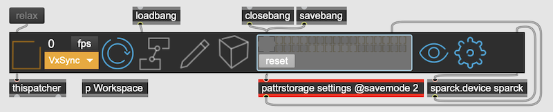
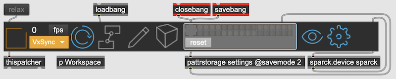
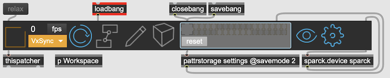

# SPARCK CORE

In order to make SPARCK work within Max and its patching environment, the SPARCK CORE abstraction needs to be in the root patcher. This is to make sure that all the properties of the nodes used inside the sub patchers are properly stored, which happens when the root patcher is saved.

TODO: link to the tutorial that steps through setting up a sparck patch for the first time.

## CORE - TOOLBAR

The Core Toolbar contains the backbone of the SPARCK System. Its UI provides the needed access to its functionality.

| ICON | Description |
|------|-------------|
| {width=100} | The Main Switch starts and stops the rendering engine. |
| | The FPS Widget shows the current running fps and the desired fps. Clicking on the 'fps'- button opens a live graph of the stability of the current frame rate. |
| {width=100} | It is possible to set the refresh of some Nodes to manual - this can reduces the performance load in some circumstances where there is only the need for an initial render pass - like a texture that is loaded from a file and only needs to be once send through the pipe line. The manual button will execute all those nodes afresh.|
| {width=100} | As mentioned above, is a conveniece button to open the subpatcher 'Workspace' |
| {width=100} | Opens and enables the StageView window. |
| | Used to select which render group to render within the StageView. |
| {width=100} | Opens the preferences |
| {width=100} | Allows you to see all the properties of all the SPARCK nodes and their values |

!!! info "StageView Mouse Navigation:"
    * rotation: <cmd> - mouse drag
    * shift: <shift> - mouse drag
    * zoom: <ctr> - mouse drag

## CORE - Ecosystem

When putting the SPARCK CORE into a patcher via the context menu it would look like this.

---

The main component in play here is obvisouly the Toolbar that also contains the backbone functionality of SPARCK. But there are more max objects that are essential for SPARCK Core to be working:

---

The **Workspace** patcher is a subpatcher there for convenience.

Clicking this Icon in the toolbar opens the **Workspace** patcher.

---

The object [sparck.device sparck] is a fork of libosssia and used for managing all the properties of the SPARCK nodes. This object is essential for the function of the SPARCK ecosystem and should not be removed or disconnected from the Toolbar in anyway. 

---

The object [pattrstorage] uses the Max buildin pattrstore system to store any max objexts within this patcher hierarchy that have a script name and an [autopattr] object with the respective patcher.  

---

Together with the [savebang] objects, this setup makes sure that the pattr and ossia managed properties are automatically stored with the patcher.

---

The [loadbang] executes the SPARCK CORE once the complete patch is loaded. This is another essential object that should not be removed.
