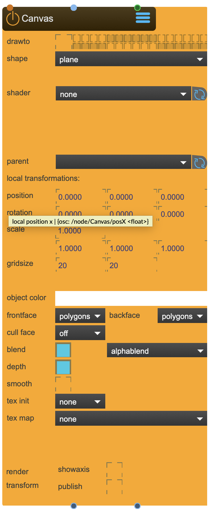
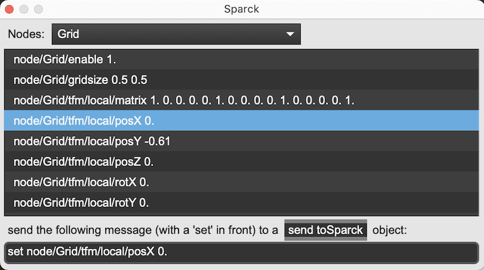
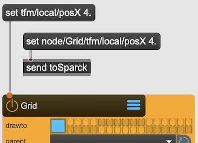

# SPARCK Node

## Anatomy

| [TfmNode] | [Canvas] | [SceneCapture] | [ShaderRaymarcher] |
|----------|--------|---------|--------|
{width=200} |  {width=200}| {width=200} | {width=200} |

All the Nodes have the following features in common:

* They habe an **enable** button
* They have properties to edit
* They have inlets through which data can flow via patch-cords into the nodes.
* They have outlets through which data can flow out of the nodes.
* They hava a title that can be changed and needs to be unique inside the project.
* They have a Menu that gives access to
    * properties in a floating window
    * renaming the node
    * help
    * collapse/expand the node
    * fold/unfold the node

### Enable button
It enables / disables the node. This affects
* If the node is being rendered into a render group
* If the node changes a texture (in case of a shader)
* If the node plays a video
* If the node runs a script 
* etc.

### Properties
All the properties visible can be edited and changed by the user. All the properties are stored when the project is saved.
Some nodes have additional windows that can pop up then a button is selected to give specific configuration possibilities(i.e. [Beamer] or [MeshWarp]).
Some nodes open the Edit Window automatically if the node needs editing through this form of interaction.

#### Property Paths

Each property can be addressed via its property path. This is usefull when there is need to control the Node through a script, via max messages or from a different process via OSC. The tooltips gives the Path. It is also possible to use the [Introspection](sparck_core.md#core-toolbar) function to query each available node for all it properties, their paths and the current values.

Lets assume you have a [Grid] Node and you want to change its local posX value. The (absolute) property-path the Introspection tool would give is:



```
set node/Grid/tfm/local/posX 0.
```

Once you identified the property path for the property inside your node, you have multiple ways to change them:

##### setting properties via patch cords

create a message with the content of:

```
set tfm/local/posX 4.
```
and connect it to the left most inlet (properties inlet)

!!! note
    when sending a message directly to a Node, the **node/Grid** part is not needed.

##### setting properties via send

create an [[send](https://docs.cycling74.com/reference/send/)] object with its name set to 'toSparck'.

create a message with the content of:

```
set node/Grid/tfm/local/posX 4.
```
and connect it to the send object.
!!! note
    when sending a message indirectly via [send toSparck], the **node/Grid** part is needed.



### Inlets
Allow the patch-cord based form of interaction with the rest of the Max environments.

### Outlets 
Allow the patch-cord based form of interaction with the rest of the Max environments.

### Help
opens the Node Reference inside this documention.

### Collapse/expand
Makes ALL the properties visible / invisible inside the Node.

### Fold/unfold 
Makes the most important properties visible / invisible inside the Node.

### Floating properties
When opening the properties via the Menu, a floating window pops up and displays all the properties. Once you click outside the window, the window disapears again.

* By pinning it you can keep it visible.
* By selecting the [-] button you send it folded to the right hand edge of the screen.
* By selecting the [+] button you fold it open next to all the other floating properties.


[LookAtCamera]: ../reference/nodes/LookAtCamera.md
[Grid]: ../reference/nodes/Grid.md
[DrawMask]: ../reference/nodes/DrawMask.md
[Hook]: ../reference/nodes/Hook.md
[OptiTrack]: ../reference/nodes/OptiTrack.md
[Texture]: ../reference/nodes/Texture.md
[SpoutSender]: ../reference/nodes/SpoutSender.md
[SyphonSender]: ../reference/nodes/SyphonSender.md
[SkyBox]: ../reference/nodes/SkyBox.md
[ShaderPointCloud]: ../reference/nodes/ShaderPointCloud.md
[Light]: ../reference/nodes/Light.md
[Canvas]: ../reference/nodes/Canvas.md
[TfmMerge]: ../reference/nodes/TfmMerge.md
[TfmMirror]: ../reference/nodes/TfmMirror.md
[ShaderBlur]: ../reference/nodes/ShaderBlur.md
[ShaderBrCoSa]: ../reference/nodes/ShaderBrCoSa.md
[ShaderColormap]: ../reference/nodes/ShaderColormap.md
[ShaderSelection]: ../reference/nodes/ShaderSelection.md
[ShaderTexStitch]: ../reference/nodes/ShaderTexStitch.md
[ShaderTexZoom]: ../reference/nodes/ShaderTexZoom.md
[ShaderTexZoom]: ../reference/nodes/ShaderTexZoom.md
[CalibrationCross]: ../reference/nodes/CalibrationCross.md
[TfmLookAt]: ../reference/nodes/TfmLookAt.md
[TextureProjectury]: ../reference/nodes/TextureProjectory.md
[TfmNode]: ../reference/nodes/TfmNode.md
[BlendSoftedge]: ../reference/nodes/BlendSoftedge.md
[SpatialShadery]: ../reference/nodes/SpatialShadery.md
[Model]: ../reference/nodes/Model.md
[QueScript]: ../reference/nodes/QueScript.md
[ShaderAnaglyph]: ../reference/nodes/ShaderAnaglyph.md
[Material]: ../reference/nodes/Material.md
[Canvas]: ../reference/nodes/Canvas.md
[ShdrTexOP]: ../reference/nodes/ShaderTexOP.md
[Video]: ../reference/nodes/Video.md
[SceneCamera]: ../reference/nodes/SceneCamera.md
[SceneCapture]: ../reference/nodes/SceneCapture.md
[BoxMapCamera]: ../reference/nodes/BoxMapCamera.md
[BoxMapCapture]: ../reference/nodes/BoxMapCapture.md
[ShaderRaymarcher]: ../reference/nodes/ShaderRaymarcher.md
[Beamer]: ../reference/nodes/Beamer.md
[CornerPin]: ../reference/nodes/CornerPin.md
[MeshWarp]: ../reference/nodes/MeshWarp.md
[Window]: ../reference/nodes/Window.md
[Viewport]: ../reference/nodes/ViewPort.md
