# Applications

SPARCK is made for the creation of interactive spatial augmented reality installations. It can be used as an arbitrary surface projection mapping tool and allows you to map any physical space and project realtime generated virtual content onto it. It helps you to turn your world into a 360° VR environment no matter the shape of your surfaces.

---

## Spatial Augmented Reality

=== "Standard Setup"
    

    

    An advanced setup for Spatial Augmented Reality. Four projectors cover the object from all directions, allowing a 360° viewing angle. A Kinect tracks the head of the observer and a turntable moves the object on its Z-axis.
    

    

    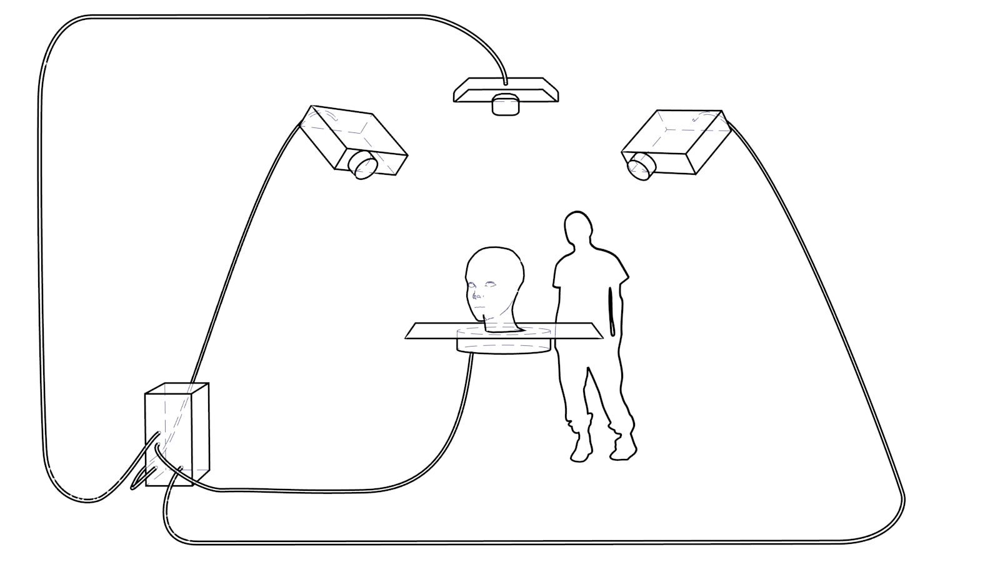
    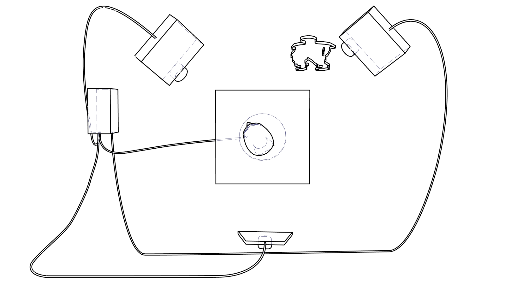
    

    

=== "High Precision"
    

    

    Two projectors cover the object from the direction of each shoulder of the observer.

    This time a high precision trackingsystem (i.e. Optitrack) is used to track the observers head and the object on the table. This allows to move the object in any direction and orientation on the table while the projected content adjusts dynamically.

    While this setup gives a lot of flexibility in movement, it requires the observer to wear infrared reflectors. The object itself can use reflectors or build-in infrared leds.
    

    

    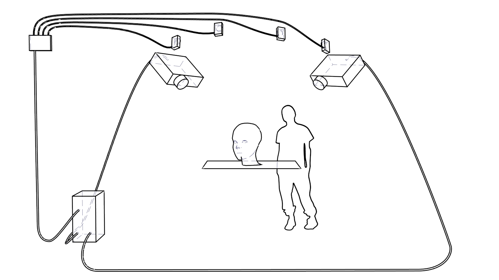
    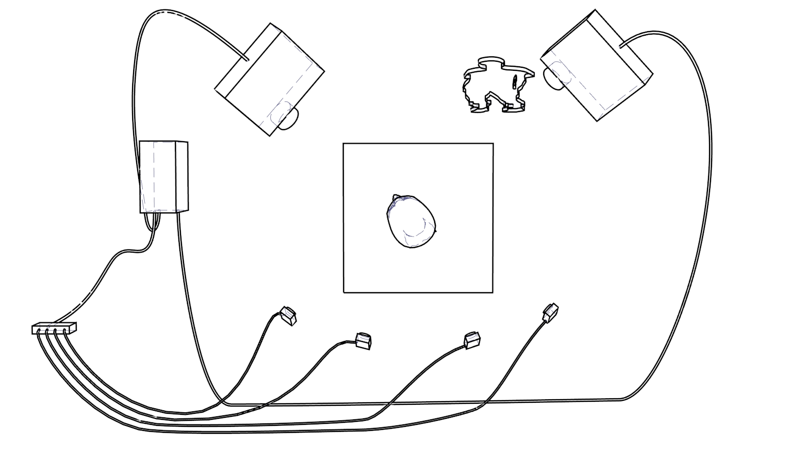
    

    

=== "360° Vision"
    

    

    An advanced setup for Spatial Augmented Reality.

    Four projectors cover the object from all the directions. This allows 360° viewing angle.

    Again a kinect tracks the head of the observer and a turntable moves the object on its Z-axis.
    

    

    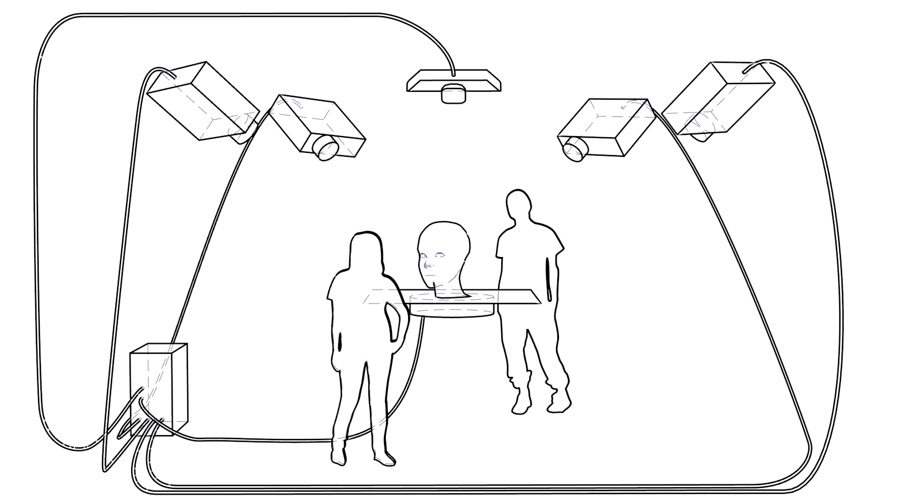
    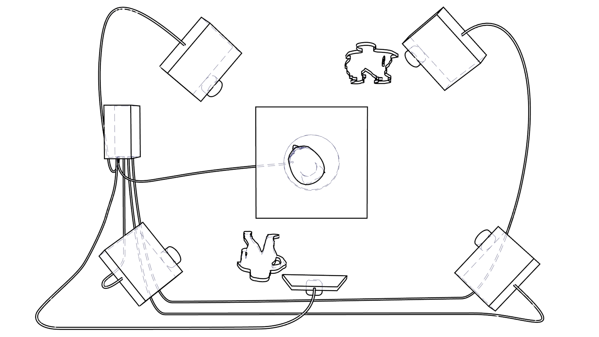
    

    

---

## Video Mapping

=== "Basic"
    

    

    Wrapping simple rectangular shapes with video content or still images.
    

    

    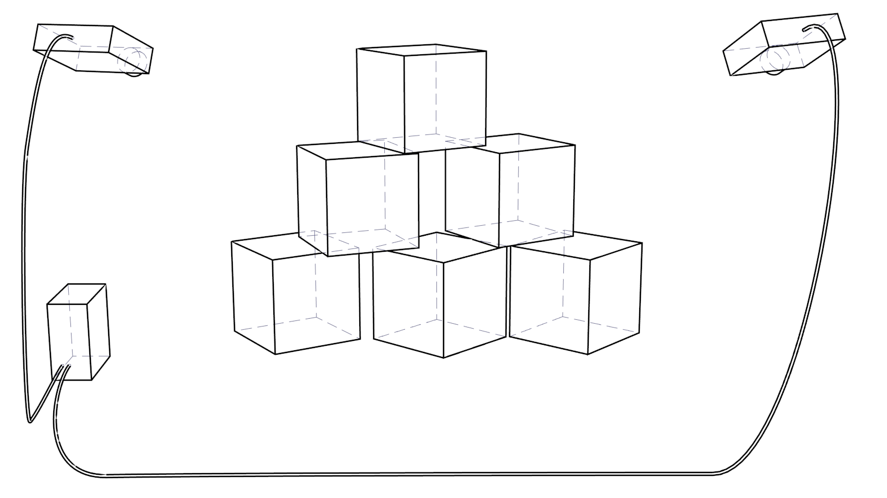
    

    

=== "Architecture"
    

    

    SPARCK has all the tools for state of the art architecture projection mapping shows.
    

    

    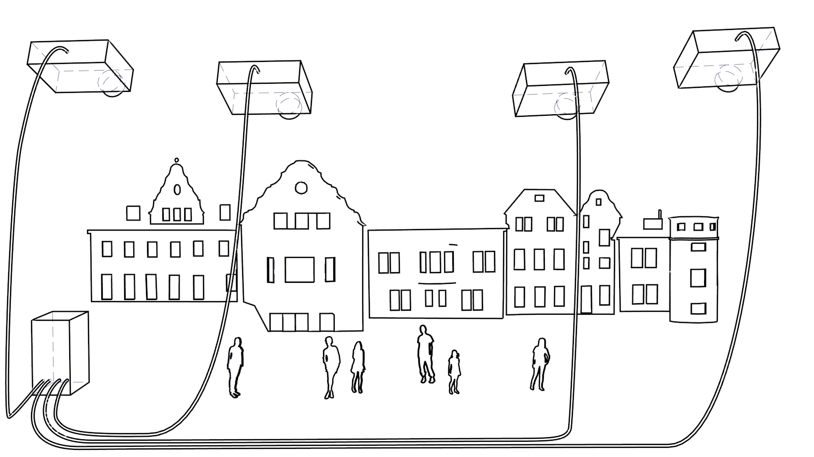
    

    

=== "Wrapping"
    

    

    SPARCK’s softedge solution can calculate the overlapping seams for up to 6 projectors per object and thus wrapping organic shapes seamlessly with video content.

    There is no limitation to the size of the object, as long there are projectors that deliver enough light and resolution.
    

    

    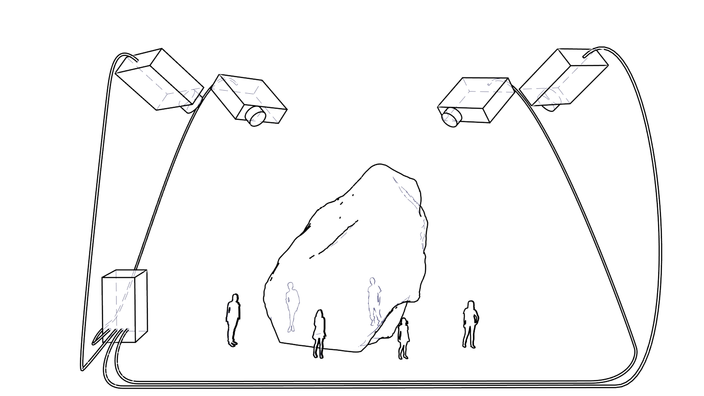
    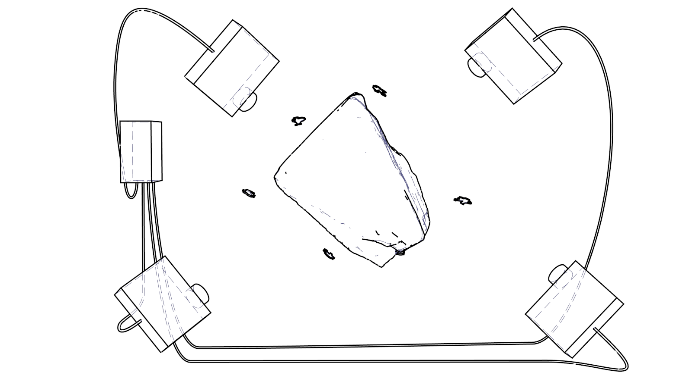
    

    

---

## Dome Projection

=== "Fish Eye Projector"
    

    

    A technically simple solution is the use of one single projector with an ultra wide angle (~180°) fish-eye lens. Easily set up to play back videos specifically created for domes, or project realtime generated VR content, with SPARCK's internal render engine or an external tool like Unity.
    

    

    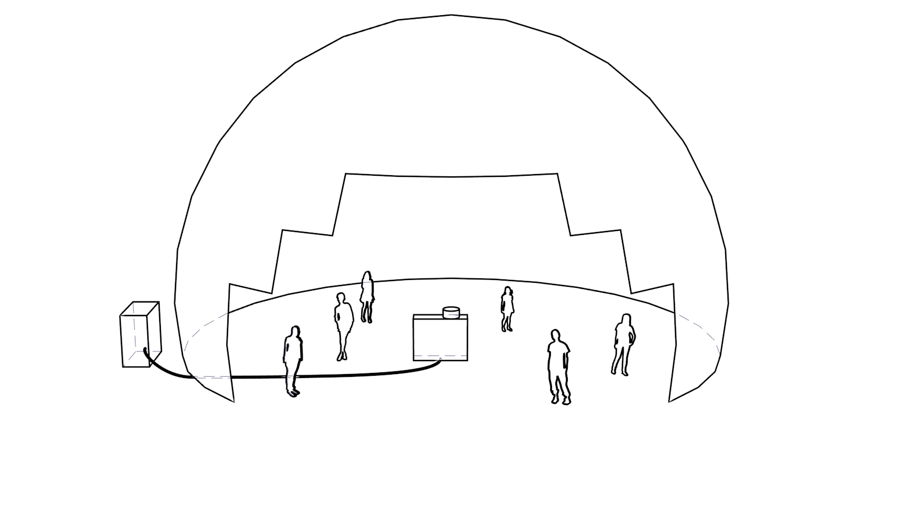
    

    

=== "Multi Projectors"
    

    

    Advanced dome projection using multiple projectors for seamless 360° coverage.
    

    

    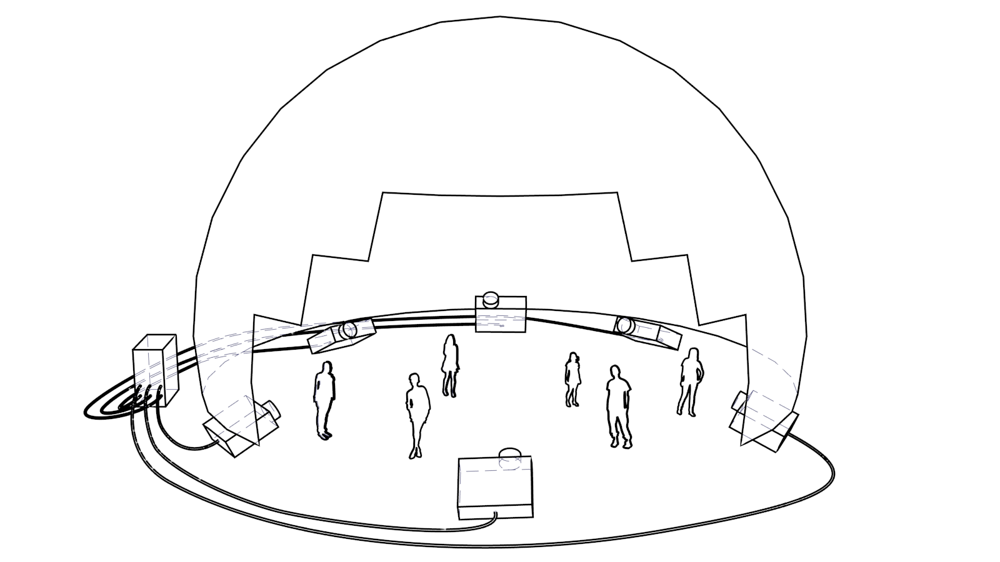
    

    

---

## Custom VR Spaces

=== "360° Space"
    

    

    SPARCK has no issues to turn any room into a VR space experience. Together with the different projection modes (see features) you can put any kind of content – be it from the internal render engine, raymarching shader or from an external render app onto any imaginable shape.
    

    

    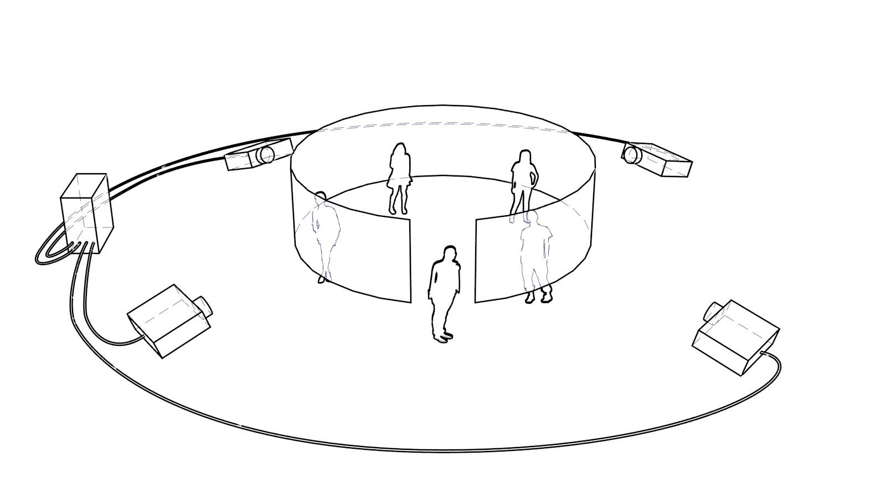
    

    

=== "360° VR Space"
    

    

    Combine your installation with a Kinect and the open source HeadRoom application and you can adjust your content to the location of the head of your visitors and make it a truly immersive experience.
    

    

    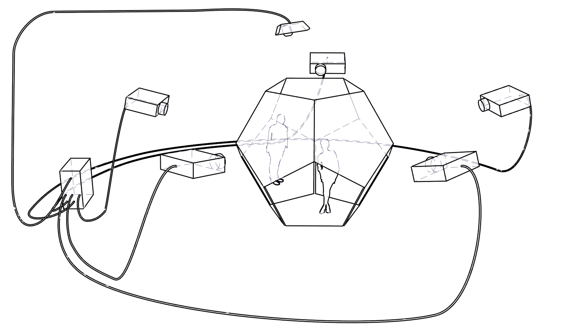
    

    

=== "VR Headset"
    

    

    Connect an Oculus Rift or HTC Vive to engage with SPARCKs virtual worlds
    

    

    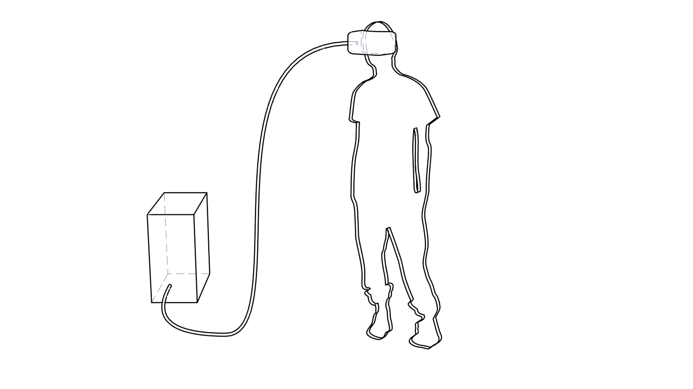
    

    

---

## Signage

=== "Display Array"
    

    

    Setting up custom arrangements of displays to show shared content. Any combination of size, angle, and placement are easily achievable. SPARCK can drive up to 96 different displays simultaneously—if your graphics cards can handle it.
    

    

    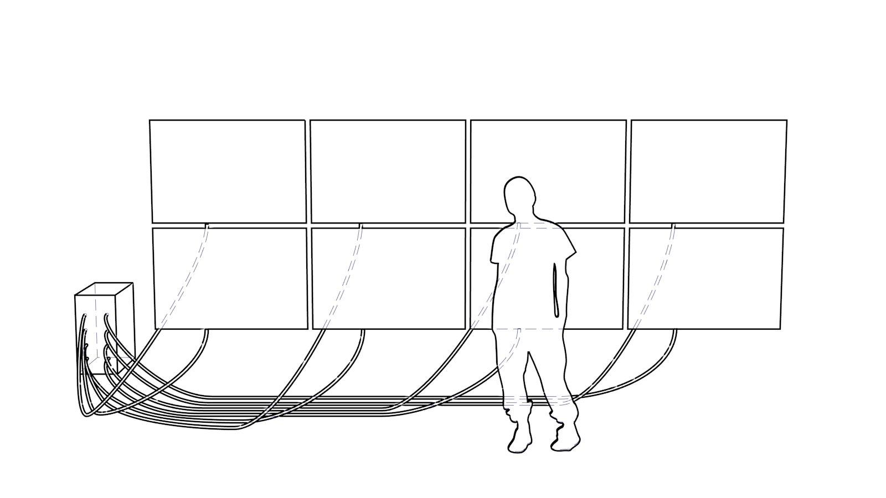
    

    

=== "Shifted Displays"
    

    

    Flexible display shifting for creative signage layouts.
    

    

    
    

    

=== "Tilted Displays"
    

    

    Tilted display arrangements for unique visual effects.
    

    

    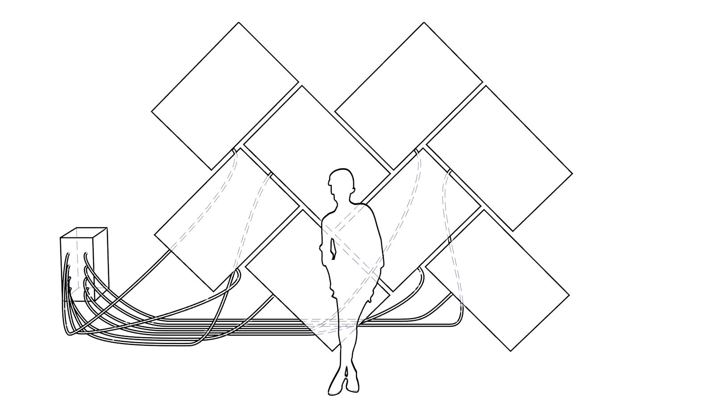
    

    

---
