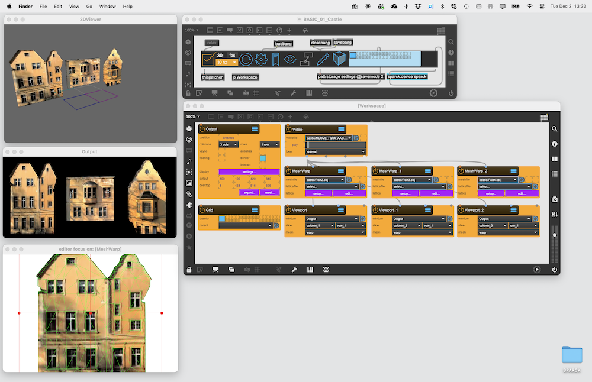
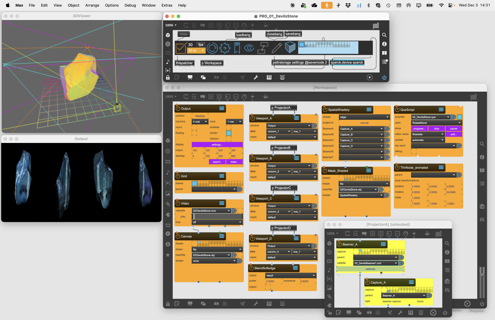
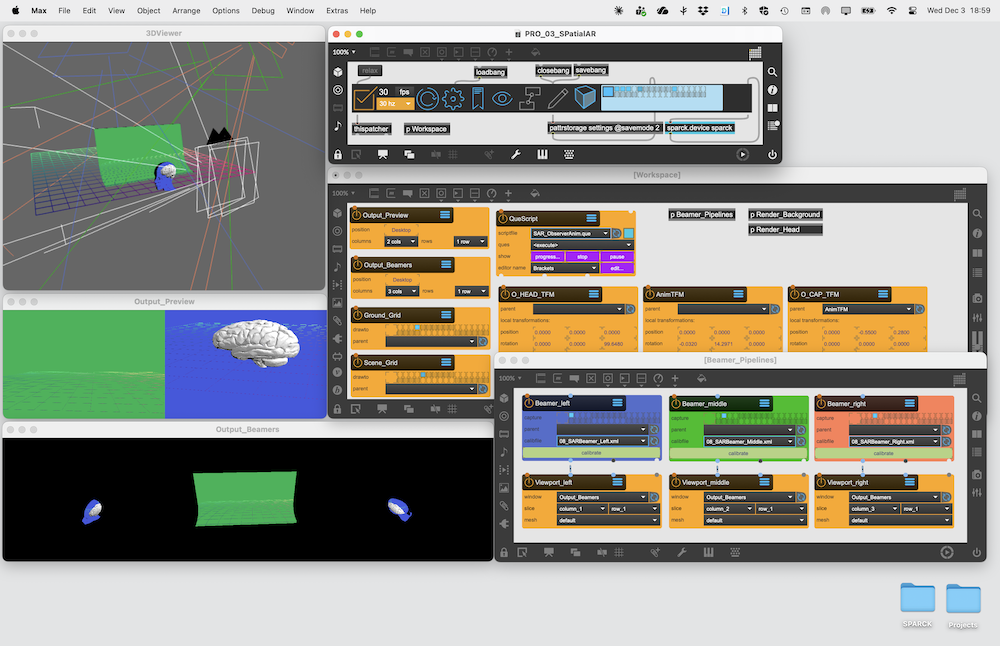

# Project Examples

The following are Project Example you can download and experiment with:

## Basics

### BASIC_01_Castle

Using the [MeshWarp] Node to output three custom meshes to three different projectors by splitting an [Window] window into three [Viewport]

### BASIC_02_Signage

Using the [MeshWarp] Node to output eight custom meshes to eight different monitors by splitting an [Window] window into eight [Viewport]

### BASIC_03_Cornerpin

Using the [CornerPin] Node to output 9 custom cornerpin to one monitor via one [Window] window

## Master

### MASTER_01_IMLab

Using the [Beamer] Node to output four calibrated renderpasses to four different projectors by splitting an [Window] window into four [Viewport]. The content projected onto the screen is generated by a [ShaderRayMarcher] object. The [BoxMapCamera] is used to indicated the ray origin for the Shader.

### MASTER_02_Dodecaedron

Using the [Beamer] Node to output three calibrated renderpasses to three different projectors by splitting an [Window] window into three [Viewport]. Each Output has a render pipline that uses a calibrated [Beamer] node that renders the [Canvas] nodes connected to the [Video] node. A second render pass is recorded by a [SceneCapture] node, which renders its own [Canvas] node (which in turn shares its transformation with the Canvas node that is recorded be the Beamers), but only with a manual render pass. this render pass is used in combination with a [ShdrTexOP], that uses it as a mask. The shader is applied inside the [Viewport], together with a [MeshWarp] node that allows small mapping corrections.

### MASTER_03_AnaglyphStereo

Illustrates how to use [SceneCamera] in stereo mode to render the same scene in two renderpasses from slightly different angles to get a stereoscopic effect. Two [Window] to show both the individual render passes and the final result. Using the [ShaderAnaglyph] to render the two passes into one texture to be viewed with an anaglyph spectacles. [QueScript] animates the Gazebo to do a slow rotation.

## Pro

### PRO_01_DevilsStone

Using the [Beamer] Node to output four calibrated render pipelines to four different projectors by splitting a [Window] into four [Viewport]. Each render pipeline uses a calibrated [Beamer] and linked [SceneCapture] node to create two renderpasses each: one for the content and the other for the blend-mask, generated by the [SpatialShadery] node. The [BlendSoftedge] blends the content pass and the blend-mask inside the [Viewport] before it is sent to the projectors.

### PRO_02_Dome

Using Six calibrated render pipelines to six different projectors by splitting a [Window] into six [Viewport]. Each render pipeline uses a calibrated [Beamer] node: In combination of the [SpatialShadery] node  settings 'edgeAndBlend' and 'baked texture', the content from the [Video] and the realtime generated and baked blend-mask are blended in one pass and then sent as is to [Viewport] nodes.

### PRO_03_SPatialAR

A Barebones Spatial Augmented Reality Setup. Three calibrated render pipelines play on three different projectors by splitting a [Window] into three [Viewport]. Each render pipeline uses a calibrated [Beamer] node. No [SpatialShadery] nodes are used in this setup to keep the patch simple. The content projected on the head [Canvas] is recorded in a primary render pass by a [SceneCapture] and then reprojected on the head from the same point with a [TextureProjectury] node. A similar setup is used for the background surface. The animations are played back a [QueScript] and multiple transformation trees and with a [TfmNodeLookAt] node it is made sure that the [SceneCamera] alway point at the correct place.

[TfmNodeLookAt]: ../../reference/nodes/TfmNodeLookAt.md
[TextureProjectury]: ../../reference/nodes/TextureProjectory.md
[TfmNode]: ../../reference/nodes/TfmNode.md
[BlendSoftedge]: ../../reference/nodes/BlendSoftedge.md
[SpatialShadery]: ../../reference/nodes/SpatialShadery.md
[Model]: ../../reference/nodes/Model.md
[QueScript]: ../../reference/nodes/QueScript.md
[ShaderAnaglyph]: ../../reference/nodes/ShaderAnaglyph.md
[Material]: ../../reference/nodes/Material.md
[Canvas]: ../../reference/nodes/Canvas.md
[ShdrTexOP]: ../../reference/nodes/ShaderTexOP.md
[Video]: ../../reference/nodes/Video.md
[SceneCamera]: ../../reference/nodes/SceneCamera.md
[SceneCapture]: ../../reference/nodes/SceneCapture.md
[BoxMapCamera]: ../../reference/nodes/BoxMapCamera.md
[ShaderRayMarcher]: ../../reference/nodes/ShaderRayMarcher.md
[Beamer]: ../../reference/nodes/Beamer.md
[CornerPin]: ../../reference/nodes/CornerPin.md
[MeshWarp]: ../../reference/nodes/MeshWarp.md
[Window]: ../../reference/nodes/Window.md
[Viewport]: ../../reference/nodes/ViewPort.md