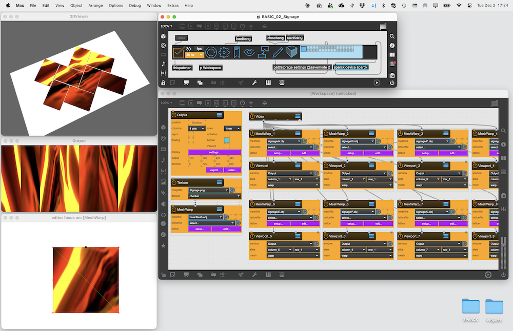
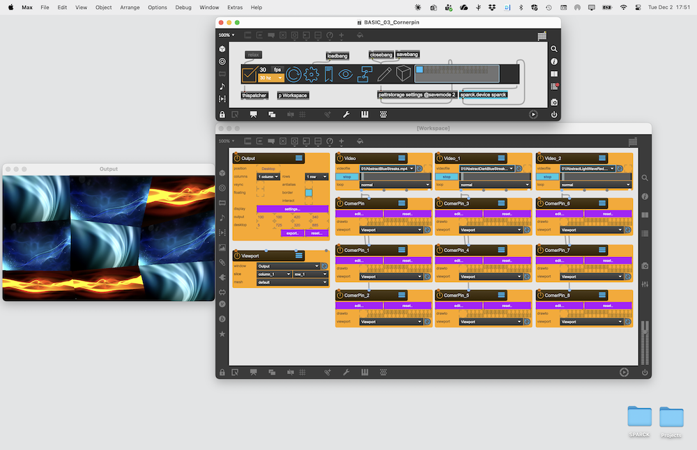
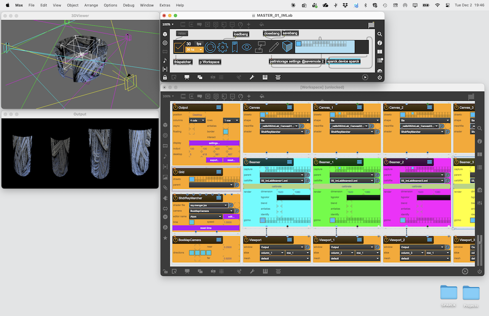
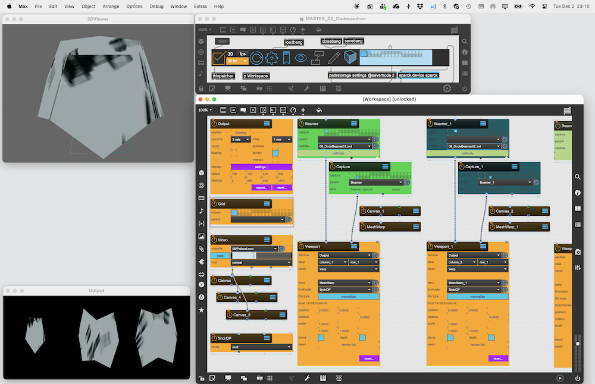

# Example Projects

The following are Example Projects you can download and experiment with:

## Basics

### BASIC_01_Castle

Using the [MeshWarp] Node to output three custom meshes to three different projectors by splitting an [Output] window into three [Viewport]

### BASIC_02_Signage

Using the [MeshWarp] Node to output eight custom meshes to eight different monitors by splitting an [Output] window into eight [Viewport]

### BASIC_03_Cornerpin

Using the [CornerPin] Node to output 9 custom cornerpin to one monitor via one [Output] window

## Master

### MASTER_01_IMLab

Using the [Beamer] Node to output four calibrated renderpasses to four different projectors by splitting an [Output] window into four [Viewport]. The content projected onto the screen is generated by a [ShaderRaymarcher] object. The [BoxMapCamera] is used to indicated the ray origin for the Shader.

### MASTER_02_Dodecaedron

Using the [Beamer] Node to output three calibrated renderpasses to three different projectors by splitting an [Output] window into three [Viewport]. Each Output has a render pipline that uses a calibrated [Beamer] node that renders the [Canvas] nodes connected to the [Video] node. A second render pass is recorded by a [SceneCapture] node, which renders its own [Canvas] node (which in turn shares its transformation with the Canvas node that is recorded be the Beamers), but only with a manual render pass. this render pass is used in combination with a [ShdrTexOP], that uses it as a mask. The shader is applied inside the [Viewport], together with a [MeshWarp] node that allows small mapping corrections.

[Canvas]: ../../reference/nodes/Canvas.md
[ShdrTexOP]: ../../reference/nodes/ShaderTexOP.md
[Video]: ../../reference/nodes/Video.md
[SceneCapture]: ../../reference/nodes/SceneCapture.md
[BoxMapCamera]: ../../reference/nodes/BoxMapCamera.md
[ShaderRaymarcher]: ../../reference/nodes/ShaderRaymarcher.md
[Beamer]: ../../reference/nodes/Beamer.md
[CornerPin]: ../../reference/nodes/CornerPin.md
[MeshWarp]: ../../reference/nodes/MeshWarp.md
[Output]: ../../reference/nodes/Window.md
[Viewport]: ../../reference/nodes/ViewPort.md