# Features
SPARCK is a modular, node-based platform designed for creating advanced spatial augmented reality installations. It brings together real-time 3D rendering, projection mapping, tracking, scripting, and multi-display output into one cohesive workflow. Whether you’re shaping light across complex physical geometries, integrating external render engines, or building interactive environments, SPARCK gives you the tools to prototype, calibrate, and deploy immersive experiences with precision and speed.

## Easy and Modular

<div class="grid" markdown>
<div markdown>
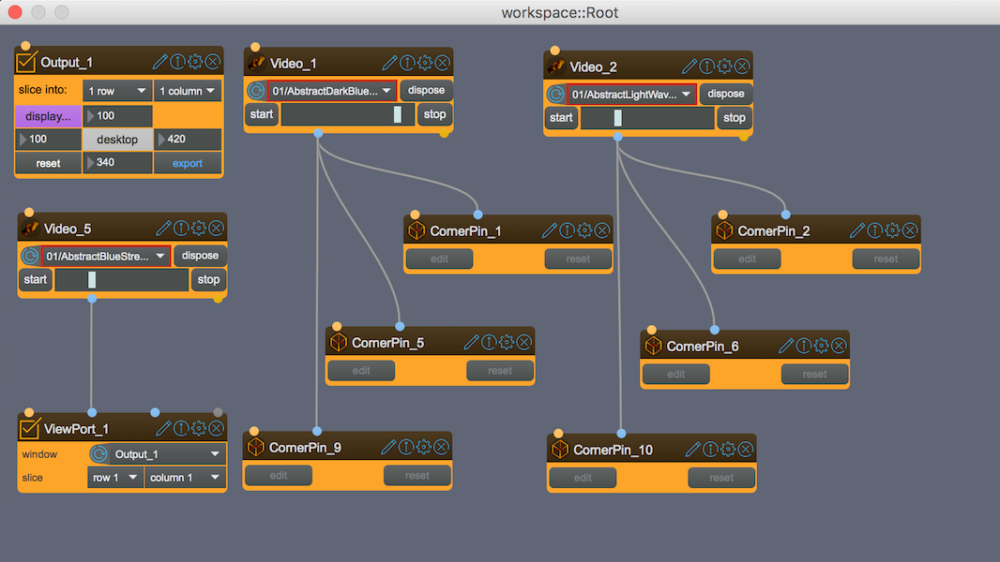
</div>
<div markdown>
!!! info "Node-Based Architecture"
    SPARCK is by design highly modular and flexible to your demands. It uses a Node-based composing principle. Every tool is encapsulated in a Node, and every month new Nodes with new functionality will become available.
</div>
</div>

## SPARCK lives and breaths 3D space.
<div class="grid" markdown>

<div markdown>
!!! info "3D Space Integration"
    SPARCK lives and breathes 3D space.
    It has a live Viewer to present your scene and visualize your installation with the calibrated projectors, virtual cameras, lights, led-strips, imported scenes or meshes, preview of dynamic softedges and much more.
</div>

<div markdown>
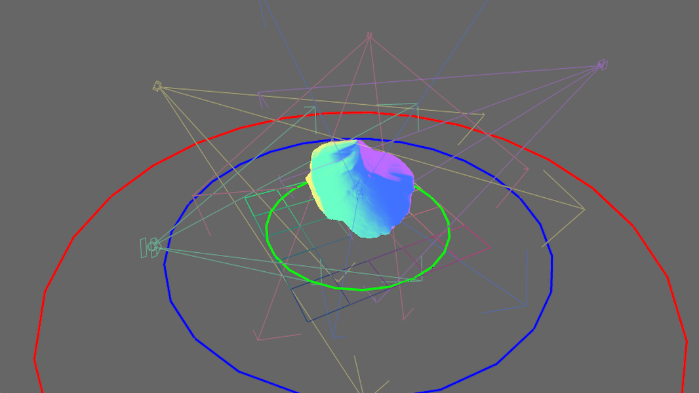
</div>

</div>

## Light and Shadow

<div class="grid" markdown>
<div markdown>
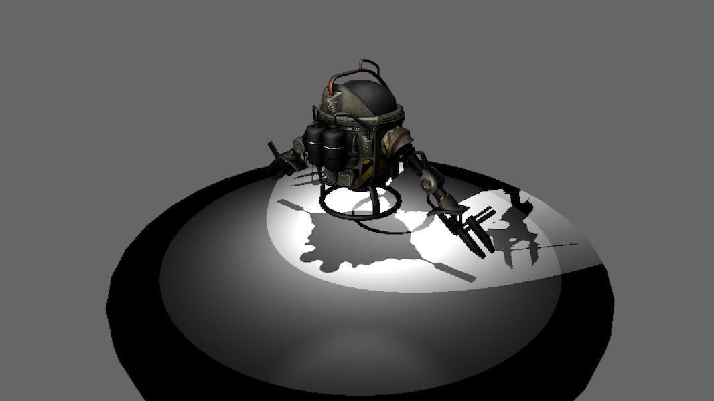
</div>

<div markdown>
!!! info "Light and Shadow"
    You can load the most common 3D model formats with integrated textures and animations into SPARCK. Add lights to make sure your scenes look even more realistic.
</div>
</div>


## Projection Mapping

!!! tip "Multiple Mapping Solutions"
    There are different tools at your disposal to solve the mapping problems from the very simple to the highly complex interactive realtime multi-projector installation.

<div class="grid cards" markdown>

-   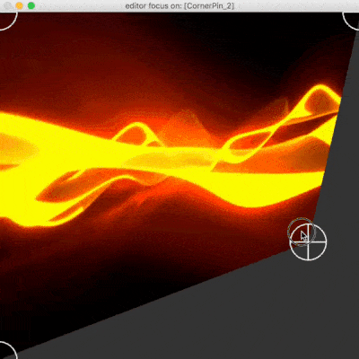
    
    With the **CornerPin-Node** you can quickly match a rectangular videotexture onto simple planar surfaces.

-   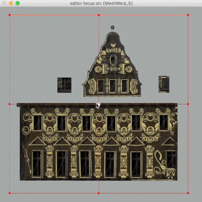
    
    **MeshWarp-Node** allows you to use your own custom meshes and manipulate them with a configurable bezier-based lattice to make your content fit the real object.

-   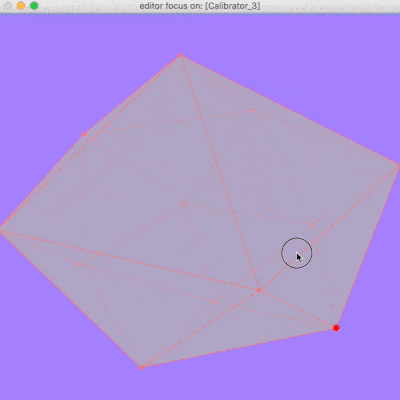
    
    The **Calibrator-Node** uses 3D keystoning to match a virtual projector with the position of a real projector using corresponding 2D/3D points with high accuracy.

-   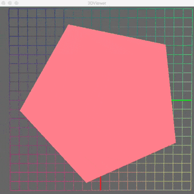
   
    **Dynamic Softedges** for spatial augmented reality with up to 6 projectors can be calculated in realtime on the fly.

</div>


## Canvas Types

!!! abstract "Unlimited Possibilities"
    Only your imagination (or the physics of 3D space) are the limitations for the types of canvas SPARCK can project onto. All you need are custom created meshes which are the virtual representations of the physical shapes SPARCK will project onto.

<div class="grid cards" markdown>

-   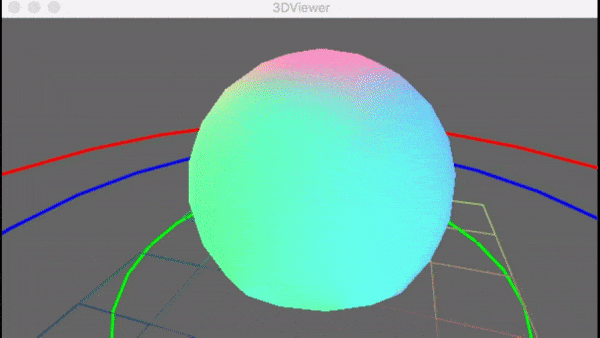
    
    **Dome Projection**

-   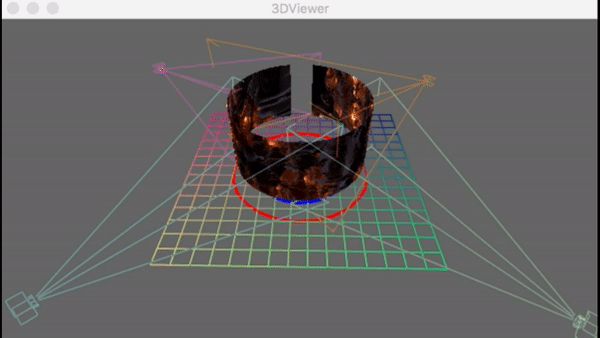
    
    **Cylinder Projection**

-   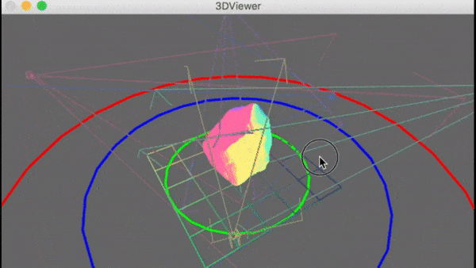
    
    **Stone Projection**

-   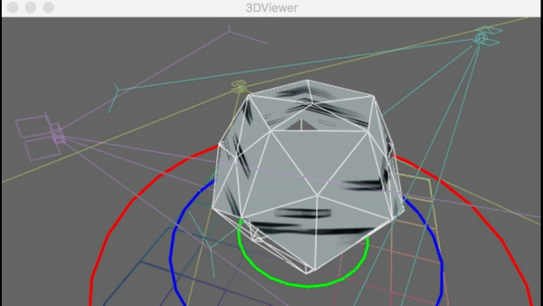
    
    **Dodecahedron Projection**

-   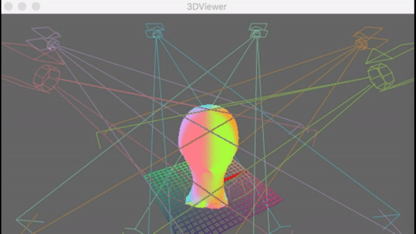
    
    **Head Projection**

-   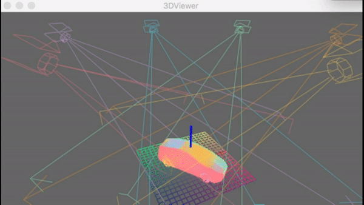
    
    **Car Projection**

</div>

---

## Projection Modes

!!! note "Virtual Projection Capabilities"
    SPARCK can also do projections of video-textures in a purely virtual manner

<div class="grid" markdown>

<div class="card" markdown>

### UV Mapping

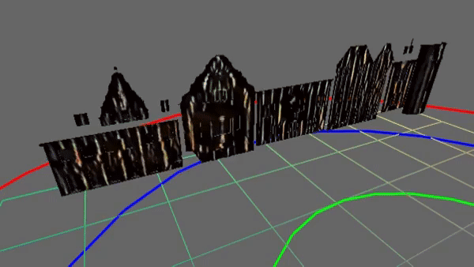

Use the good old UV mapping technique and map your content onto a custom mesh with UV-vertices.

</div>

<div class="card" markdown>

### Texture Projection

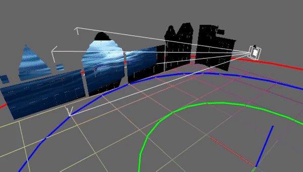

Take a single texture and virtually project it onto a virtual canvas, then capture it with the virtual representation of a projector and project it onto the physical world. Easy.

</div>

<div class="card" markdown>

### Raymarching

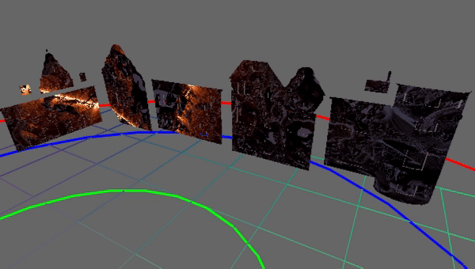

You also can create you own realtime raytracing-like [Raymarching shader](http://shadertoy.com) and use it to create amazing immersive spaces.

</div>

<div class="card" markdown>

### BoxMap Projection

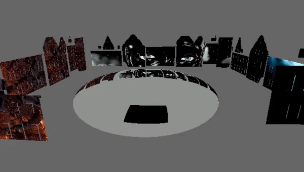

Or use the more sophisticated BoxMap projection to map seamlessly complete 360° 3D scenes from the internal or an external RenderEngine via Syphon or Spout.

</div>

</div>

---

## RealTime Tracking

!!! success "Interactive Content"
    In order to drive interactive content there are several ways to get external tracking tools to talk to SPARCK.

=== "Optitrack"

    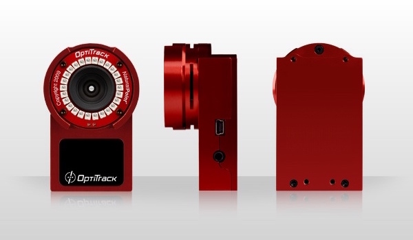

    Using third-party camera based tracking system [Optitrack](http://www.optitrack.com), SPARCK can be configured to receive the real-time transformation data-stream of multiple objects in the scene. This data is then used to move the corresponding 3D object inside SPARCK synchronous with the physical model, providing a tracked match between virtual & physical worlds.

    

=== "Microsoft Kinect"


    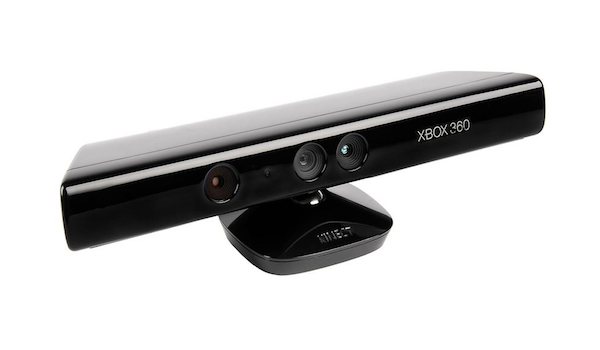

    Using Microsoft Kinect together with [HeadRoom](https://github.com/tecartlab/HeadRoom), SPARCK can track visitors and their heads and use the data to move corresponding virtual cameras to record the virtual scene and project it back onto the physical world. 
    
    Especially useful where the user can just walk at a spatial augmented reality installation and doesn't need to wear or hold anything to get the experience.


---

## Scripting

!!! code "QueScript Integration"
    With [QueScript](../reference/quescript/QS1-Introduction.md) SPARCKS has its own nonlinear animation scripting language. With a few commands you can create many parallel running scripts to control any aspect of SPARCK or beyond.

```xml
<script>
  <que name="myQue">
    <timer>
      <send>/address list with strings and numbers 0 2.45 56</send>
      <wait timer="5s"/>
      <print>timer has passed</print>
    </timer>
  </que>
  <que name="my2ndQue">
    <anim name="simpleRamp" duration="5s" fadeout="2s">
      <track name="t1">0. 1.</track>
      <send>/address ramp {t1}</send>
    </anim>
    <wait anim="simpleRamp"/>
  </que>
</script>
```

!!! tip "Max/MSP Integration"
    Or use SPARCK Package and use SPARCK inside your own MaxPatches and let Max take care of all the interaction.

---

## Multi Screen Video Output

!!! example "Display Output Selector"
    With SPARCKS Display Output Selector you will have sent your content within seconds to any imaginable configuration of your hardware, be it multiple graphic cards or video splitter (i.e. Matrox or DataPath). 
    
    In theory SPARCK can deliver to up to 96 individual output devices.


### Configuration Examples

<div class="grid cards" markdown>
-   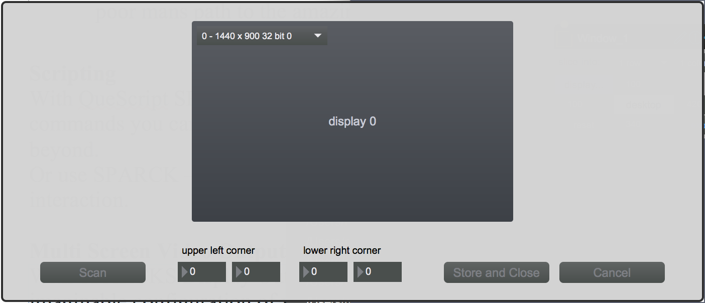

-   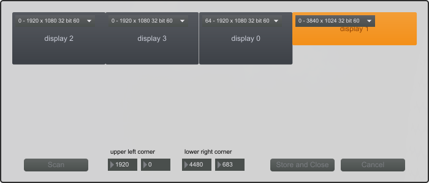

-   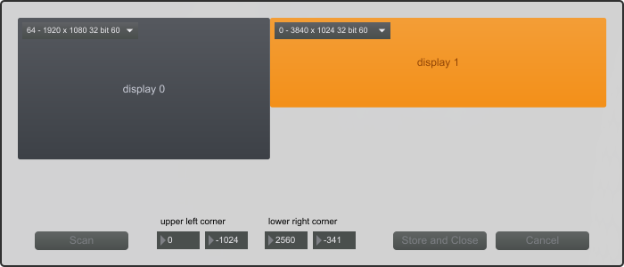

-   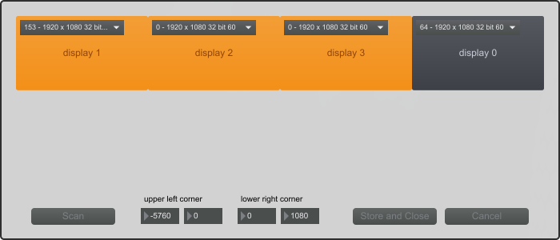

-   

-   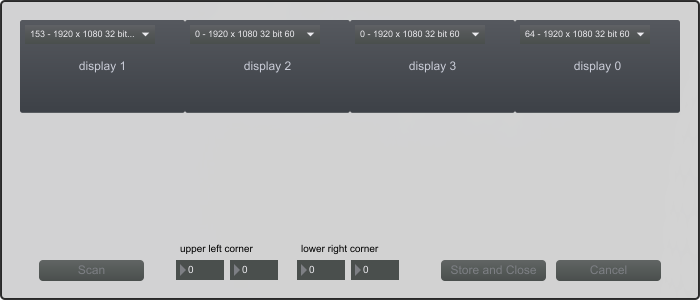

</div>
 ---
 
## Integrates with other Apps

!!! info "External Rendering"
    If the internal 3D toolset is not of your taste, you can use other tools to generate the virtual content and send it to SPARCK to project it onto the real world.

<div class="grid" markdown>

<div class="card" markdown>


**Spout**

Any Apps that have the industry standard [Spout](http://spout.zeal.co) integrated can stream visuals in realtime between themselves and SPARCK.

</div>

<div class="card" markdown>

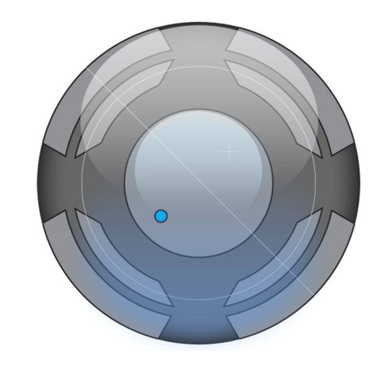

**Syphon**

Any Apps that have the industry standard [Syphon](http://syphon.v002.info) integrated can stream visuals in realtime between themselves and SPARCK.

</div>

</div>

---

## And There's Much More

<div class="grid cards" markdown>

-   :material-speedometer:{ .lg .middle } **Fast**
    
    ---
    
    SPARCK lives on the GPU in 3D space, so everything graphical is done fast and efficient with the best image quality possible, always in realtime on the spot.

-   :material-remote:{ .lg .middle } **Remote Controllable via OSC**
    
    ---
    
    Each and every parameter of each Node you are going to use can be addressed via OSC and thus controlled by any external App, like TouchOSC.

-   :material-layers:{ .lg .middle } **Live Composite and Effects**
    
    ---
    
    A whole suite of color management, live texture masking and mixing tools are available.

-   :material-volume-high:{ .lg .middle } **Audio**
    
    ---
    
    Plays back Audio that is part of your video file. When using SPARCK – DEVELOPER you have the complete arsenal of MaxMSP at your disposal for audio fidelity craziness.

-   :material-video:{ .lg .middle } **Videos**
    
    ---
    
    SPARCK videoplayer uses code from ffmpeg and can cope with most common videocodes like HAP, h264 or Apple ProRes inside containers like AVI, MOV or MPEG.

-   :material-image:{ .lg .middle } **Textures**
    
    ---
    
    SPARCK can deal with TIFF, GIF, JPEG, PNG

</div>