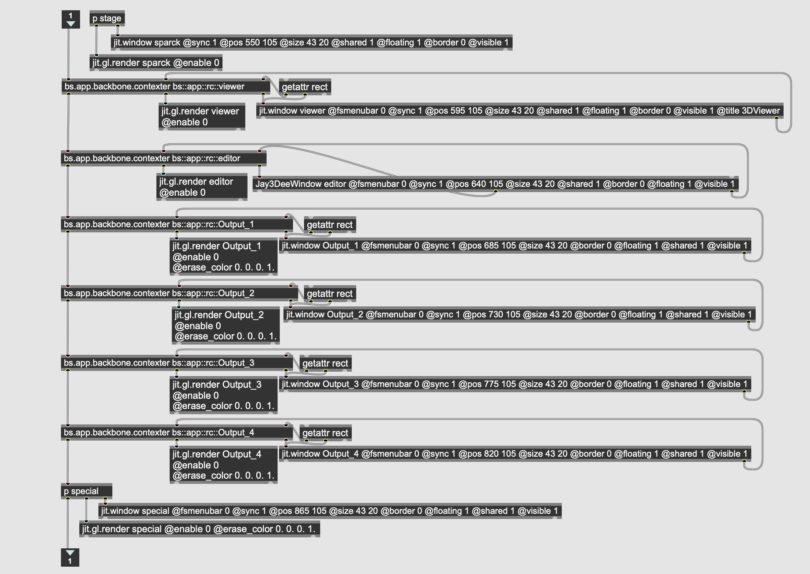
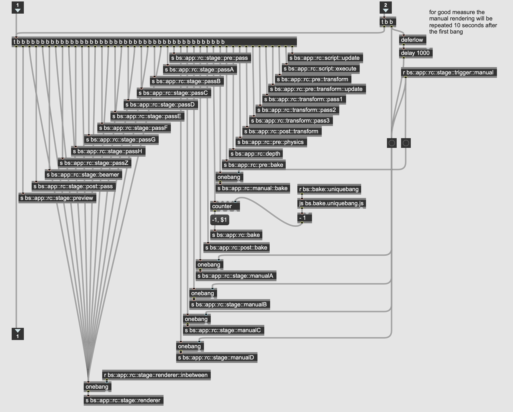
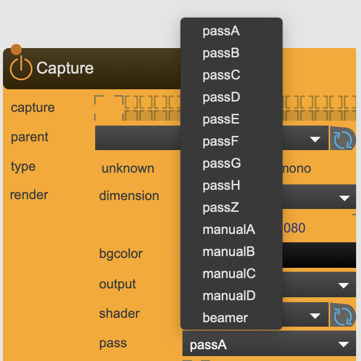
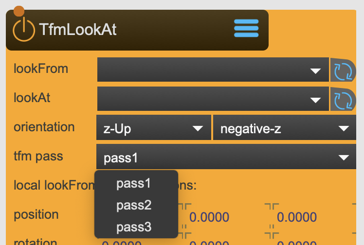
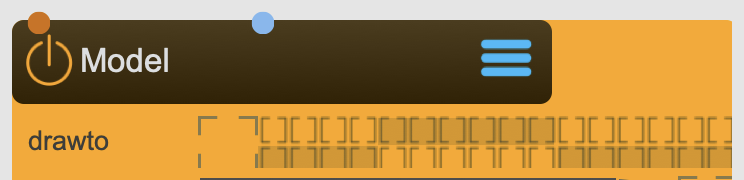
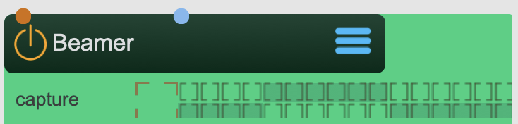

# The way of SPARCK

## Render Contexts

SPARCK is based on Max Jitter and uses 8 Render Context in the Background:

1. A Sparck-Context is where most of the content is rendered.
2. The 3dViewer-Context is for displaying the 3d Viewer
3. The Editor-Context is for the Editor
4. Output-Context 1
5. Output-Context 2 
6. Output-Context 3
7. Output-Context 4
8. A Special-Context for Texture Inputs, like Video or Spout/Syphon inputs 

The 4 Output-Context are for the last renderpass to output to the Output Windows - This doesn't mean only 4 Projectors can be attached: Each Output Window can be served by 24 Viewports, this makes 96 theoretical Output Screens. 

## Render Passes

!!! info "Script Passes"
    * 1.Script-Update
    * 2.Script-Execute
!!! info "Transforms Passes"
    * 3.Pre-Transform
    * 4.Pre-Transform Update
    * 5.Transform:pass1
    * 6.Transform:pass2
    * 7.Transform:pass3
    * 8.Post-Transform
!!! info "Misc Passes"
    * 9.Pre Physics
    * 10.Depth
    * 11.Pre Bake
    * 12.Manual Bake
    * 13.Bake
    * 14.Post Bake
!!! info "Manual Render Passes"
    * 15.Render Pass Manual A
    * 16.Render Pass Manual B
    * 17.Render Pass Manual C
    * 18.Render Pass Manual D
!!! info "Render Passes"
    * 19.Pre Render Pass
    * 20.Main Render Pass A
    * 21.Main Render Pass B
    * 22.Main Render Pass C
    * 23.Main Render Pass D
    * 24.Main Render Pass E
    * 25.Main Render Pass F
    * 26.Main Render Pass G
    * 27.Main Render Pass H
    * 28.Beamer Render Pass 
    * 29.Post Render Pass
    * 30.Preview Render Pass

Each Frame is rendered by multiple transformation and render passes that have to run in a special sequence.
30 passes are never active in any circumstances; This architecture allows to control from within those nodes that affect or are affected by the transformation and rendering sequence, when and in which sequence they are executed. While the default settings make sure that in most use cases you don't have to worry to much about this aspect, in special circumstances it is necessary to decide which node is renderer before another. 

For example: 

-   
    if the result of the rendering of one nodeA is the input for nodeB, it is important that nodeA is rendered before nodeB. By indicating the render pass you can control the sequence.

-   
    The same applies to transformations. While for standard Transformation Trees the sequence is defined by the hierarchy of the tree, there are transformation nodes whose result is a transformation matrix that is detatched. If a transformation tree relies on such a node, this specific tree needs to be executed after that one node.

## Render Groups

There are two type of nodes when it comes to rendering 2d and 3d textures:

1. Content - Nodes

Content nodes are [Model](../reference/nodes/Model.md), [Canvas](../reference/nodes/Canvas.md), [Grid](../reference/nodes/Grid.md), [CornerPin](../reference/nodes/CornerPin.md), [SkyBox](../reference/nodes/SkyBox.md), [MeshWarp](../reference/nodes/MeshWarp.md) that place objects to be rendered.

2. Recording - Nodes

Recording nodes are [SceneCapture](../reference/nodes/SceneCapture.md), [BoxMapCapture](../reference/nodes/BoxMapCapture.md), [Beamer](../reference/nodes/Beamer.md)

* For the content nodes, the render group interface indicates into which group a content needs to be rendered.
* For the recording nodes, the render group interface indicates which groups a rendering node renders.