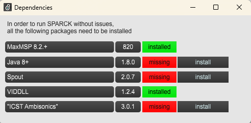

[Preparation]: ../setup/prerequisites.md

Assuming you alread followd the [Preparation], 

## 1. Startup Max if it hasn't started yet. 
 
You need to have started up Max at least one time.

Max will create a folder under '/Documents/Max 9/Packages'

## 2. Install SPARCK

Next you need to install SPARCK from the repository into the Packages folder:

=== "MacOS"

    1. Open the Terminal
    2. get to the correct folder
           1. ```cd ~/Documents/Max\ 9/Packages```
    3. download SPARCK by executing
           1. ```git clone https://github.com/immersive-arts/Sparck2.git```

=== "Windows"

    1. Open PowerShell
    2. get to the correct folder
       1. ```cd "~\Documents\Max 9\Packages"```
    3. download SPARCK by executing
       1. ```git clone https://github.com/immersive-arts/Sparck2.git```

---

## 3. Restart Max

1. Go to Max > Menu > File > Show Package Manager
2. Click on "Remote Packages" and switch to "Installed Packages"
3. Scroll down to SPARCK and select it
4. Press Launch
   1. A Max Patch opens called "SPARCK overview"
5. press "dependencies"
   1. A Max Patch opens called "Dependencies"
      1. If your installations of the prerequisites were successfull:
      2. MaxMSP 8.2 and Java 8+ should already be green<br> <br>
   2. Install also the other missing Dependencies via the Package Manager.
      1. Spout, pressing install will open up the Max Package Manager to install it. <br> <br>
      2. ICST Ambisonics, pressing install will open up the Max Package Manager to install it. <br> <br>

Done. Sparck and all its dependencies are installed and you are ready to start.
