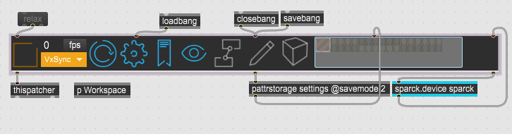
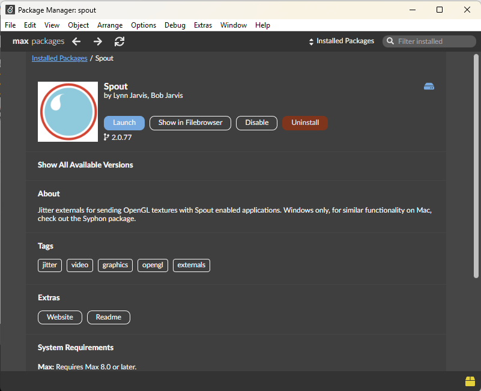
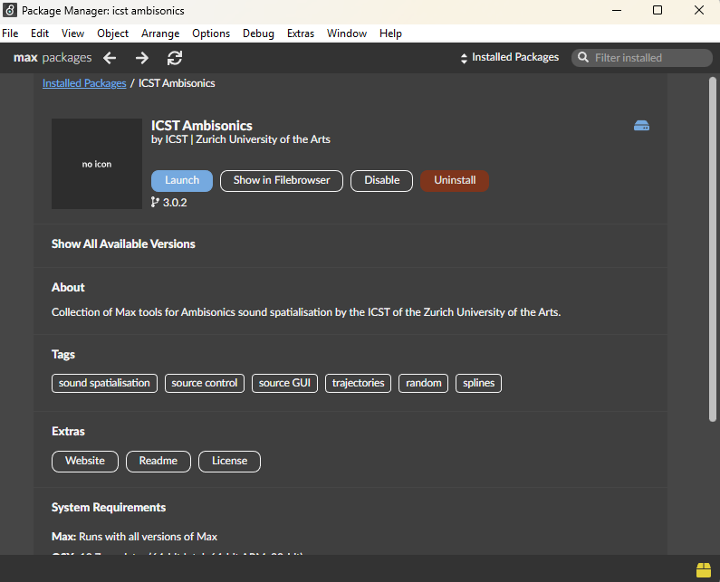
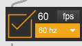

# Getting Started
This tutorial shows how to make the initial setup for Sparck for any kind of setup.

Before starting make sure you have Max and the Sparck pakages are installed. For more informatioin check the [Setup](https://immersive-arts.github.io/Sparck2_Documentation/start/setup/) page.

1. Create a new Max patch. File > New Patcher.

2. In the patcher click with the right mouse Paste From > Sparck2 > 0_APP > APP.maxpat

1. Once the Sparck app is added to the patch, a window will pop up, proceed to install al the missing components. Simply press the install button (gray button). 

      1. Java 8+. Instructions on how to install is can be found on the github page.
      2. Spout, pressing install will open up the Max Package Manager to install it.   
      3. ICST Ambisonics, pressing install will open up the Max Package Manager to install it.   

1. Save the patch (e.g. Calibration.maxpat) with Save As... under a dedicated folder. Max will prompt you to also save a "preferencea.json" file, save it too.
2. Close the patch.
3. Open it again, this will create additional folders and subfolders, such as _settings, _assets, _tmp, _export at the same location of your .maxpat file.

If all is corectly installed and configured the Sparck App should look like in the picture below. Set the **Frame Rate** to your prefered one.

Open the **p Workspace** Max node, by click it twice (make sure the pacth is loked, if the patch is in Edit modet the press it with CTRL + Right Click mouse) and add there all your nodes for your requires setup, such as: 
- Floor Projection 
- [Spatial Augmented Reality](https://immersive-arts.github.io/Sparck2-Documentation/start/tutorials/03_Spatial_Augmented_Reality/Spatial_Aumented_Reality/) 
- Wall Projection 
- ...