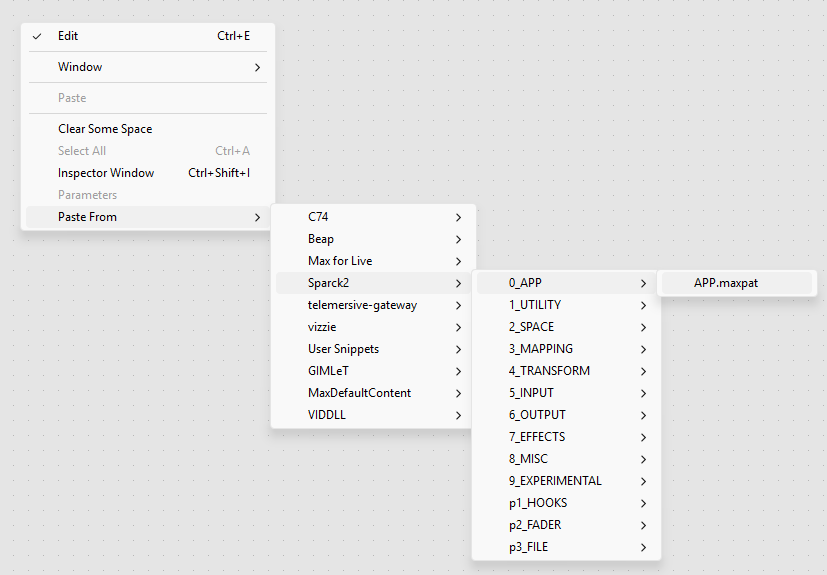
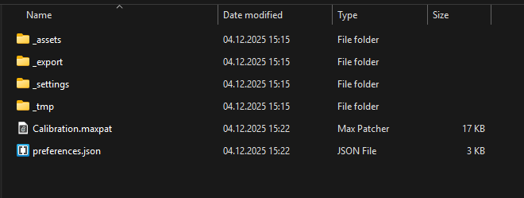
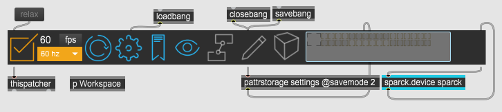

# Getting Started
This tutorial shows how to begin any type of project with SPARCK.

Before starting, make sure you have Max and the SPARCK packages installed. For more information, check the [Setup](../../setup/index.md) page page.

1. Create a new Max patch. File > New Patcher.

2. In the patcher, right-click and choose **Paste From > Sparck2 > 0_APP > APP.maxpat**.

1. Save the patch (e.g., *Calibration.maxpat*) using **Save As...** into a dedicated folder. Max will prompt you to save a `preferences.json` file—save that as well.
2. Close the patch.
3. Open it again, this will create additional folders and subfolders—such as `_settings`, `_assets`, `_tmp`, and `_export`—in the same location as your `.maxpat` file.

If everything is correctly installed and configured, the SPARCK App should look like the image below. Set the **Frame Rate** to your preferred value.

Open the **p Workspace** Max node by double-clicking it. Make sure the patch is locked—if it is still in Edit mode, lock it using **Ctrl + Right‑Click**. Inside the Workspace, add all nodes required for your setup.

See the [Tutorials](../index.md) page for examples of SPARCK configurations, such as floor or wall projection setups.