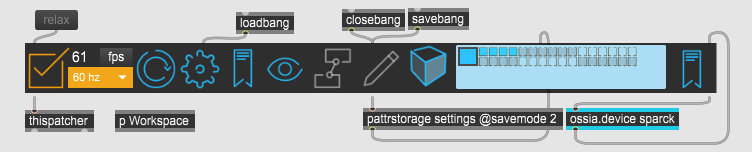
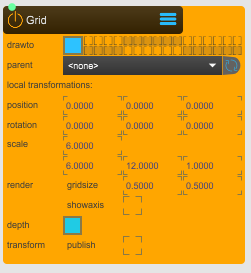
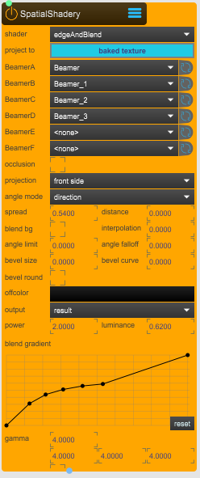

# Spatial Augmented Reality
This article showcases how to set up a SPARCK project for the use case where 4 projectors are calibrated to project on moving objects within a Motion Capture (optical system) volume, creating a Spatial Augmented Reality (SAR) project.

In this context Sparck is used to calibrate 4 projectors that are installed on the 4 corners of a room at a mid‑height, allowing for moving objects and floor projection. 

Once calibrated, Sparck calculates the exact position of each projector and determines what area each projector can see (its view). This takes into account the projector's resolution and other technical settings, allowing precise content alignment on moving objects and surfaces.

This is done using co-planar vertices selection on a highly accurate 3D model of the entire room and reference markers positioned in the room at the time of calibration.

Once the projectors are calibrated, Sparck uses the **OptiTrack** node to receive [OSC2NatNet](https://github.com/tecartlab/app_NatNet2OSC) mocap data to determine where and how each tracked object is positioned in the space. 

And since both the virtual and physical space are aligned thanks to the calibration of the projectors, Sparck then uses this information to correctly display computer-generated (CG) visual content on each tracked objects and on the floor.

This last part is essentially handled by the **SpatialShadery** node which calculates how much of the content (in pixels) should be shown by each projector, as well as how bright each pixel should be to make sure the colours blend smoothly.

## SAR setup with 4 Projectors
First add the Sparck app to your Max patch. See the [Getting Started](https://immersive-arts.github.io/Sparck2_Documentation/start/tutorials/01_Getting_Started) documentation for more information on how to start.

 
*Sparck APP.*

The image below shows the overall Max subpatcher **p Workspace**. Inside it we place all the Sparks nodes required for this configuration.

*p Workspace subpatch.*

In white a highly precise simplified 3D model of the Immersive Arts Space. In black, a floor plane (see **Canvas** node) with a **Grid** (also a node). And 4 colored wireframes, displaying the positions of the projectors situated in the corner of the virtual room after performing the projectors calibration. 

 
*3D viewer of Sparck. Preview of the virtual setup.*

 
*Output preview of Sparck (4 col, 1 row).*

Four frames are stitched together, corresponding to the 3D view from each projector position after calibration. To distinguish the projectors, four different colors are used to identify them (see **Beamer** node with *indentify* toggled).

## Basic Node Configuration
The following text explains and shows how to correctly setup all the different nodes for a Spatial Augmented Reality setup.

### Output Node
TODO: Change the name to windows instead of Output, also relative images

This node is used to output the rendered result of Sparck to some output devices, in this case the 4 projectors, basically it handles how the content is distributed for each outputs.

 
*Output node, can be found under 1_UTILITY > WINDOW.maxpat*

**position**: switch between the **Output** or **Desktop**. Where **Output** display the visual content on the configured projectors and **Desktop** create a window that preview how the visual content is distributed.

**columns and row**: slices the output into designated frames. In this case we set the columns to 4 and the rows to 1. As shown in the picture above about the Preview of Sparck

**display**: pressing **setting...** opens up the display setup tool to configure the **Output** overall pixel amount used for projection. Select the displays you wish to use for projection. Once selected they become orange. Now, **Store and Close** to close the configuration.

 
*Settings... interface to select and configure which display is used for projection.*

In this instance, the computer is connected to 2 monitors of 1920 x 1200 pixels (grayed) and 4 projectors of 2560 x 1600 pixels (orange). Only the orange ones will be used for projecion.

### Beamer Node
The beamer node will create a virtual world projector inside of Sparck's **3D Viewer**. This node is essential since is used to calibrate the projector to register its position, orientation and lens properties in respect of the virtual-physical space. See [Calibration](../02_Calibration/calibration.md) for more information about how to clibrate a projector.

 
*Beamer node, available under 2_SPACE > BEAMER.maxpat*

**capture**: select in which render layer the beamer will be displayed. Make sure to select only one of the little squares (turqoise square), for every other beamer, select a different square. 

**calibfile**: create and save a .xml file in which the projector information about its position in 3D space, and lenses will be stored.

**calibrate**: is a button that will launch the window editor to calibrate the projector.

**identify**: if enabled, helps identify which projector is, in the **Output** and **Desktop** since it display a specific background color registerd in the **calibfile**.

**gizmo**: If enabled (turqois big square), it displays on the **3D viewer** the projector at the position registered in the **calibfile**.

### Viewport Node
This node create a texture that is displayed in a designated slice of the **Output**. Connected to a **Beamer** node, it makes sure to output the point of view of this beamer to a slice of the overal **Output**.

 
*Viewport, available under 1_UTILITY > VIEWPORT.maxpat*

**window**: select the **Output**. For each **Viewport** connected to a **Beamer** node, make sure it reference the **Output** node.

**slice**: select the designated slice wehre to output the visual content. In this case, make sure to target for each **Viewport** node a different colum_x (eg. 1, 2, 3, 4), and all should reference the same row_1.

### Model node
In this context the **Model** node is used to display in Sparck's **3D Viewer** a simplified but highly precise model of the Immersive Arts Space. This model helps referencing where projectors, floor and tracked object are located virtually.

 
*Model, available under 2_SPACE > MODEL.maxpat*

**drawto**: selects the render layer where the model is rendered (turqouis big square). In this case the model is only displayed on the Sparck's **3D Preview** and not outputted on the projectors.

**meshfile**: selects a 3D model mesh file to load and use. To import a 3D model, place it inside the Sparck forlder directory under Sparck/_assets/_models. Then update the menu by clicking the round wheel. Make sure your 3D model doesn't have too many polygons since this will have and inpact on Sparck frame rate.

### Grid Node
The **grid** node is a helper used to display a grid in Sparck's **3D Viewer**.

 
*Grid, available under 2_Space > GRID.maxpat*

**drawto**: if enabled (turqois big square), selects the render layer where the model is rendered. In this case the model is only displayed on the Sparck's preview and not outputted on the projectors. Some times we want to see it olso trough the projectors, then toggle the small quares for each projectors, as in the **Beamer** nodes.

**scale**: 1 Sparck unit equal to 1 meter (100cm). In this case the scale is set on the size of IAS floor plan, 6m whide and 12m long.

**render gridsize**: changes the grid slice size.

**showaxis**: anable/disable the axis display.

### SpatialShadery node
The **SpatialShadery** node is an essential component for Spatial Augmented Reality. It is used to calculate the spatial relationship between the projectors and the scene. Essentially, it determines — from the point of view of each projector — which pixels should be rendered by which projector and how intense each pixel should be. In this way, it produces a soft-edge blend shader for the **Output**, ensuring that the content from multiple projectors merges smoothly into a single coherent projection.

 
*SpatialShadery, available under 7_EFFECTS > SPATIAL.SHADERY.maxpat*

**shader**: select the shader type, in this case we use **edge & blend** which calculated the soft-edge combined with the blending.

**project to**: set to **baked textures**, implements all render passes for generating all the pixel color and brightness.

**Beamer A-D**: for each BeamerX target a different **Beamer** node from where to project.

**projection**: set to **front side**.

**spread**: set to 0.5400 which is the factor for differentiation between the overlapping projections, achieving in this manner the soft-edge blending. Set to 0 equals no spread at all, and to 1 full spread. Find a good balance that fit your situation.

**output**: is the display mode of the shader, in this case is set to **result** which show the final baked texture, essentially how bright and colored all the pixel are.

**power**: is the soft-edge blending power. Find a good balance that fit your situation.

**luminance**: is the soft-edge blending luminance. Find a good balance that fit your situation.

### Optitrack node
The Optitrack node listen to NatNet2OSC to get motion capture data from Optitrack. It is an essential node for Spatial Agmented Reality since it handles how the Optitack rigidbodies positional data is distributed inside of Sparck, which than virtual 3D models and shapes can reference.

 
*Optitrack, available under 4_TRANSFORM > OT.RECEIVER.maxpat*

**stream 1-8**: select an Optritack rigidbody stream. If the rigidbody is registered inside of Motive (Optitrack software), it will become available in the dropdown menu. It is important to differently ID (and name) each rigidbodies inside of Motive. Use **refetch...** button every time you register new rigidbodies inside of Motive.

**in port**: set the port number at which the mocap stream is being received.

**out port**: set the port number at which the mocap stream is sent.

**out IP**: set the IP address. In this case, the IP correspond to where Motive/Optitrack is sending the mocap.

**leap forward**: increases the forward prediction of the position and rotation of the rigidbodies. Since the speed at wich the projection refresh is lower from the speed of at which objects move in the physical space. It reduces jitters on the projected visual content of traked objects.

### SpoutReceiver node
The **SpoutReceiver** node receives [Spout](https://spout.zeal.co/) textures. Generally, is an animated texture that is real time generated by a visual or game engine, such as TouchDesigner, Unity, Unreal, Notch etc.

 
*SpoutReceiver, available under 5_INPUT > SPOUT.RECEIVER.maxpat*

**sender**: select a Spout video stream.

**flip x**: flip the video stream horizontally.

**flip y**: flip the video stream vertically.

### Canvas node
The **Canvas** node draw a variety of basic 3D shapes, such as plane, cube, sphere, a custom 3D mesh etc. It is a lightweight version node of the **Model** node, the difference is that the **Canvas** node doesn't contains additional settings such as material, lighting, shadow, etc.

 
*Canvas, available under 2_SPACE > CANVAS.maxpat*

**drawto**: selects the render layer where the canvas is rendered. In this case the canvas is displayed on the Sparck **Preview** and also on the beamer layers for ouput (big and small turqois squares). 

**shape**: select a basic shape to use. In this case is a basic plane but could be a sphere, torus, cylinder, ect.

**shader**: select the shader to use. In this case the **SpatialShadery** node shader is referenced. Since we want each projector to contribute to projecting onto that surface from all angles, the shader calculates how each pixel should be rendered with soft-edge blending. This canvas is used to project on the floor, covering the entirety of the space.

**scale**: 1 Sparck unit equal to 1 meter (100cm). In this case, the scale is set on the size of IAS whole floor plan, 6m whide and 12m long.

## Customize project
Add Max subpatches accordingly to costumize the project, e.g add additionals tracked object for SAR, or add a projection dome, etc.

In this case we add a simple physical movable wall that is being tracked by Optitrack that is used to project a video (it can also be a Spout stream, or an image). Add to your Max patch a **p Wall** subpatch.

 
*p Wall subpatch, contains additional Sparck nodes to project on a tracked plane surface.*

Open it up and inside insert a **RigidBody** node, **Video** node and **Canvas** node.

 
*Inside the p Wall subpatch, basic nodes setup for 1 tracked plane displaying a looping video.*

### Video node

### RigidBody node

## Project files
TODO: Add project file link download
