# Spatial Augmented Reality
This article explains how to set up a SPARCK project for a use case in which four calibtated projectors are used to project onto moving objects inside a Motion Capture (optical system) volume, creating a Spatial Augmented Reality (SAR) environment.

In this setup, SPARCK calibrates four projectors installed in the corners of a room at mid‑height, enabling projection on moving objects as well as on the floor.

Once calibrated, SPARCK knows the exact position and orientation of each projector and determines the visible area (its view frustum). It accounts for each projector’s native resolution and technical characteristics, allowing precise content alignment on physical objects and surfaces.

Calibration is performed by selecting co‑planar vertices on a highly accurate 3D model of the room and using reference markers placed within the space.

After calibration, SPARCK uses the [OptiTrack] node to receive [OSC2NatNet](https://github.com/tecartlab/app_NatNet2OSC) mocap data, which provides the real‑time position and orientation of tracked objects.

Since both the virtual and physical spaces are aligned through projector calibration, SPARCK can correctly project computer‑generated (CG) content onto moving objects and the floor.

This mapping is primarily handled by the [SpatialShadery] node, which computes how much of the content each projector should display and how bright each pixel should be for smooth colour blending.

Download the project files here: [SAR_Projection.zip](https://github.com/immersive-arts/Sparck2/releases/download/1.0.0/Tutorial_Spatial_Augmented_Reality.zip)

## SAR Setup with 4 Projectors
Start by adding [SPARCK] to your Max patch. See the [Getting Started](https://immersive-arts.github.io/Sparck2_Documentation/start/tutorials/01_Getting_Started) documentation for more information.

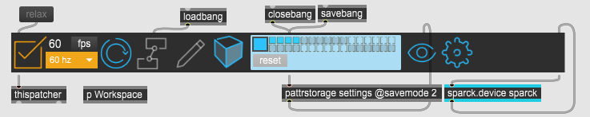 
*SPARCK*

The image below shows the Max subpatcher **p Workspace**, which contains all necessary SPARCK nodes for this configuration.

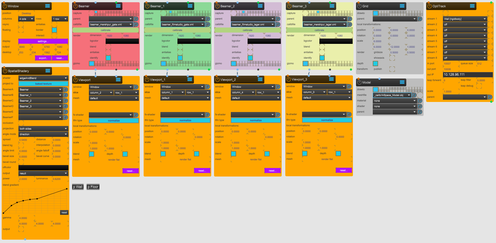 
*p Workspace subpatch*

In white: a highly precise simplified 3D [Model] of the Immersive Arts Space.
In black: a floor plane (using a [Canvas] node) with a [Grid] node.
In colour: four wireframes representing calibrated projector positions.
In the middle, in white: a traked moving wall.

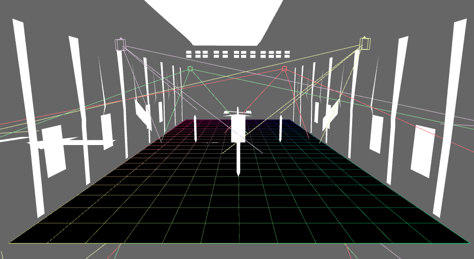 
*3DViewer preview of the virtual setup. In this image the [Grid] and [Model] nodes are enabled*

Four frames correspond to the calibrated view of each projector. Projectors are color‑coded via the **identify** toggle in the [Beamer] node.

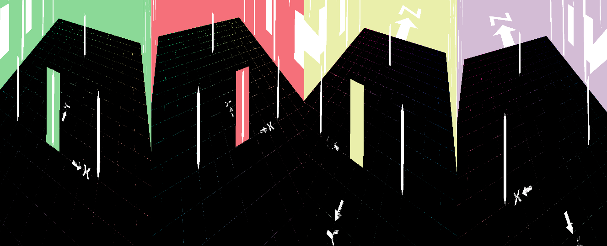 
*Window in Desktop preview (4 columns, 1 row). In this image the [Grid] and [Model] nodes are enabled*

## Nodes Configuration
The following sections explain how to correctly configure all nodes required for a Spatial Augmented Reality setup.

### Window Node
The [Window] node outputs SPARCK’s rendered result to the projectors. It determines how content is distributed across the four projector outputs.

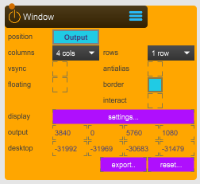 
*Window node — 1_UTILITY > WINDOW.maxpat*

**position**: Switch between **Output** (content displayed on projectors) and **Desktop** (content preview).

**columns and rows**: Defines how the [Window] is divided. Set **4 columns** and **1 row** for four projectors.

**display**: **settings...** Opens the display setup tool. Select the projector displays (orange), then click **Store and Close**.

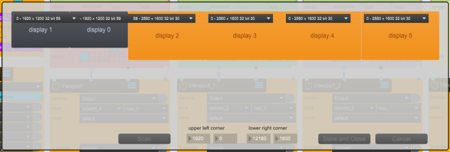 
*Display selection interface*

Example: The system has two monitors (1920×1200, greyed out) and four projectors (2560×1600, orange). Only the projectors are selected.

### Beamer Node
The [Beamer] node creates a virtual projector in SPARCK’s **3DViewer**. It is essential for calibrating the projector’s spatial position, orientation, and lens properties. See the [Calibration](../02_Calibration/calibration.md) guide for details.

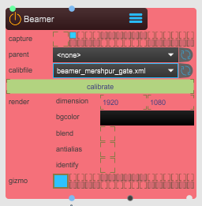 
*Beamer — 2_SPACE > BEAMER.maxpat*

**capture**: Select the render layer for each Beamer. Each Beamer must use a different render layer (small turquoise square).

**calibfile**: Saves calibration data to a `.xml` file.

**calibrate**: Opens the calibration editor.

**identify**: Displays a colour background in both [Window] **Output** and **Desktop** to identify the projector.

**gizmo**: Shows the projector’s position in the **3DViewer**.

### Viewport Node
This node creates a texture displayed in a designated slice of the [Window]. When connected to a [Beamer], it outputs that Beamer’s point of view.

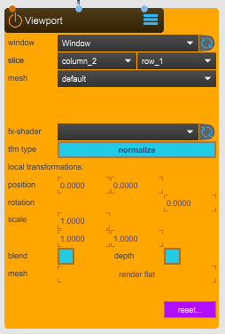 
*Viewport — 1_UTILITY > VIEWPORT.maxpat*

**window**: Targets the [Window] node.

**slice**: Assign each [Viewport] to an unique slice: **column 1–4**, all using **row 1**.

### Model Node
The [Model] node displays a simplified but accurate model of the Immersive Arts Space, helping visualize the positions of projectors, the floor plane, and tracked objects. It is deabled (grayed out) since is not an essential node. 

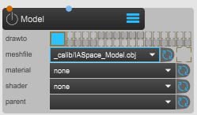 
*Model node collapsed — 2_SPACE > MODEL.maxpat*

**drawto**: Selects the render layer. Here, the [Model] appears only in the **3DViewer** (large turquoise square).

**meshfile**: Loads a 3D model from `Sparck/_assets/_models`. Ensure polygon count is reasonable for performance.

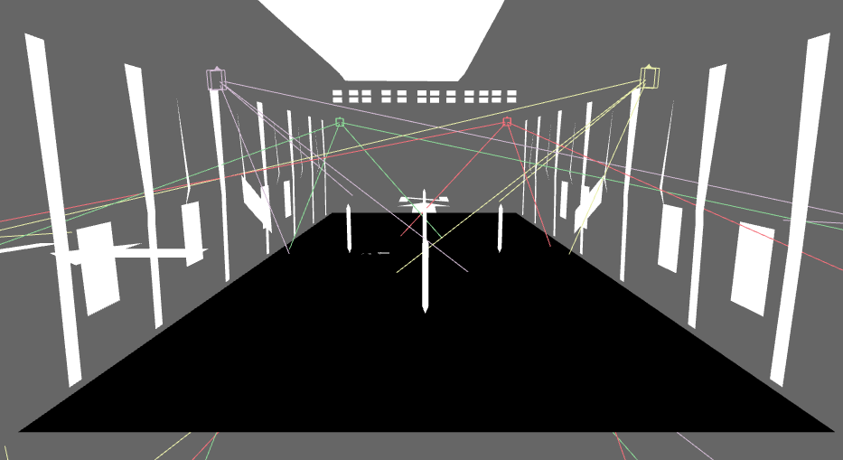
*IAS [Model] and floor [Canvas] preview*

### Grid Node
The [Grid]{ data-preview } node is a helper tool used to display a reference grid in SPARCK. It is disabled here but can be enabled for checking projector calibration accuracy: if the grid lines from both projectors overlap cleanly, calibration is good; if they appear doubled or misaligned, calibration needs adjustment. See [Calibration](../02_Calibration/calibration.md) for more information.

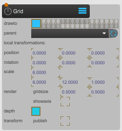 
*Grid node — 2_SPACE > GRID.maxpat*

**drawto**: If enabled (large turquoise square), selects the render layer where the grid is shown. In this setup, it is visible only in the **3DViewer**, but it can also be shown through the [Beamer] outputs if needed, especially to check calibration accuracy. See [Calibration](../02_Calibration/calibration.md) for more information.

**scale**: 1 SPARCK unit equal to 1 meter (100cm). In this case it maches the IAS floor plan (6m whide and 12m long).

**render gridsize**: Adjusts subdivision size.

**showaxis**: Enables or disables [Grid] axis display.

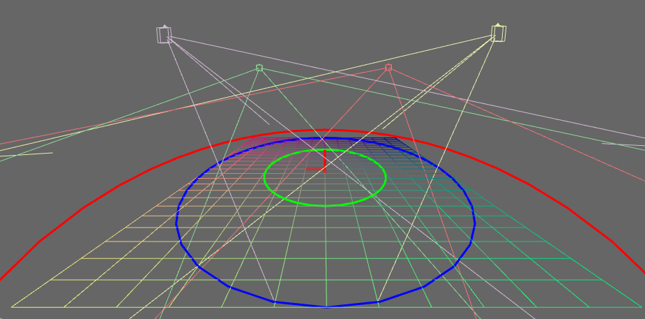 
*Grid axis diplay*

### SpatialShadery Node
The [SpatialShadery] node is at the core of Spatial Augmented Reality. It computes per‑projector pixel visibility and brightness, producing soft‑edge blending across all projectors.

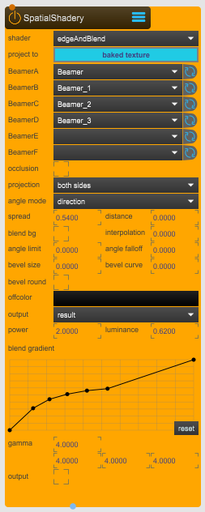 
*SpatialShadery node — 7_EFFECTS > SPATIAL.SHADERY.maxpat*

**shader**: Use **edge & blend** for soft‑edge blending.

**project to**: Set to **baked textures**.

**Beamer A–D**: Assign each [Beamer].

**projection**: Use **both siedes**.

**spread**: Controls the distribution of pixel blending between overlapping projections. 0 = no spread, 1 = full spread. Typical value: **0.54**.

**distance**: Controls the distance as an additional differentiator. It will show its influence when the spread is increased. 0 = no distance, 1 = full distance. Find a good balance that fit your situation.

**output**: Set to **result** to display final blended output.

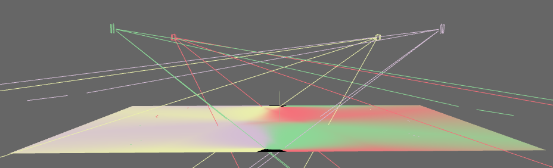 
*SpatialShadery with output set to **mask**, displaying the [Beamer]s weights. It essently display how the per‑projector pixels are computed for the final **result**.*

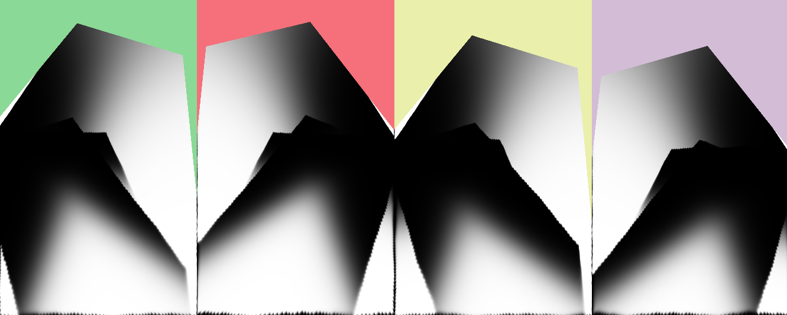 
*SpatialShadery with output set to **mask**, displaying the [Beamer]s weights, previewed from the [Window] **Desktop**. Each slide is [Beamer] point of view.*

**power**: Controls the soft-edge blending power. Find a good balance that fit your situation.

**luminance**: Adjusts the brightness balance. Find a good balance that fit your situation.

### OptiTrack Node
The [OptiTrack] node receives rigidbody motion capture data from **NatNet2OSC**. It distributes this positional data inside SPARCK so virtual models and shapes can follow physical tracked objects.

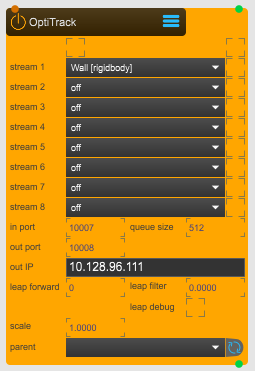 
*OptiTrack — 4_TRANSFORM > OT.RECEIVER.maxpat*

**stream 1–8**: Select a rigidbody from Motive. Ensure unique names/IDs.

**in port**: Port where mocap data is received.

**out port**: Port where data is forwarded.

**out IP**: Destination IP for mocap forwarding.

**leap forward**: Predictive smoothing to reduce jitter from fast‑moving tracked objects.

## Customize the project
You can extend this project by adding additional tracked objects, floor projection, or moving structures.

In this example, a floor projection and a tracked movable wall is added. They receive projection content (video, Spout stream, or static image). Add a **p Wall** and a **p Floor** subpatches to your Max project.

 
*Max Subpatchers **p Wall** and **p Floor**.*

### Tracked wall projection
Inside the **p Wall** subpatcher, add a [RigidBody], [Video], and [Canvas] node.

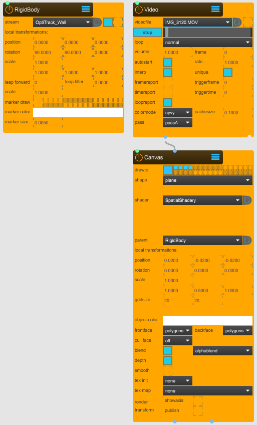 
*Setup for one tracked plane displaying a looping video*

#### RigidBody Node
The [Rigidbody] node is a 3D space transformation node (position, rotation and scale) that receives transformation data from the [OptiTrack] node.

**stream**: Targets streams from the [OptiTrack] node.

**position**: Position x, y, z. If necessary, adjust these values to better fit the tracked projection surface. In this case, slight positional corrections are done on the [Canvas] node but they could have been done directly on the [RigidBody] node.

**rotation**: Rotation x, y, z. If necessary, adjust these values to better fit the tracked projection surface. In this case, a correction of 90° rotation had to be done.

**scale**: Scale x, y, z. If necessary, adjust these values to better fit the tracked projection surface. In this case, a correction of 90° rotation had to be done.

**leap forward**: If value is positive, it calculates forward predicted position. If value is negative, it queues the transformation for the amout of time (i.e. to make it synchronous with video feed that takes longer to capture). Adjust these values on your needs.

#### Video Node
The [Video] node loads and playback videos. This node is attached to the [Canvas].

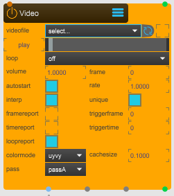 
*Video — 1_INPUT > VIDEO.maxpat*

**videofile**: Load a and playback a file. All the video files should be put at this path located inside the SPARCK project folder: **../_assets/_videos**

**loop**: set to **loop**, change it to suit your needs.

#### Canvas node
The [Canvas] node draws basic 3D shapes (plane, cube, sphere, custom mesh). It is lighter than the [Model] node and contains no material or lighting properties.

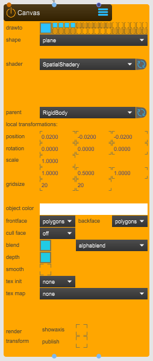 
*Canvas — 3_SPACE > CANVAS.maxpat*

**drawto**: Selects the render layer. Here shown in SPARCK **3DViewer** and on all the 4 [Beamer] layers.

**shape**: Select the geometry. For SAR floors, a **plane** is used.

**shader**: Assign the [SpatialShadery] shader for multi‑projector blended projection.

**scale**: Here set to the the physical tracked wall dimensions: 1m height × 0.5m widht.

### Floor projection
For the **p Floor** subpatcher, add inside a [SpoutReceiver] and a [Canvas] nodes. A [Video] node could be used insted of a [SpoutReceiver] node.

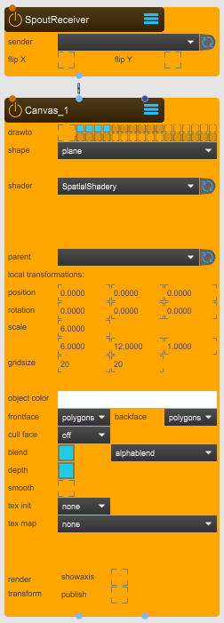 
***p Floor** subpatch*

#### SpoutReceiver Node
The [SpoutReceiver] node receives real‑time textures from applications such as TouchDesigner, Unity, Unreal, or Notch (and others) via Spout.

 
*SpoutReceiver — 5_INPUT > SPOUT.RECEIVER.maxpat*

**sender**: Select the Spout stream.

**flip x / flip y**: Flip texture orientation if needed.

#### Canvas Node
The [Canvas] node draws basic 3D shapes (plane, cube, sphere, custom mesh). It is lighter than the [Model] node and contains no material or lighting properties. In this case we use it to project content on the floor.

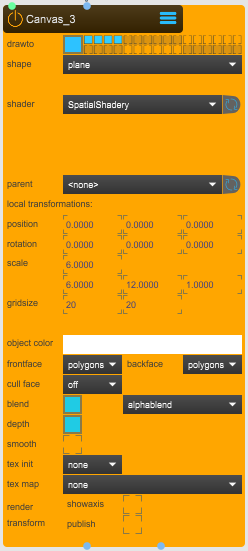 
*Canvas — 2_SPACE > CANVAS.maxpat*

**drawto**: Selects the render layer. Here shown in **3DViewer** and on all the 4 [Beamer] layers.

**shape**: Select the geometry. For SAR floors, a **plane** is used.

**shader**: Assign the [SpatialShadery] shader for multi‑projector blended projection.

**scale**: Here set to the IAS floor dimensions: 6m × 12m.

[Beamer]: ../../../reference/nodes/Beamer.md
[BlendSoftedge]: ../../../reference/nodes/BlendSoftedge.md
[BoxMapCamera]: ../../../reference/nodes/BoxMapCamera.md
[BoxMapCapture]: ../../../reference/nodes/BoxMapCapture.md
[CalibrationCross]: ../../../reference/nodes/CalibrationCross.md
[Canvas]: ../../../reference/nodes/Canvas.md
[CornerPin]: ../../../reference/nodes/CornerPin.md
[DrawMask]: ../../../reference/nodes/DrawMask.md
[Grid]: ../../../reference/nodes/Grid.md
[Hook]: ../../../reference/nodes/Hook.md
[Light]: ../../../reference/nodes/Light.md
[LookAtCamera]: ../../../reference/nodes/LookAtCamera.md
[Material]: ../../../reference/nodes/Material.md
[MeshWarp]: ../../../reference/nodes/MeshWarp.md
[Model]: ../../../reference/nodes/Model.md
[OptiTrack]: ../../../reference/nodes/OptiTrack.md
[QueScript]: ../../../reference/nodes/QueScript.md
[RigidBody]: ../../../reference/nodes/RigidBody.md
[SceneCamera]: ../../../reference/nodes/SceneCamera.md
[SceneCapture]: ../../../reference/nodes/SceneCapture.md
[ShaderAnaglyph]: ../../../reference/nodes/ShaderAnaglyph.md
[ShaderBlur]: ../../../reference/nodes/ShaderBlur.md
[ShaderBrCoSa]: ../../../reference/nodes/ShaderBrCoSa.md
[ShaderColormap]: ../../../reference/nodes/ShaderColormap.md
[ShaderPointCloud]: ../../../reference/nodes/ShaderPointCloud.md
[ShaderRaymarcher]: ../../../reference/nodes/ShaderRaymarcher.md
[ShaderSelection]: ../../../reference/nodes/ShaderSelection.md
[ShaderTexStitch]: ../../../reference/nodes/ShaderTexStitch.md
[ShaderTexZoom]: ../../../reference/nodes/ShaderTexZoom.md
[ShdrTexOP]: ../../../reference/nodes/ShaderTexOP.md
[SkyBox]: ../../../reference/nodes/SkyBox.md
[SPARCK]: ../../../reference/sparck_core.md
[SpatialShadery]: ../../../reference/nodes/SpatialShadery.md
[SpoutReceiver]: ../../../reference/nodes/SpoutReceiver.md
[SpoutSender]: ../../../reference/nodes/SpoutSender.md
[SyphonSender]: ../../../reference/nodes/SyphonSender.md
[Texture]: ../../../reference/nodes/Texture.md
[TextureProjectory]: ../../../reference/nodes/TextureProjectory.md
[TfmLookAt]: ../../../reference/nodes/TfmLookAt.md
[TfmMerge]: ../../../reference/nodes/TfmMerge.md
[TfmMirror]: ../../../reference/nodes/TfmMirror.md
[TfmNode]: ../../../reference/nodes/TfmNode.md
[Video]: ../../../reference/nodes/Video.md
[Viewport]: ../../../reference/nodes/ViewPort.md
[Window]: ../../../reference/nodes/Window.md