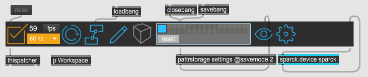
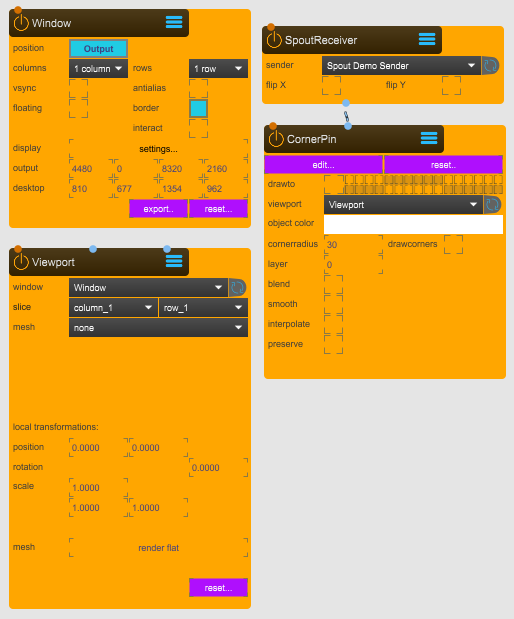
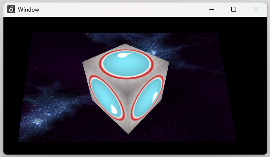
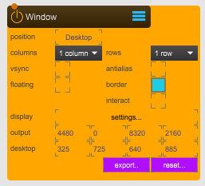
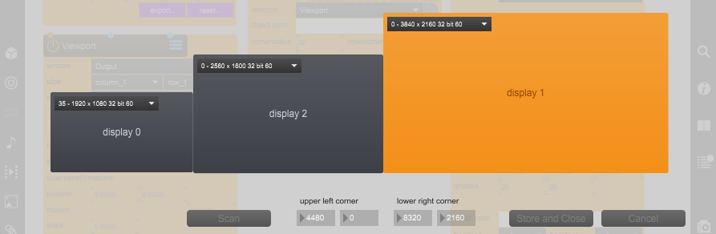
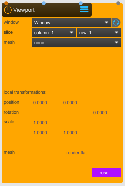
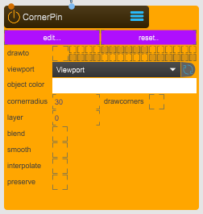
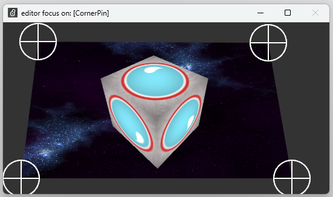
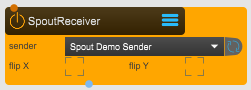

# Wall Projection
This tutorial explains how to configure Sparck for a wall projection using the **CornerPin** node.

In your Max patch, add Sparck. See [Getting Started](../01_Getting_Started/Getting_Started.md) for more information.

*Sparck*

The image below shows the overall Max subpatcher **p Workspace**, which contains all the Sparck nodes required for this configuration.

 
*Wall projection Sparck setup*

 
*CornerPin desktop preview*

TODO: Add download button, the files are here:
[Wall_Projection.zip](https://github.com/immersive-arts/Sparck2/releases/download/1.0.0/Wall_Projection.zip)

## Basic Node Configuration
The following text explains and shows how to correctly setup all the different nodes for a wall projection setup.

### Window Node
This node outputs the rendered result of Sparck to an output device — in this case, one projector.

 
*Window node, available under 2_OUTPUT > WINDOW.maxpat*

**position**: Switch between **Output** or **Desktop**. **Output** displays visual content on the configured projectors, while **Desktop** creates a preview window.

**columns and rows**: Slices the output into designated frames. In this case both the columns and rows are set to 1.

**display**: Press **setting...** to open the display setup tool and configure the total pixel area used for projection. Select the display(s) you want to use. Selected displays appear orange. Click **Store and Close** when done.

 
*Settings interface to select and configure the display used for projection.*

In this example, the computer is connected to two monitors (1920×1080 and 2560×1800, grayed out) and one projector (3840×2160, orange). Only the orange display is used for projection.

### Viewport Node
This node creates a texture that is sent to the **Output**.

 
*Viewport node, available under 2_OUTPUT > VIEWPORT.maxpat*

**window**: References the **Output** node.

**slice**: Selects the designated slice where the content will be displayed — here, column 1 and row 1.

**mesh**: Set to **none** so that no mesh is applied, as the **CornerPin** node handles the mapping.

### CornerPin Node
The **CornerPin** node provides controls to map textures to the output window by freely repositioning the image corners.

 
*CornerPin node, available under 04_MAPPING > CORNERPIN.maxpat*

**edit...**: Opens the CornerPin editor. A pop-up window appears, allowing you to adjust the four corners to match the projection surface.

*CornerPin edit interface*

**reset...**: Resets the CornerPin configuration.

**viewport**: Targets the **Viewport** where the CornerPin is rendered.

### SpoutReceiver Node
The **SpoutReceiver** node receives textures from [Spout](https://spout.zeal.co/). These are typically real‑time animated textures generated by visual engines such as TouchDesigner, Unity, Unreal, or Notch.

 
*SpoutReceiver node, available under 1_INPUT > SPOUT.RECEIVER.maxpat*

**sender**: Select the Spout video stream.

**flip x**: Flip the incoming texture horizontally.

**flip y**: Flip the incoming texture vertically.

