# Floor Projection
This tutorial explains how to configure SPARCK for a floor projection using two calibrated projectors.

Calibrating the projectors is essential for correctly blending their images on the floor using a [SpatialShadery] node. Accurate calibration aligns the projectors with the virtual scene, ensuring that projected virtual elements display, track and move in perfect sync with real-time generated content.

Download the project files here: [Floor_Projection.zip](https://github.com/immersive-arts/Sparck2/releases/) TODO: Upload them here

## Setup with 2 projectors
In your Max patch, add [SPARCK]. See [Getting Started](../01_Getting_Started/Getting_Started.md) for more information.

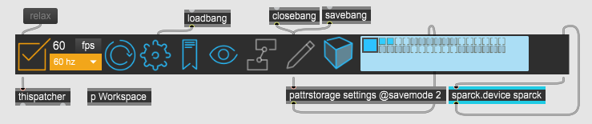 
*SPARCK for this setup*

The image below shows the overall Max subpatcher **p Workspace**, which contains all the SPARK nodes required for this configuration.

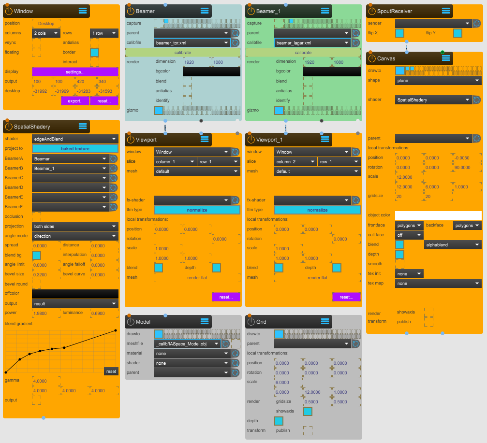 
*Floor projection SPARCK setup*

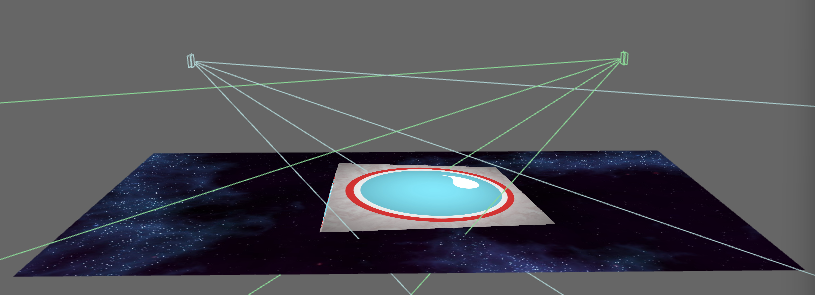 
*A [Canvas] set as a floor with streamed Spout content* 

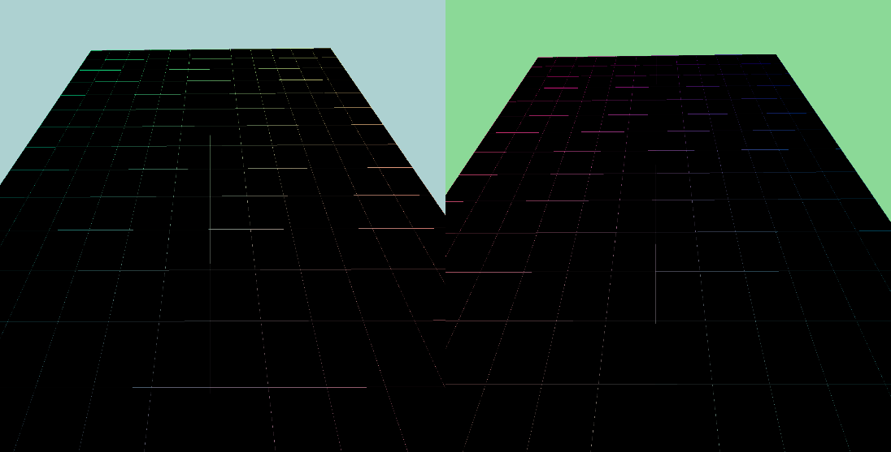 
*[Window] node, **output** preveiw. In this preview, the [Grid] is also visible and the [Beamer] have **indentify** toggled*

## Nodes Configuration
The following sections describe how to correctly set up all the necessary nodes for a floor‑projection configuration.

### Window Node
The [Window]{ data-preview } node outputs the rendered result of SPARCK to the output devices — in this case, two projectors.

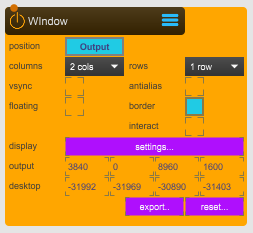 
*Window node. Available under 01_UTILITY > WINDOW.maxpat*

**position**: Switch between **Output** and **Desktop**. **Output** displays the visual content on the configured projectors, while **Desktop** creates a preview window that shows how the content is distributed across the [Beamer] nodes.

**columns and rows**: Slices the [Window] into designated frames. Here, **2 columns** and **1 row** are used to match the two [Beamer] nodes.

**display**: Press **setting...** to open the display setup tool and configure the total projection resolution. Select the display(s) you want to use — selected displays appear orange. Click **Store and Close** when done.

### Beamer Node
The [Beamer]{ data-preview } node creates a virtual projector inside SPARCK's **3DViewer**. It is essential for calibrating the projector's position, orientation, and lens properties in relation to physical space. See [Calibration](../02_Calibration/calibration.md) for details on calibrating a [Beamer].

The [Beamer] node is connected to the [Viewport] node. TODO: Why?

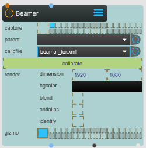 
*Beamer node. Available under 02_SPACE > BEAMER.maxpat*

**capture**: Select the render layer where the [Beamer] output is displayed. Make sure only one small turquoise square is active for each [Beamer].

**calibfile**: Create and save a `.xml` file that stores the [Beamer]'s calibrated position and lens data.

**calibrate**: Launches the calibration editor. See [Calibration](../02_Calibration/calibration.md) for more information.

**identify**: If enabled (turquoise square), displays a color background in both **Output** and **Desktop** windows to identify which projector is active, using color information stored in the **calibfile**.

**gizmo**: When enabled (large turquoise square), displays the projector gizmo in the **3DViewer** at its calibrated virtual position.

### Viewport Node
The [Viewport]{ data-preview } node creates a texture that is sent to the [Window].

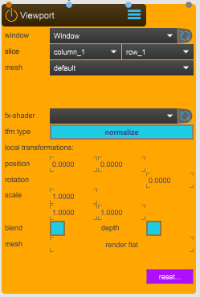 
*Viewport node. Available under 01_UTILITY > VIEWPORT.maxpat*

**window**: References the [Window] node.

**slice**: Selects the designated slice where content will be displayed. The first [Viewport] uses **column_1, row_1**; the second [Viewport] uses **column_2, row_1**.

**mesh**: Set to **default**. This ensures that the texture fits the [Beamer] resolution, especially when **tfm type** is **normalized**.

### SpatialShadery Node
The [SpatialShadery]{ data-preview } node is at the core of Spatial Augmented Reality. It computes per‑projector pixel visibility and brightness, producing soft‑edge blending across all projectors.

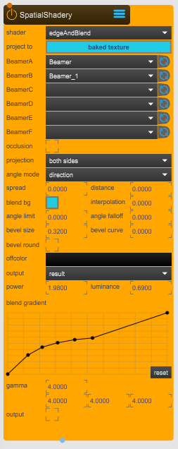 
*SpatialShadery node. Available under 07_EFFECTS > SPATIALSHADERY.maxpat*

**shader**: Use **edge & blend** for soft‑edge merging.

**project to**: Set to **baked textures**.

**Beamer A–D**: Assign each [Beamer].

**projection**: Use **both side**.

**spread**: Controls the distribution of pixel blending between overlapping projections. 0 = no spread, 1 = full spread. Find a good balance that fit your situation.

**distance**: Controls the distance as an additional differentiator. It will show its influence when the spread is increased. 0 = no distance, 1 = full distance. Find a good balance that fit your situation.

**output**: Set to **result** to display final blended output.

**power**: Controls the soft-edge blending power. Find a good balance that fit your situation.

**luminance**: Adjusts the brightness balance. Find a good balance that fit your situation.

### Canvas Node
The [Canvas]{ data-preview } node can draw a variety of basic 3D shapes such as planes, cubes, spheres, or custom meshes. It is a lightweight version of the [Model] node and does not include material, lighting, or shadow settings. Here it is used to create a simple plane on which content will be projected. A [SpoutReceiver] node is connected to the [Canvas] node.

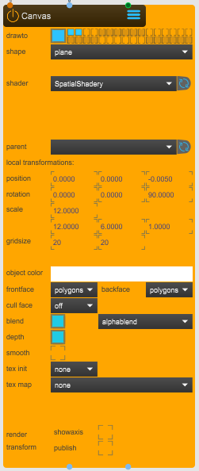 
*Canvas node. Available under 02_CANVAS > CANVAS.maxpat*

**drawto**: Selects the render layer where the [Canvas] is displayed. In this setup, the [Canvas] is visible in the **3DViewer** and in the [Beamer] output layers.

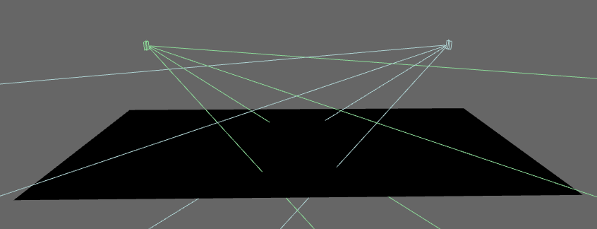 
*Preview of the floor using a [Canvas].* 

**shape**: Select a base shape. A plane is used here, though other shapes such as spheres or cylinders can be used.

**shader**: Select the shader to apply. Here, the [SpatialShadery] shader is used to ensure both projectors contribute correctly with soft‑edge blending.

**scale**: 1 SPARCK unit equals 1 meter (100 cm). The plane is scaled to match the IAS floor plan (6m wide × 12m long). Correct scaling ensures alignment between virtual projection content and real‑time visuals from engines such as Unreal or TouchDesigner.

### SpoutReceiver Node
The [SpoutReceiver]{ data-preview } node receives real‑time textures from [Spout](https://spout.zeal.co/), typically generated by visual engines like TouchDesigner, Unity, Unreal, or Notch.

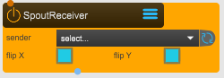 
*SpoutReceiver node. Available under 05_INPUT > SPOUTRECEIVER.maxpat*

**sender**: Select the Spout video stream.

**flip x**: Flip the incoming texture horizontally.

**flip y**: Flip the incoming texture vertically.

### Model Node
The [Model]{ data-preview } node is used to display a simplified but accurate 3D model of the Immersive Arts Space inside the **3DViewer**, helping visualize projector and floor positions. It is disabled here because it is not required for the projection setup.

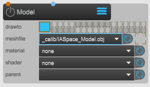 
*Model node. Available under 02_SPACE > MODEL.maxpat*

**drawto**: Selects the render layer (large turquoise square). Here, the Model appears only in the **3DViewer**.

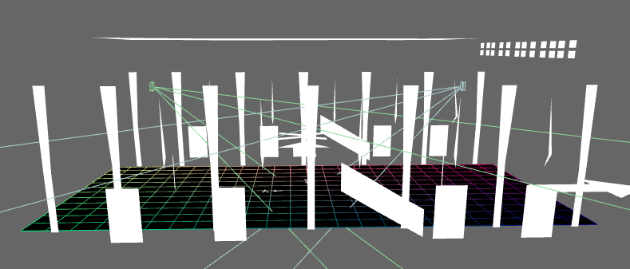 
*In white, a simplified accurate 3D model of the Immersive Arts Space dispayed inside SPARCK 3Dviewer, also displayed the floor canvas and the grid*

**meshfile**: Loads a 3D model from `Sparck/_assets/_models`. Ensure to keep the polygon count reasonable for good performance.

### Grid Node
The [Grid]{ data-preview } node is a helper tool used to display a reference grid in SPARCK. It is disabled here but can be enabled for checking projector calibration accuracy: if the grid lines from both projectors overlap cleanly, calibration is good; if they appear doubled or misaligned, calibration needs adjustment. See [Calibration](../02_Calibration/calibration.md) for more information.

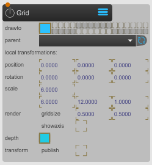 
*Grid node. Available under 02_SPACE > GRID.maxpat*

**drawto**: If enabled (large turquoise square), selects the render layer where the grid is shown. In this setup, it is visible only in the **3DViewer**, but it can also be shown through the [Beamer] outputs if needed, especially to check calibration accuracy.

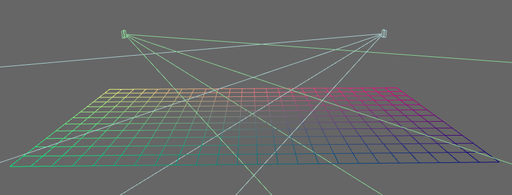 
*Grid dispayed inside SPARCK 3Dviewer*

**scale**: 1 SPARCK unit equal to 1 meter (100cm). In this case it maches the IAS floor plan (6m whide and 12m long).

**render gridsize**: Adjusts the size of the grid subdivisions.

**showaxis**: Enables or disables the [Grid] axis display.
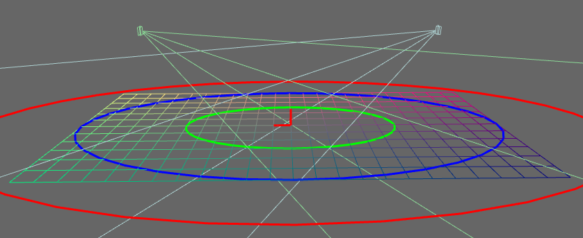 
*Grid exis enabled, preview inside SPARCK 3Dviewer*

[Beamer]: ../../../reference/nodes/Beamer.md
[BlendSoftedge]: ../../../reference/nodes/BlendSoftedge.md
[BoxMapCamera]: ../../../reference/nodes/BoxMapCamera.md
[BoxMapCapture]: ../../../reference/nodes/BoxMapCapture.md
[CalibrationCross]: ../../../reference/nodes/CalibrationCross.md
[Canvas]: ../../../reference/nodes/Canvas.md
[CornerPin]: ../../../reference/nodes/CornerPin.md
[DrawMask]: ../../../reference/nodes/DrawMask.md
[Grid]: ../../../reference/nodes/Grid.md
[Hook]: ../../../reference/nodes/Hook.md
[Light]: ../../../reference/nodes/Light.md
[LookAtCamera]: ../../../reference/nodes/LookAtCamera.md
[Material]: ../../../reference/nodes/Material.md
[MeshWarp]: ../../../reference/nodes/MeshWarp.md
[Model]: ../../../reference/nodes/Model.md
[OptiTrack]: ../../../reference/nodes/OptiTrack.md
[QueScript]: ../../../reference/nodes/QueScript.md
[SceneCamera]: ../../../reference/nodes/SceneCamera.md
[SceneCapture]: ../../../reference/nodes/SceneCapture.md
[ShaderAnaglyph]: ../../../reference/nodes/ShaderAnaglyph.md
[ShaderBlur]: ../../../reference/nodes/ShaderBlur.md
[ShaderBrCoSa]: ../../../reference/nodes/ShaderBrCoSa.md
[ShaderColormap]: ../../../reference/nodes/ShaderColormap.md
[ShaderPointCloud]: ../../../reference/nodes/ShaderPointCloud.md
[ShaderRaymarcher]: ../../../reference/nodes/ShaderRaymarcher.md
[ShaderSelection]: ../../../reference/nodes/ShaderSelection.md
[ShaderTexStitch]: ../../../reference/nodes/ShaderTexStitch.md
[ShaderTexZoom]: ../../../reference/nodes/ShaderTexZoom.md
[ShdrTexOP]: ../../../reference/nodes/ShaderTexOP.md
[SkyBox]: ../../../reference/nodes/SkyBox.md
[SPARCK]: ../../../reference/sparck_core.md
[SpatialShadery]: ../../../reference/nodes/SpatialShadery.md
[SpoutReceiver]: ../../../reference/nodes/SpoutReceiver.md
[SpoutSender]: ../../../reference/nodes/SpoutSender.md
[SyphonSender]: ../../../reference/nodes/SyphonSender.md
[Texture]: ../../../reference/nodes/Texture.md
[TextureProjectury]: ../../../reference/nodes/TextureProjectory.md
[TfmLookAt]: ../../../reference/nodes/TfmLookAt.md
[TfmMerge]: ../../../reference/nodes/TfmMerge.md
[TfmMirror]: ../../../reference/nodes/TfmMirror.md
[TfmNode]: ../../../reference/nodes/TfmNode.md
[Video]: ../../../reference/nodes/Video.md
[Viewport]: ../../../reference/nodes/ViewPort.md
[Window]: ../../../reference/nodes/Window.md